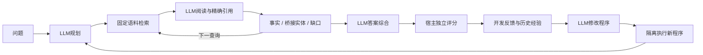

# RAG RSI

**真实修改器替代试跑已完成：**12道已用开发题、两区组、cases/trace共16次机会全部执行；13次JSON无效、3次无可执行变化，接受子程序为0。新增116次调用、¥1.60303356；含原停止轮累计154次、保守¥1.74111468，低于授权1,566次／¥399。旧未知请求保留。瓶颈在反馈到代码修改，不能比较两条件的质量收益。[完整报告与链路图](docs/v3_paired_modifier_result_20261009.md)。

基于固定大模型的 RAG 程序自改进系统。LLM 负责问题分解、证据阅读、动态查询、答案综合和程序修改；宿主负责语料访问、预算、隔离执行与独立评分。

**最新真实结果：24题固定证据终答对照已完成，96次新调用，账本¥0.07725。** 删除中间派生判断后，F1为44.68%→55.56%，EM为16/48→25/48；F1差的95%区间为[−9.95,+30.56]个百分点。非拒答F1零从2增到3，未满足预注册推进条件，因此不部署整块删除。[完整报告与链路图](docs/v3_answer_probe_result_20261009.md) · [聚合与独立复算](docs/v3_answer_probe_result_20261009.json)

本轮固定原问题与历史支持引句，只改终答输入；改善与退步并存，不能称正常检索端到端或独立任务提升。此前三条件校准已出现非地板信号，循环平均F1提高但区间跨零。[前轮结果](docs/v3_musique_calibration_result_20261009.md)。**LLM改程序与经验选择有无稳定收益，仍未验证。** [当前状态](docs/CURRENT_STATUS.md) · [证据等级](docs/EVIDENCE_STATUS.md)

真实实验与原冻结源码在 `codex/v3-feedback-grounding`，本开发分支 `codex/v3-experience-ablation` 已接入反馈分层、提案机会覆盖及机制记忆开关。全套750项中749通过、1项跳过；另有5次真实WSL脚本执行与恢复验证通过，外部API为0。这是工程证据，不能作为真实演化收益。[实现与验收](docs/v3_experience_controls_20261009.md)。`main` 的 `be43a19` 为历史版本；MuSiQue保持机制开发校准，BrowseComp保留困难检索和迁移。

**最新离线定位：**引句可能丢失身份、时间和指代，中间判断则有时补足、有时误导。已实现默认关闭的原文邻域模块；全24题78条引句容量检查通过，尚无新模型收益证据。本轮777项测试通过、1项跳过，另有2次真实WSL合成执行通过。[验收记录](docs/v3_quote_context_validation_20261009.json) · [案例复核、架构与论文借鉴](docs/v3_quote_context_review_20261009.md)。

**最新工程进展：**闭卷组件和跨实验历史排除已实现；新面板96/107/168题已冻结，总371题。原96/120/240均衡目标不足，按相同已选身份另立可行版本。853项测试通过、1项跳过，另2次真实WSL合成执行通过，零新API。统一三条件测量入口仍待接线，尚无新质量结果。[实现、容量修订与验收](docs/v3_closed_book_panels_20261009.md) · [原审查路线](docs/v3_independent_evidence_plan_20261009.md)

**发表路线已明确：第一篇聚焦RAG程序改进，第二阶段检验改进策略学习，第三阶段验证完整双循环。** 经验机制保留接口、暂时关闭。优先完成只用开发题的修改器试跑，再核定正式三条件搜索规模；168题报告集留给第一篇的最终确认。[完整计划与具体试跑草案](docs/v3_stage_one_paper_plan_20261009.md)

**阶段入口已完成：**开发搜索可单独冻结；选择和报告显式执行并延迟解析各自参考，同一本账本约束总额与阶段额。新增40项测试；完整894项中893通过、1项跳过，另11次真实WSL合成测量全部通过；本轮零新API，真实修改器试跑仍未启动。[实现与验收](docs/v3_evolution_phases_20261009.md)。

**此前配对试跑准备验收（执行现状见上）：**12道已用开发题、cases/trace两条件、两个区组共16个提案机会；区组内共享一次完整根测量，交错执行并统一记账。928项测试中927通过、1项跳过；另6次真实WSL合成测量全部通过。历史完整请求尺寸通过，真实根仍须联合过门槛。冻结上限1,528次／¥399，保守包络¥398.764544；本轮零新API，不能作为真实修改收益证据。[计划与验收](docs/v3_paired_modifier_smoke_20261009.md)。

## 架构



开发题 `D_fit` 供程序改进；`D_select` 只选择并锁定交付；`D_report` 只报告。答案评分、证据来源合法性、交付率与成本分列，保留负收益。模型自称证据充分不等于事实正确。

## 快速验证

需要 Python 3.10+。本核心及本地测试仅使用标准库。

```powershell
python -B -m unittest discover -s . -p "test_*.py" -v
```

完整隔离执行演示需要 Windows + 已具备 namespace/cgroup 支持的 Ubuntu-22.04 WSL。没有对应环境时明确失败，不在宿主直接执行模型生成代码。

```powershell
python -B -m code_rsi.v3 offline-demo --out D:\Codex\Projects\rsi-agent\runs\offline_demo
```

演示使用虚构故事、脚本模型、预设改动，只验证父程序→子程序→选择→锁定→报告的数据流。它不会调用付费 API，不能作为模型性能成绩。

## 代码入口

- `code_rsi/v3/rag.py`：模型驱动的证据闭环，可复制为隔离候选 `rag_core.py`。
- `code_rsi/v3/datasets.py`：公开输入与私有评价参考分离。
- `code_rsi/v3/infrastructure.py`：语料、结构化模型、请求复用与限时调用。
- `code_rsi/v3/execution.py`：复用已验证的 WSL 隔离执行和宿主测量。
- `code_rsi/v3/experience_policy.py`：经验驱动的父代和改进模块选择。
- `code_rsi/v3/evolution.py`：单一程序演化、交付选择和报告流程。
- `code_rsi/paired_evolution.py`：共享根、交错提案、统一预算的开发题配对试跑。
- `code_rsi/v3/diagnostics.py`：从执行记录提取失败与父子配对反馈，区分观测和模型自报。
- `code_rsi/v3/browsecomp_data.py`：固定版本列获取，问题先读、参考在完整生成冻结后取得。
- `code_rsi/v3/fit_literal_audit.py`：对新增开发题常量与已展示长摘录做保守检查，不读取私有参考。
- `code_rsi/v3/task_metrics.py`：任务专用指标，缺失标注明确不可评分。
- `code_rsi/v3/calibration.py`：固定两臂/三臂真实调用入口，完整生成冻结后再解锁评分。
- `code_rsi/v3/reader_replay.py` 与 `reader_probe.py`：精确回放前缀，隔离末轮阅读提示的局部干预，生成冻结后才做锚点诊断和本地评分。
- `code_rsi/live_evolution.py`：完整代码演化入口，统一预算、模型身份与恢复保护。
- `code_rsi/prepare_musique.py`：本地MuSiQue-Ans三角色分组与组成问题去重。
- `code_rsi/prepare_answer_probe.py`、`answer_replay.py`、`answer_probe.py`：固定历史证据，版本化比较终答派生判断或原文邻域；共用原隔离、预算、恢复和评分接口。

完整演化使用[正式入口与分组说明](docs/v3_live_evolution.md)，内部直接复用 `EvolutionRunner`；固定流程校准使用下列入口。真实模型试跑需冻结具体方案与授权范围。没有默认凭据文件读取，也不在导入时发请求。

```powershell
python -B -m code_rsi.v3 preflight --plan <本地冻结方案.json>
python -B -m code_rsi.v3 calibrate --plan <本地冻结方案.json> --execute --approved-plan-hash <已审核方案哈希>
python -B -m code_rsi.v3 grade --plan <本地冻结方案.json>
```

`preflight` 只检查文件、语料、源码与费用上界，不读取密钥或发送请求。`calibrate` 需要用户已经授权该方案；命令行哈希本身不能替代授权。成功生成后自动完成本地代理评分和盲评包；未知调用结果会停止。相同方案重启使用已冻结结果，不重复购买请求。

## 文档

- [当前证据等级表](docs/EVIDENCE_STATUS.md)
- [任务校准与检索瓶颈报告](docs/v3_task_recalibration_20261008.md)
- [全局重构与最新自演化论文整合](docs/V3_全局重构与自演化文献整合_20261007.md)
- [当前架构与信息链](docs/v3_architecture_audit.md)
- [RAG与程序演化文献](docs/v3_literature_evidence.md)
- [SkillOpt / SkillRL / ACE / MemEvolve](docs/v3_supplement_skills_memory.md)
- [R-Zero / Hyperagents / Harness / CORAL](docs/v3_supplement_harness.md)
- [题库决定与官方指标边界](docs/v3_benchmark_decision.md)
- [失败反馈契约](docs/v3_feedback_contract.md)
- [任务评分规则](docs/v3_task_metrics.md)
- [8题真实流程校准方案](docs/v3_calibration_protocol.md)
- [首轮真实校准结果](docs/v3_calibration_result.md)
- [上下文轮换修复与复测](docs/v3_rolling_protocol.md)
- [正式演化入口与MuSiQue分组](docs/v3_live_evolution.md)
- [最新验证摘要](docs/v3_validation_summary.json)

MuSiQue开发适配、BrowseComp高难确认、MultiHop回归、BRIGHT检索侧轨各有不同语料与评分要求。内部EM/F1不冒充BrowseComp官方模型裁判成绩。

## 仓库维护

本仓库保存源码、测试、架构与研究文档；运行数据、完整题库、参考答案、凭据、API请求/响应和原始账本保留本地。每个验证通过的改动形成可追溯提交。研究结论明确分为：实现通过、机制样例通过、真实题库增益已验证。
