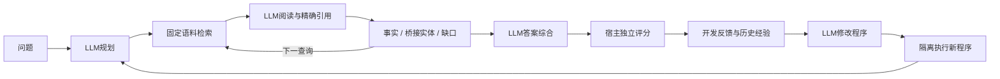

# RAG RSI

基于固定大模型的 RAG 程序自改进系统。LLM 负责问题分解、证据阅读、动态查询、答案综合和程序修改；宿主负责语料访问、预算、隔离执行与独立评分。

当前状态：**v3 已修复上下文链路、检索截断、终答来源与模块归因，现已接通三臂校准、题级配对统计、开发题常量检查与生成后参考获取。527 项测试全部通过，包含真实 WSL 来源回归；尚未证明真实 LLM 改程序能带来稳定质量提升。** 首轮真实校准仍是旧版本的 8 道已用题，不计作当前版本效果。

准备阶段新增真实模型 API 调用 0、费用 0；官方问题列已免费获取。新16题测量现已完成：245次真实调用，测量账本¥2.2693，含启动保守占用合计¥2.2847。代码位于 `codex/v3-feedback-grounding`，主工作区保留 `be43a19` 冻结版本。[新16题冻结方案与延迟参考](docs/v3_new16_protocol.md) · [第二轮审查落实与新题盘点](docs/v3_review_followup_20261008.md) · [三臂协议、统计与验证](docs/v3_three_arm_protocol.md) · [上一轮修复报告](docs/v3_review_fixes_20261008.md) · [机器可读验证](docs/v3_validation_summary.json)。已排除40道已用题和32道已接触官方材料题，从758个题号差集中按冻结种子取得16道问题并完成有限词面重叠检查。新方案为16题×三臂×2次，最多320调用，新增费用硬上限¥82，现已完成；[完整结果与架构图](docs/v3_new16_result.md)。A/B/C原始EM分别0/32、1/32、1/32；1次检索超时使整体比较无效，尚无稳定质量提升。54次后续阅读已收到293个新窗口，不宣称全历史独立。

## 架构



开发题 `D_fit` 供程序改进；`D_select` 只选择并锁定交付；`D_report` 只报告。答案评分、证据来源合法性、交付率与成本分列，保留负收益。模型自称证据充分不等于事实正确。

## 快速验证

需要 Python 3.10+。本核心及本地测试仅使用标准库。

```powershell
python -B -m unittest discover -s . -p "test_v3_*.py" -v
```

完整隔离执行演示需要 Windows + 已具备 namespace/cgroup 支持的 Ubuntu-22.04 WSL。没有对应环境时明确失败，不在宿主直接执行模型生成代码。

```powershell
python -B -m code_rsi.v3 offline-demo --out D:\Codex\Projects\rsi-agent\runs\offline_demo
```

演示使用虚构故事、脚本模型、预设改动，只验证父程序→子程序→选择→锁定→报告的数据流。它不会调用付费 API，不能作为模型性能成绩。

## 代码入口

- `code_rsi/v3/rag.py`：模型驱动的证据闭环，可复制为隔离候选 `rag_core.py`。
- `code_rsi/v3/datasets.py`：公开输入与私有评价参考分离。
- `code_rsi/v3/infrastructure.py`：语料、结构化模型、请求复用与限时调用。
- `code_rsi/v3/execution.py`：复用已验证的 WSL 隔离执行和宿主测量。
- `code_rsi/v3/experience_policy.py`：经验驱动的父代和改进模块选择。
- `code_rsi/v3/evolution.py`：单一程序演化、交付选择和报告流程。
- `code_rsi/v3/diagnostics.py`：从执行记录提取失败与父子配对反馈，区分观测和模型自报。
- `code_rsi/v3/browsecomp_data.py`：固定版本列获取，问题先读、参考在完整生成冻结后取得。
- `code_rsi/v3/fit_literal_audit.py`：对新增开发题常量与已展示长摘录做保守检查，不读取私有参考。
- `code_rsi/v3/task_metrics.py`：任务专用指标，缺失标注明确不可评分。
- `code_rsi/v3/calibration.py`：固定两臂/三臂真实调用入口，完整生成冻结后再解锁评分。
- `code_rsi/live_evolution.py`：完整代码演化入口，统一预算、模型身份与恢复保护。
- `code_rsi/prepare_musique.py`：本地MuSiQue-Ans三角色分组与组成问题去重。

完整演化使用[正式入口与分组说明](docs/v3_live_evolution.md)，内部直接复用 `EvolutionRunner`；固定流程校准使用下列入口。真实模型试跑需冻结具体方案与授权范围。没有默认凭据文件读取，也不在导入时发请求。

```powershell
python -B -m code_rsi.v3 preflight --plan <本地冻结方案.json>
python -B -m code_rsi.v3 calibrate --plan <本地冻结方案.json> --execute --approved-plan-hash <已审核方案哈希>
python -B -m code_rsi.v3 grade --plan <本地冻结方案.json>
```

`preflight` 只检查文件、语料、源码与费用上界，不读取密钥或发送请求。`calibrate` 需要用户已经授权该方案；命令行哈希本身不能替代授权。成功生成后自动完成本地代理评分和盲评包；未知调用结果会停止。相同方案重启使用已冻结结果，不重复购买请求。

## 文档

- [全局重构与最新自演化论文整合](docs/V3_全局重构与自演化文献整合_20261007.md)
- [当前架构与信息链](docs/v3_architecture_audit.md)
- [RAG与程序演化文献](docs/v3_literature_evidence.md)
- [SkillOpt / SkillRL / ACE / MemEvolve](docs/v3_supplement_skills_memory.md)
- [R-Zero / Hyperagents / Harness / CORAL](docs/v3_supplement_harness.md)
- [题库决定与官方指标边界](docs/v3_benchmark_decision.md)
- [失败反馈契约](docs/v3_feedback_contract.md)
- [任务评分规则](docs/v3_task_metrics.md)
- [8题真实流程校准方案](docs/v3_calibration_protocol.md)
- [首轮真实校准结果](docs/v3_calibration_result.md)
- [上下文轮换修复与复测](docs/v3_rolling_protocol.md)
- [正式演化入口与MuSiQue分组](docs/v3_live_evolution.md)
- [最新验证摘要](docs/v3_validation_summary.json)

MuSiQue开发适配、BrowseComp高难确认、MultiHop回归、BRIGHT检索侧轨各有不同语料与评分要求。内部EM/F1不冒充BrowseComp官方模型裁判成绩。

## 仓库维护

本仓库保存源码、测试、架构与研究文档；运行数据、完整题库、参考答案、凭据、API请求/响应和原始账本保留本地。每个验证通过的改动形成可追溯提交。研究结论明确分为：实现通过、机制样例通过、真实题库增益已验证。
