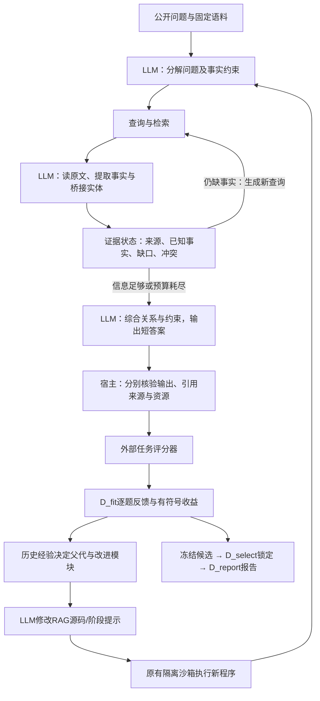

# RAG RSI：全局重构与自演化文献整合

日期：2026-10-07。范围：当前架构实读、一手论文核验、统一核心实现与零 API 工程验证。**未把离线夹具收益当成真实模型改进；本轮尚未新增付费实验。**

## 1. 当前真正的堵点

当前并非只有一个“父节点选择公式不够好”的问题。

1. **两条流程尚未贯通。** 原 RSI 主工程在 `D:/Codex/Projects/RAG_RSI_Pilot_20260919`；BrowseComp 校准在另一项目，P4根据冻结的最终片段重建请求，并未调用原程序搜索器。P5的follow-up也不是根据新读取结果在线产生。因此，检索输送的局部变化并没有完成“LLM读反馈→改程序→重新多轮检索→正确回答”的验证。
2. **回答交付仍损失严重。** P4每臂64个逻辑结果：B0交付47、截断15、格式失败2；D5交付41、截断16、格式失败7。确认正确交付分别11/64和9/64。该非官方盲评结果不支持D5改善，且不能直接当官方BrowseComp成绩。证据：`BrowseCompPlus_Calibration_20261006/runs/paid_paired_answer_P4/evaluation_public.json`。
3. **文档被找到不等于所需事实进入答案。** 词面相关、合法来源区间和LLM判断支持是不同概念。旧流程较擅长证明文字被传输了，仍缺少动态补缺口、关系核对与答案综合。
4. **经验已有，但没有充分改变下一动作。** 旧经验卡很丰富，选择却主要是固定权重质量/正增益/新颖度加softmax。负收益、中间分支与动作适用条件没有充分利用。
5. **任务与资源契约分裂。** 旧引擎2048完整消息预算、四题型MacroEM；P4使用不同输入/输出额度和独立非官方语义评测。不能在迁移时默默混算。
6. **历史续跑脚本过多。** 新实验继续叠加版本壳，会使“哪个实现生效、哪份账本权威”越来越难确定。应保留历史证据，把未来工作移到一个数据驱动入口。

这些是代码与既有结果支持的诊断。题库是否太简单、模型是否缺少推理能力，仍需受控比较，不能据低分或平局直接确定。

## 2. 补充论文能借什么

以下是本项目的迁移判断，不是论文已证明我们的方案有效。

| 工作 | 优化对象与依据 | 对本系统的直接用途 | 优先级与边界 |
|---|---|---|---|
| [TextGrad](https://arxiv.org/abs/2406.07496) | 自然语言反馈沿计算图回传到组件 | 将“答错”拆成检索、证据保留、关系推理、输出格式的具体修改理由 | 高；反馈依然可能错，不是可靠性证明 |
| [GEPA](https://arxiv.org/abs/2507.19457) / [optimize_anything](https://arxiv.org/abs/2605.19633) | 执行轨迹和可行动反馈驱动文本/代码候选演化 | 统一程序、评价器、逐题反馈接口，保留各题表现互补的候选 | 最高；真实得分与副信息分开，最终独立确认 |
| [SkillOpt](https://arxiv.org/html/2605.23904v1) | 修改可复用技能文本，不训权重 | 有界修改、明确修改目标、拒绝反馈；RAG技能如“先定位实体，再核对时间关系” | 高；Markdown优化不等同整程序搜索 |
| [ACE](https://arxiv.org/html/2510.04618v3) | 增量更新带ID的上下文经验 | 不反复重写长总结，按需提供少量适用经验与失败反例 | 高；不能在最终报告题后更新再称冻结评估 |
| [MemEvolve](https://arxiv.org/html/2512.18746v1) | 同时演化经验内容和记忆系统代码 | 明确编码、保存、检索、管理接口；分开比较新记忆与新架构 | 第二阶段；先同一快照验证，防记忆污染 |
| [Hyperagents](https://arxiv.org/html/2603.19461v1) | 演化任务代理及元代理代码 | 任务RAG程序与修改器分层，保留有用的中间程序 | 第二阶段；外层评价与选择不是无限自改 |
| [Continual Harness](https://arxiv.org/html/2605.09998v1) | 在持续环境中改提示、技能、记忆等 | 最近失败触发局部修改，而非每题无差别增加多轮审阅 | 可借调度；游戏和问答反馈性质不同，部分实验还训练权重 |
| [EnvHarness](https://arxiv.org/html/2608.19880v1) | 改环境初态、接口和组合方式，保留验证器 | fit内增加干扰文档、隐藏一跳证据、改变检索限制来诊断脆弱性 | 后续独立实验；不能改正式题库的答案定义 |
| [R-Zero](https://arxiv.org/html/2508.05004v1) | Challenger/Solver交替训练权重 | 借能力边缘练习的思路 | 暂不照搬；自投票不等于事实裁定 |
| [SkillRL](https://arxiv.org/html/2602.08234v1) | 技能库与策略权重共同训练 | 借通用/任务技能层级、失败抽象 | 暂不做权重训练；论文收益不可归给冻结API记忆 |
| [CORAL 多代理演化](https://arxiv.org/html/2604.01658v1) | 长驻代理、共享经验、异步候选探索 | 将来并行不同改进假设，并共享真实执行结果 | 后续；按全部API成本比较，不能只看评估次数 |

**需要更正两处概括。** TextGrad初稿是2024-06-11，Nature论文在2025-03发表；不宜称为“来自2025的唯一基础工作”。“2026大多都能抽象为GEPA-like”可作阅读入口，却不能当严格机制等价：R-Zero/SkillRL更新权重，EnvHarness改变训练环境，ACE改变外部上下文，优化对象、反馈来源与泛化协议都不同。

GEPA的2026 `optimize_anything`已明确支持代码、架构等文本对象，不能把当前实现仍局限地描述成只改prompt。它最值得借的是 **score + actionable side information**：分数负责比较，具体执行反馈负责告诉LLM如何改。

CORAL有同名歧义：用户所列多代理工作应指2604.01658；[推荐系统CORAL](https://arxiv.org/html/2609.02730v1)是另一篇，不能合并引用。

## 3. 仍须保留的RAG专用能力

这些通用自演化框架本身不会自动解决RAG。具体执行环节仍需借[ChainRAG](https://aclanthology.org/2025.acl-long.1089/)的缺失实体补全与顺序检索，以及[PRISM](https://arxiv.org/html/2510.14278v1)的证据需求分解。

PRISM的Adder只重看已有候选池，无法补回完全未召回的材料。本系统要显式区分“重选现有证据”和“发起新的检索”。[OpenMLE/Frontis-MA1](https://arxiv.org/html/2607.28568v1)可借动作专属经验，但其父代仍带随机抽样；本轮确定性经验控制器是我们的设计，尚非论文复现。

LLM负责语义分解、阅读、关系综合、下一查询和程序修改。宿主负责文件/网络隔离、预算、真实来源校验、冻结与评分。两者职责不同；宿主不以规则假装理解全部语义，LLM也不能自报“我答对了”当最终奖励。

## 4. 本轮落地的统一核心

入口：`python -m code_rsi.v3 offline-demo --out <本项目runs中的目录>`；可组合的生产接口为 `EvolutionRunner`。历史程序不删除、不改结果，新核心不导入旧v25*续跑壳或P4脚本。

| 模块 | 本轮实现 |
|---|---|
| `datasets.py` | MuSiQue、BrowseComp、MultiHop、BRIGHT公共输入和私有评价参考分离；MuSiQue题目局部语料；排除文档过滤 |
| `rag.py` | LLM规划→检索→LLM阅读→桥接实体/缺口→后续检索→短答案；同一核心可跑单次检索基线 |
| `infrastructure.py` | 本地语料/现有BrowseComp SQLite适配；JSON模型接口、完整请求预算、持久化响应、未知请求不重买；付费网络独立进程限时 |
| `execution.py` | 复用原有WSL沙箱，真实执行候选源码；公共服务、宿主来源验证、任务独立评分和恢复身份 |
| `experience_policy.py` | 同评价条件下的动作经验；负收益保留；确定性模块/父代探索；质量来自答案评分，诊断不冒充奖励 |
| `evolution.py` | 程序归档→修改→D_fit实测→经验→一次选择→锁定→报告；拒绝修改反馈给下一步 |

程序可修改 `rag.py` 和 `rag_core.py`，不是只能从有限动作表选参数。现阶段将文件边界限制为这两个独立候选文件；其中的LLM阶段提示和控制流程均可变化。语料服务、外部评分器、费用账本不交给候选修改。

奖惩不用一个新综合分糊住问题：答案质量、有符号父子差、交付率、引文来源合法率和成本分别保存。主交付仍按声明的任务答案指标比较；证据覆盖只能定位失败。经验模块中的不确定性惩罚是明确启发式，不冒充校准置信区间。

引用字符串在原文中存在，仅证明来源准确；不能证明引用支持结论。最终真实正确性由隔离评分器确定。无证据与错误引用单列，不能抹掉仍可判断的答案字段。

## 5. 题库安排

推荐保留现有MultiHop-RAG作回归，增加MuSiQue作可解释开发任务，BrowseComp-Plus作高难确认；BRIGHT只作独立检索验证。MuSiQue原版是每题20段上下文任务，不伪称全库检索。Full通过移除支持证据构造不可回答题，不能把全数据合库后继续用原不可回答标签。

官方分数仍按各任务定义。当前代码支持内部EM/F1，不声称已经实现MuSiQue Full成组充分性、BRIGHT nDCG或BrowseComp官方模型裁判。BrowseComp代理EM必须显式声明，不能与官方成绩混算。

详细数据与文献边界见 `v3_benchmark_decision.md`。

## 6. 验证与剩余工作

本轮零API测试覆盖动态第二跳、引用伪造、预算预留、模型坏格式、费用硬帽、重复请求复用、未知传输不计零分、角色隔离、负收益和归档恢复等。另以虚构三组故事，通过真实WSL执行根程序和一个已知修改，再进行独立选择与报告；**脚本模型、预设修改所得收益只说明链路接通。** 最新测试数与独立运行回执记录在 `v3_validation_summary.json`。

还未证明：DeepSeek在真实问题上的增益；经验选择优于固定/随机选择；技能与记忆提供可迁移收益；全局重构已达到研究目标。这些需要独立实测，不能以单元测试代替。

建议下一次实际比较先只有两臂：同一模型、同一语料、同一输出格式及预算，上线“单次检索”和“动态证据闭环”。固定小批已用开发题，同时报有效交付、答案得分、引用来源、搜索/读/呈现/作答信息流、实际费用。若动态闭环有可修复差异，再开启LLM程序修改；之后单独消融经验或技能。避免一次加上记忆自改、环境生成和多代理后无从归因。

P4的114次/45元授权对应已完成的冻结32题实验，不能默默转给新任务或新内容。当前付费试跑尚未新增；新协议应列明题目、源码/反馈发送范围和硬预算，再启动真实调用。

## 7. 精简原则

只保留一份活动运行manifest、一份费用账本、一份程序档案、一次搜索冻结、一份交付锁及一份报告。自动检查嵌入组件边界；不让多个同模型审阅者反复裁决事实，不把额外审查本身当进展。

旧结果与旧协议保留，用于追溯，不强行迁移为v3新成绩。当前重构完成的是第一段可运行基础，后续证据必须从新冻结实验产生。
