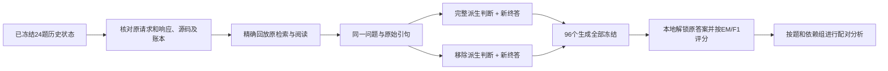

# MuSiQue 固定证据终答输入对照（2026-10-09）

状态：核心实现、独立测试与真实 WSL 脚本演示完成；本协议没有开始真实 API 调用。前一轮 24 题三条件测量已结束，本轮是独立干预，不计入前轮结果。

## 1. 要回答的问题

在检索、阅读、原问题与已验证引句完全固定时，规划／阅读产生的派生判断块，是否压低终答的质量，或诱发本不必要的拒答？

前轮三个事后案例显示了不同问题：额外时间限定、答案表达粒度、标注支持与严格证据契约的差异。它们构成本轮假设的来源，不构成总体因果证明。本轮不只挑这些失败案例，也不预设删除判断一定更好。

## 2. 完整样本与两组条件

使用前轮已用 D_fit 的全部 24 道 MuSiQue 题，按原冻结顺序，机械选取 support 条件 repeat=0 的历史状态。不查看分数挑状态、不选两次中较好的回答，不增加新题。支持原文条件有特权材料，本轮只能诊断“该固定输入下的终答转换”，不能估计正常检索流程的端到端效果。

每个状态，两组各产生 2 次新的终答，共 96 次新调用。它们仍是 24 道题、23 个已知依赖组，不能当作 96 个独立问题。

| 条件 | 终答收到的信息 | 唯一改变 |
|---|---|---|
| full_state | 原问题、原指令、原引句，加完整派生判断块 | 对照，保持历史输入 |
| evidence_only | 同一原问题、同一指令、同一原引句 | 移除下列全部派生判断字段 |

删除字段：constraints、claims、gaps、conflicts、stop_reason、unresolved_conflict_count。测的是整个块的总影响，不将结果归因于某一个字段。

保留字段：question、instructions、stage_instructions、additional_guidance、output_schema、evidence。原 instructions 和 additional_guidance 必须为空；其余提示保持原样。引句按原顺序、原 ID、原偏移和原文保留，证据记录只允许 citation_id、source_id、docid、start、end、quote、source_verified 七项。来源核验标志不代表语义充分性。

删除块也会减少请求长度，不能把本轮解释为排除了长度影响的纯粹“锚定心理机制”。它直接检验一个可部署的输入投影改动是否值得后续确认。

## 3. 链路与执行约束



- 不重新检索、重排、阅读或生成新引句；不改变模型、温度、thinking、输出上限或评分规则。
- 两组都买新终答。旧终答仅在宿主用于原始材料完整性校验，不能代替任何一组新响应，也不会作为消息发送。
- 历史搜索返回由原冻结后端在本地重建，并核对原响应哈希；历史模型结果按原问题、重复编号和完整请求体定位，不能只凭相同文本误用其他重复的响应。
- 新请求库按新协议、状态、组别、重复分别隔离；只有恢复同一请求身份时才能复用已结算响应。
- 原程序在现有 WSL 隔离环境运行。投影发生在服务调用前，宿主记录的是模型真正收到的投影请求。
- 原 26 个运行文件不修改；3 个新增辅助源码单独绑定 SHA256。源码或输入变化后必须重新冻结计划。
- 任何请求物理结果未知，保留预留费用并停止；不能自动重购或记零。已结算但输出无效的单元保留，无效单元不纳入可比较分数，也不对成功子集排名。
- D_select、D_report 及历史封存包不使用。参考答案仅在所有新生成完成并校验后由宿主读取。

## 4. 测量与分析

主指标沿用 MuSiQue Answer F1。次指标为 EM、拒答数、非拒答但 F1=0 数、非拒答但 EM=0 数、来源合法性及费用。F1=0 不自动等同无证据幻觉，F1>0 也不自动等同完整正确。

每题先平均两次回答，主差为 evidence_only 减 full_state。沿用原 23 个依赖组，按组配对 bootstrap 10,000 次，报告 95% 区间和逐题正／零／负方向。组别顺序与重复顺序按冻结种子打乱。它们是有限开发题上的描述性诊断，不是独立泛化确认。

同时报告每题重复一致率／分数波动；引用来源合法与答案语义受支持分开。无效单元会使全板质量比较不可用，不用仅成功题的均值替代。

## 5. 结果如何推进

- F1 改善、EM 未下降且非拒答 F1=0 未增加：可将该输入投影列为下一项独立确认候选；区间仍跨零时仅称初步迹象。
- 拒答减少但正确性没有改善，或错误回答增加：不视为有效改进，不直接部署。
- 无明显差异：说明移除整个派生块没有解决本批问题；不在这 24 题上反复改提示以追求过关。
- 负效应：保留负结果，说明派生判断中也可能有有用信息；不能据此立刻追加筛字段搜索并合并结果。

本轮即使正向，也不能宣称经验选择、修改器或 RSI 演化有效。后续正常检索条件／新题确认及真实程序演化须另行冻结。

## 6. 预算与入口

调用上限固定 96，单次终答输出上限 800 tokens。费用按已冻结的每一个完整请求体字节数，加 1,024 保守输入余量及最大输出费用求和；本轮完整请求体上界合计 ¥1.379624，新增硬上限 ¥2；最终计划哈希在准备摘要中列出。实际费用应单独报告，不能将最坏包络称为预计账单。

沿用指定凭据来源，但预检不读取密钥。执行需绑定本轮精确计划哈希；前一轮 528 次／¥135 授权对应已完成实验。

```powershell
python -B -m code_rsi.prepare_answer_probe --source-plan <已完成计划> --output <本轮cases.json>
python -B -m code_rsi.answer_probe preflight --plan <本轮plan.json>
python -B -m code_rsi.answer_probe generate --plan <本轮plan.json> --approved-plan-hash <已审核哈希>
python -B -m code_rsi.answer_probe grade --plan <本轮plan.json>
```

[前轮真实结果](v3_musique_calibration_result_20261009.md) · [MuSiQue 原论文](https://aclanthology.org/2022.tacl-1.31/) · [独立配对分析实现](../code_rsi/v3/paired_analysis.py)


## 7. 冻结与验收

计划哈希：`a4c5eda71687f177008397b96d6eb57a53052f857d4a10f91cb477f84116a90b`。全套679项测试中678通过、1项跳过；另有真实WSL双臂脚本测量通过，2次脚本终答、恢复新增0次。最终源码的47项新增测试再次全部通过，覆盖回放、生成恢复与历史材料准备。原草案plan.json保留；待执行版本为plan_v2.json。它们是工程证据，不是质量改善证据。

[准备摘要及源码哈希](v3_answer_probe_preparation_20261009.json)
