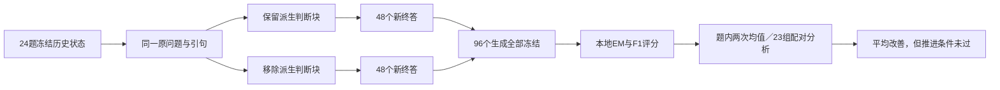

# 固定证据终答输入对照：真实结果与推进判断

日期：2026-10-09。结论：**删除中间派生判断后，本批平均 F1 和 EM 上升，但负效应与新增零分作答仍在，未满足预注册推进条件，不上线“全部删除判断块”。**

## 1. 本轮究竟测了什么

沿用已用 MuSiQue D_fit 的全部24题，机械固定前轮 support 条件 repeat=0 的历史状态；每题两条件各购买两次新终答，共96次。两个条件的原问题、终答指令和已验证引句完全相同。full_state 保留原中间判断；evidence_only 删除 constraints、claims、gaps、conflicts、stop_reason、unresolved_conflict_count 整个块。不重新检索、阅读或生成引句，模型、温度、输出上限、评分规则不变。

这是具有标注支持材料特权的固定状态诊断，材料也已用于开发。它不能代替正常检索端到端实验或独立任务确认。删除块还缩短了输入，测的是整项输入投影，不是排除了长度影响的单个认知机制。

运行源码350195b，精确计划哈希 a4c5eda71687f177008397b96d6eb57a53052f857d4a10f91cb477f84116a90b。全部生成冻结后才由本地宿主解析本轮参考答案；旧回答没有充当任一组新响应。

## 2. 完整结果

| 指标 | 完整判断 full_state | 仅证据 evidence_only | 差异 |
|---|---:|---:|---:|
| Answer F1 | 44.6759% | 55.5556% | +10.8796个百分点 |
| 完全正确 EM | 16/48（33.3333%） | 25/48（52.0833%） | +9次，+18.75个百分点 |
| 拒答 | 20/48 | 16/48 | −4次 |
| 非拒答、F1=0 | 2/48 | 3/48 | +1次 |
| 非拒答、EM=0（含部分正确） | 12/48 | 7/48 | −5次 |
| 引用来源校验通过 | 48/48 | 47/48 | −1次 |
| 同题两次回答字符串相同 | 24/24题 | 22/24题 | −2题 |

96个结果均满足执行、模型答案来源及可计分要求。引用来源校验是单列诊断，不等于答案语义充分，也不作为本轮事后删例依据。唯一来源失败为Q08/evidence_only/repeat1：模型拒答并未给引用，宿主记missing_citations；不是已经证实“编造了引用”。该结果完整保留在主分析。

MuSiQue的EM/F1沿用冻结本地规则。F1=0不自动证明幻觉，F1>0也不等于完整正确或证据充分。

## 3. 统计不确定性和重复波动

先平均每题两次，再以原23个依赖组重采样10,000次。主差 evidence_only−full_state 的F1为 **+10.88个百分点**；95%区间 **[−9.95，+30.56]个百分点**，跨零。24题中6题提高、14题不变、4题退步；不能把96个输出当96道独立题。

full_state两次重复的字符串和评分均完全一致；evidence_only有两题字符串不同，但仅一题F1发生变化，平均题内极差0.041667。当前观察到的组间效果不一致，不能简化成“全是回答随机性”。两次重复仍不足以证明未来调用确定稳定。

按本批方差和正态近似，现有规模的最小可检测效应约29.92个百分点；以10个百分点为目标时估算需约206个独立组。此为不稳定的试点设计近似，不是追加购买建议，也不是应继续扩大相同实验的理由。

## 4. 改善与退步分别发生在哪里

匿名题号仅用于本地记录对应；公开不含题面、标准答案或原始消息。

- Q03、Q09、Q14、Q16、Q22：从两次均拒答变为两次均按原评分完全正确。Q09与原先“额外时间限定可能压制回答”的假设相容，但整块删除不能定位唯一原因。
- Q05：从部分正确提升到两次完全正确。
- Q08：从两次部分正确退化为一次零分作答、一次拒答。新增非拒答F1零正来自这里。
- Q10：从两次正确变为两次拒答。
- Q12：从两次正确变为一次正确、一次拒答。
- Q19：从两次部分正确变为两次拒答。
- Q02、Q07仍保持部分正确；本改动没有解决所有答案表达或推理问题。

这说明派生判断既可能妨碍终答，也可能提供有用的联系。结果支持继续研究“如何把证据与判断分开传递”，不支持把所有判断当作无用内容。上述是按结果作出的事后局部描述，不是已估计的普遍因果类型占比。

## 5. 按冻结规则决定是否推进

| 预注册条件 | 结果 |
|---|---|
| F1提高 | 是 |
| EM不下降 | 是 |
| 非拒答F1零不增加 | **否：2→3** |
| 三项全部满足，列为后续确认候选 | **未满足** |

因此本轮不部署整块删除，不放宽门槛，也不在同24题上追加字段排列搜索来“救”结论。区间跨零也意味着稳定收益尚未确立。平均分上升、拒答减少和个别案例修复都不能单独替代该判定。

## 6. 费用、身份与完整性

- 96次新终答，96笔预留均已结算，未结算0，无账本告警。
- 输入66,066 tokens，输出2,575 tokens；按冻结价格与返回usage记账合计 **¥0.07724652**，硬上限¥2。账本计算不等同于另行核对过供应商付款账单。
- full_state：48次，¥0.03034288；evidence_only：48次，¥0.04690364。较短输入没有在本批带来较低账本费用，不能从字数直接推断价格。
- 返回模型均为deepseek-flash，fingerprint均为aeb56401ca74e127821c4f9126dcb669。别名和指纹一致不保证未来服务权重永远不变。
- 费用只含本轮新终答；历史规划、检索与阅读由冻结记录回放，不能视为正常端到端成本。
- 未使用D_select、D_report或历史封存数据。原始记录只在本地runs，公开仅聚合和哈希。

## 7. 对当前瓶颈的更新判断

题库难度不是唯一问题。本轮在固定引句下，仅改变终答输入就出现可观察差异，说明“中间判断如何影响最终回答”值得修；但正负效应并存，尚不能说该修法稳定有效。已抽引句能够传到终答，也不意味着阅读抽全了必要事实。

下一项建议是先离线审查6个改善和4个退步案例，分别标记原问题条件、原文事实与模型推测；再另立一项“终答独立核对原问题、明确把前序推测作为待验证信息”的最小改动。由LLM基于原问题和证据做判断，不写题号或答案规则。若要测试新的提示或输入表达，必须作为新版本，完整保留本轮失败条件，在正常检索状态和独立留出角色上另行确认；本报告没有启动该新实验。

反馈分层、机会覆盖与机制记忆的实现准备另在codex/v3-experience-ablation进行，不能混进本轮冻结源码，也不能将工程验收称为真实演化收益。研究顺序保持：定位终答损失 → 只修一项RAG能力 → 反馈贡献 → 经验复用／模块选择。

独立复核从已冻结分数、计划分组和账本重新计算了主统计、23组10,000次bootstrap及96笔结算，全部吻合；未读取原始API消息或参考正文。第0轮F1差+12.96个百分点（6正15零3负），第1轮+8.80个百分点（6正14零4负）。审计哈希见聚合文件。它是计算复核，不增加独立题目或消除开发材料局限。

## 8. 逐题F1（两次均值）

| 匿名题号 | 完整判断 | 仅证据 | 差 |
|---|---:|---:|---:|
| Q01 | 1.0000 | 1.0000 | +0.0000 |
| Q02 | 0.5000 | 0.5000 | +0.0000 |
| Q03 | 0.0000 | 1.0000 | +1.0000 |
| Q04 | 0.0000 | 0.0000 | +0.0000 |
| Q05 | 0.8889 | 1.0000 | +0.1111 |
| Q06 | 1.0000 | 1.0000 | +0.0000 |
| Q07 | 0.3333 | 0.3333 | +0.0000 |
| Q08 | 0.5000 | 0.0000 | -0.5000 |
| Q09 | 0.0000 | 1.0000 | +1.0000 |
| Q10 | 1.0000 | 0.0000 | -1.0000 |
| Q11 | 0.0000 | 0.0000 | +0.0000 |
| Q12 | 1.0000 | 0.5000 | -0.5000 |
| Q13 | 1.0000 | 1.0000 | +0.0000 |
| Q14 | 0.0000 | 1.0000 | +1.0000 |
| Q15 | 1.0000 | 1.0000 | +0.0000 |
| Q16 | 0.0000 | 1.0000 | +1.0000 |
| Q17 | 0.0000 | 0.0000 | +0.0000 |
| Q18 | 1.0000 | 1.0000 | +0.0000 |
| Q19 | 0.5000 | 0.0000 | -0.5000 |
| Q20 | 0.0000 | 0.0000 | +0.0000 |
| Q21 | 0.0000 | 0.0000 | +0.0000 |
| Q22 | 0.0000 | 1.0000 | +1.0000 |
| Q23 | 0.0000 | 0.0000 | +0.0000 |
| Q24 | 1.0000 | 1.0000 | +0.0000 |

[冻结协议](v3_answer_probe_protocol_20261009.md) · [聚合与记录哈希](v3_answer_probe_result_20261009.json) · [前轮MuSiQue校准](v3_musique_calibration_result_20261009.md)
