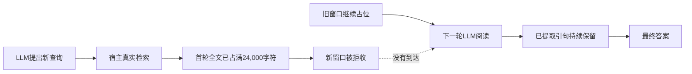

# v3 首轮真实校准：结果与信息堵点（2026-10-07）

**运行完整结束，动态流程出现了一个题目的重复命中，但多轮新增资料进入阅读的链路仍被上下文管理堵住。**

## 1. 结果

代码版本 `0fcb73d04c22256aed2ee649280d97651aafecbb`。方案哈希 `c0b457fc2ce4188f61844c36befe23bc46627547223e42cc9cdbace970616d0f`。8道已用开发题、两臂、各两轮重复，共32个结果；生成全部冻结后才在本地读取参考答案。

实际105次调用，输入446,646 token、输出29,007 token；按保守高峰价格记账 **¥1.01144848**，低于授权硬上限¥30。无未决请求和费用告警。这个数字是保守价格估算，不等于供应商最终发票。

| 指标 | 单次检索 | 动态流程 |
| --- | ---: | ---: |
| 预定结果 | 16 | 16 |
| 执行完成 / 隔离核验 | 16 / 16 | 16 / 16 |
| 截断或模型格式错误 | 0 | 0 |
| 规则EM匹配 | 0/16 | 2/16 |
| 规则EM / token F1均值 | 0 | 0.125 |
| 模型/候选报告弃答 | 16/16 | 14/16 |
| 最终有精确来源引文 | 1/16 | 3/16 |
| 最终回答输入含证据 | 2/16 | 9/16 |
| 逻辑模型调用 | 32 | 73 |
| 保守折算费用 | ¥0.15752424 | ¥0.85392424 |

原始自动诊断把28次`missing_citations`合并记作`invalid_answer_citation`。独立复核表明，这28次全部发生在模型报告信息不足的弃答中，真正的伪造引用ID或引用不一致为0。新代码已拆分“缺少引用”和“无效引用”，不改写本轮旧冻结统计，也不改变答案分。

“答案字段可用”均为100%，但这里包括“信息不足”的弃答，不等于正确回答覆盖率。引用有来源也不等于它支持答案；例如弃答也可能附上已发现但不足的证据。

两条EM命中均来自同一道题的两次重复，等价于8题中1题改善。内部规则代理差为+12.5个百分点，但只有8个题级统计单位、且题目已用于开发，两臂实际成本也不同。**不能宣称官方BrowseComp准确率提升，不能宣称已证明泛化或RSI演化有效。** 本轮没有进行模型程序修改或额外语义裁判。

## 2. 信息在哪里断开

所有16条动态轨迹都进行了多轮阅读。首轮阅读之后，一共又执行49次检索；进入后续阅读窗口的新来源数量却是 **0**。这16条轨迹的各轮阅读窗口均没有改变，并都记录了`source_budget`。

原因在原`rag.py`的`search()`：

```text
room = max_context_chars - usage[source_chars]
```

`source_chars`累计记录已经加入的全文字符，永不释放；`sources`只追加。首轮五个4,800字符窗口占满24,000字符后，下一查询即使找回新内容，也没有位置加入。三个阅读轮次于是反复处理首轮材料。



这不是“后续查询没有调用”，也不是“所有引用都被丢弃”：已单独核对的一条动态轨迹中，13条原文引句、合计1,034字符，全部通过宿主来源校验并进入最终回答请求。模型最终仍判信息不足。该例只能证明引用传输成功，不能证明这批材料足够回答。

本轮两条命中也不能归因于“后续找到了新证据”。独立复核确认：两次命中的最终引文分别4条和1条，首轮已全部通过来源核验；同题single与loop首轮文档交集为0。因此差异包括首轮查询规划、多查询和重复阅读，不是单纯增加循环轮数的消融。loop费用约为single的5.42倍，不是等实际成本比较。

## 3. 修复方向

将全文阅读窗口与持续证据记录分开：

1. 每轮为新检索窗口重新分配空间，同轮多个查询按排名交错入窗，避免第一个查询占满。
2. 已经核验的短引句、事实、桥接实体及未解决冲突保留；最后回答仍能引用前轮证据。
3. 来源ID全轨迹唯一；“曾经看过”和“当前窗口中存在”分别管理，不能把未真正呈现的材料永久去重。
4. 不增加模型调用或轮数；源正文每轮仍最多24,000字符，完整消息继续受原有payload和字节上限约束。累计看到的正文量另行记录，不能与单轮驻留量混淆。

该修复已应用到主源码，新增长窗口回归后270项测试通过。真实WSL中第一轮24,000字符、第二轮6,000字符的新来源进入阅读，最终保留前后两条精确引用；完整演化合成流程也通过。原始付费对照与冻结成绩不改写。以上证明机制修复，真实收益仍需[修复版复测](v3_rolling_protocol.md)。

## 4. 文献与本项目的关系

[The Complexity Trap](https://arxiv.org/abs/2508.21433)在软件工程任务中比较了简单遮蔽旧观察与模型总结，支持先用简单窗口管理作为基线；它没有证明本项目RAG会提高，因此不照搬其收益数字。

[AgentFold](https://arxiv.org/abs/2510.24699)把上下文当作可主动管理的工作空间，并保留关键细节；其训练过的Web代理不是我们的冻结API。本项目借用“工作窗口可变化、关键证据持久保留”的设计思路，不增加训练或新的总结代理。

这也补足此前GEPA/TextGrad式反馈的前提：必须先让程序的修改真正改变模型看到的信息，反馈才有可行动的内容。ACE的增量经验适合保存跨尝试的教训；题内证据窗口管理与跨题经验库仍应分开。

## 5. 复核与复现

- 本轮源码已推送，GitHub测试：[通过记录](https://github.com/2749111465lin-hue/rsi-agent/actions/runs/37642774669)。
- 运行前251项测试及真实WSL合成演化/校准均通过。真实校准随后暴露了长窗口场景遗漏，说明合成短文测试不足以覆盖实用边界。
- [脱敏结果JSON](v3_calibration_result.json)包含聚合量及匿名题级结果；完整题目、参考答案、调用记录、账本和盲评包留在本地runs中，不上传Git。
- 不把旧P4结果与本轮混算；模型思考模式、输入/输出契约、运行路径已不同。
- 冻结报告使用当时的源码。新实现若要重算旧结果，需要明确评分版本；不覆盖旧冻结文件。
