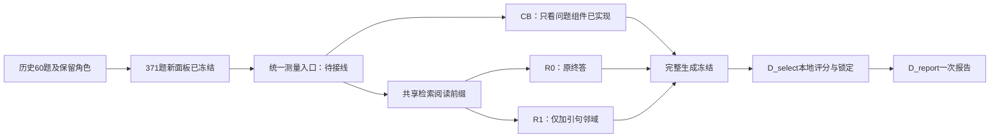

# 闭卷组件与新面板：实现、容量修订和验收

日期：2026-10-09；开发分支：`codex/v3-experience-ablation`。

**本轮完成：真正只看问题的闭卷组件，以及96道开发题、107道选择题、168道报告题的本地冻结。总计371题，每题在实际入选集合中占一个已知依赖组。尚未在这些题上调用模型，统一三条件测量入口仍待接线；没有新增质量成绩。**

这是对“扩大有效样本、增加闭卷基线”的执行，不继续购买旧24题的重复回答。原付费实验的评分、失败判定和冻结源码不变。

## 1. 已实现的闭卷条件

闭卷输入仅含原问题，提示明确允许使用模型自身知识；不把“只能依据引句回答”的RAG提示套在空材料上。保持现有模型服务封装、温度0、关闭thinking、默认800输出token和1000字符答案上限；正式模型身份仍须由下一份计划冻结。

- 程序只发一次终答请求，检索、文档读取上限均为0，后端也拒绝这两项能力。
- 宿主固定问题和提示版本，候选不能夹带文档、前序判断或另一个问题。
- 返回答案必须等于实际模型输出；沿用原请求身份、费用账本、未决请求停止与恢复规则。
- 普通执行收据中的空引用仍为来源未认证；闭卷报告单独显示“引用来源不适用”，不伪造来源有效。
- RAG的原提示、证据要求与默认行为没有放宽。

新增20项组件测试。另在真实WSL隔离中执行“脚本回答”和“脚本拒答”两例：每例均为1次模型服务、0次检索、0次读取，答案来源及隔离验证通过。这里模型服务由虚构响应提供，**外部API为0，不是闭卷质量实验**。

闭卷答对只能说明该输入下模型可直接作答，不能逐题证明参数记忆、训练污染或RAG是否真正依赖证据。后续保留闭卷/RAG对错交叉表；qrels仅确认支持文档成员覆盖，语义支持仍需独立审查。

## 2. 新面板先解决什么

旧准备器只处理单次分割，没有跨实验历史输入；同一角色内还允许共享组成题。新版是明确的schema3，原schema2行为保持。

已登记的历史包含24题开发曝光和36题保留角色，共60题。按两个维护工作区的已知面板和计划盘点，没有发现这些计划中的额外MuSiQue题号；这不保证知道所有历史访问。旧保留角色不改写。

新版检查题号、原题组、规范化问题、单跳题ID、绑定实体后的子题文本、支持段落。任何新候选若与历史直接共享这些单位即排除；新入选题之间也禁止共享，包括角色内部。最后在“历史＋实际入选题”上重新验证依赖连通关系。

可信本地准备器为分组读取了私有标注，包括组成题答案。它们只形成身份判断和哈希，不进入公开任务字段、模型请求或修改器；没有读取模型成绩选题。不能把这一步表述为完全没有读取参考。

## 3. 两个抽样规则校正

### 3.1 占位符不等于同一道问题

“Where is #1?”在不同样本中可能指向不同实体。直接用这个模板连组会形成最大15,516行的组件，是过度合并。现在只在前序引用明确时，使用对应前序标注答案绑定后比较文本身份。

全数据有2处自然数字/非前序引用无法这样解析。仅跳过这两个额外文本身份边，保留原题、单跳ID和支持段等其他检查；不删题，也不把所有异常连到同一个假单位。[官方格式转换脚本](https://github.com/StonyBrookNLP/musique/blob/922ac98f19a201998dbdae6d7f2887a5258dbdeb/raw_data_to_official_format.py)也显式处理了自然语言中类似数字符号的情况。

### 3.2 未使用的桥题不等于历史曝光

若已用A包含x，未使用B包含x、y，候选C只包含y，B存在于题库中不意味着y已被实际曝光。主抽样规则因此检查实际历史和入选样本；全题库传递闭包仅作为更保守的敏感性结果。

实际检查：22,355行中1,431行因直接历史关联被排除；旧保留题与已用题的直接关联为0。全库闭包下有6道旧保留题可经未用桥题相连，**不能把这6道宣布为实际泄漏**。

[MuSiQue论文S5](https://aclanthology.org/2022.tacl-1.31.pdf)讨论了实际分割之间的组成题、支持段及答案重叠。本项目借鉴组成关系隔离，schema3不把常见答案字符串单独作为依赖边，也不保留schema2的额外答案字符串排除。因此这是明示的新采样政策，不是原官方分割的完全复现。

“已知单位互斥”仍不保证潜在主题、语义改写和实体依赖全部消失；不把371题宣称为严格统计独立的随机样本。

## 4. 原均衡目标不足，另立可行规模

原待检查目标为96／120／240，二、三、四跳各占三分之一。固定种子和排序下只有下表数量，原运行保存为`quota_shortfall`，未发布不完整面板。这是该确定性算法的缺额，不是所有抽样算法都不可能满足配额的证明。

| 角色 | 原目标 | 新冻结题数／已知组数 | 二跳 | 三跳 | 四跳 |
|---|---:|---:|---:|---:|---:|
| D_fit | 96 | 96 | 32 | 32 | 32 |
| D_select | 120 | 107 | 40 | 40 | 27 |
| D_report | 240 | 168 | 80 | 68 | 20 |
| 合计 | 456 | 371 | 152 | 140 | 79 |

**修订先于模型测量冻结，直接采用原确定性抽样已选出的身份，不再换种子、顺序或规则搜索更多题。** 新配额准备成功，逐角色题目和顺序与原容量检查完全一致。旧不足文件保留，新面板使用独立设计标识`musique-independent-evidence-capacity-v1-20261009`。

报告主统计按题目等权、题内先平均重复；另列每个跳数的结果和区间。168道报告题中四跳只有20道，所以不能称三类等权，也不能靠总体结果证明四跳任务稳定获益。168题进入原建议的100–200规模，但不是功效保证；邻域干预的真实方差和效应未知。

所有新题先登记为其对应角色的预留项，下一份历史清单包含原60＋新371＝431项。新面板的D_select/D_report未用于模型测量、调参或交付选择。

## 5. 准备器还修复了一个实际交接漏洞

独立复核构造反例：准备成功后意外截短某角色的公开题目列表，旧writer仍可能依据`status=ready`发布。新版在创建目录前重新核对角色配额、题号顺序、参考键、组映射、成员角色、原始候选审计和跨角色唯一性。

截短、换题号、遗漏参考、共享组、错角色等反例均拒绝；历史清单内部的既有关联仍允许保存。这是修复文件交接完整性，不增加人工审批，也不改变采样算法。

## 6. 验收与文件边界

- 全套 **854项：853通过、1项跳过**，耗时154.193秒；跳过为显式环境条件测试。
- 新旧准备器45项通过，含7项发布边界测试；闭卷组件20项通过。
- 额外2次真实WSL合成执行通过，外部API 0、费用¥0、未读取凭据。
- 本地面板7份数据/分组文件的哈希全部复核；新身份与原选中身份逐项一致。
- 未提交题目、参考答案、组成题标注、原始上下文、API消息或私有审计明细。公开仅实现、测试、聚合与哈希。
- 原旧24题邻域待执行方案未修改；当前源码下零API预检明确拒绝：`runtime or answer-probe source changed after freeze`。历史预检通过不等于现在可执行，也不是新面板授权。

[脱敏验收与文件哈希](v3_closed_book_panels_20261009.json)

## 7. 现在距离真实比较还差什么

继续复用现有`calibration.py`生命周期，增加明确的新协议，不复制第三套运行器。最少必要接线：

1. 新入口绑定面板manifest、groups、历史、容量修订及各角色文件哈希；正常RAG后端不读取gold支持投影。CB使用单独源码、模型提示和零检索限制。
2. R0/R1共享当前题、当前角色、当前重复的完整检索阅读前缀；终答按臂分开请求bank。即使两份终答正文偶然完全相同，也各生成一次，恢复时不重复购买。
3. 检查全部终答前请求与响应，不能只检查第一次规划/阅读；R1去掉合法context后须等于R0完整终答输入。没有可附加邻域的题仍保留，不按交付成功筛样本。
4. 阶段路由继续传递宿主超时。逐阶段复验缓存身份，未知物理结果停止，不能换bank重购。
5. 每个角色全部题×臂×重复生成冻结后才本地解析评分；D_select锁定R0/R1交付，CB不参选，再允许D_report，报告分数不改赢家。
6. 正式请求数量与费用上限由最终配置计算、冻结后再执行；本轮没有提出或使用新的付费授权。

若每题正常流程最多K次、R次重复，共享前缀后每角色的调用上限为`R × N × (K+2)`。先核验实际K，不能把旧短终答单价直接当整个端到端流程的费用上限。

假设与证据分层、原题约束锚定、句段边界吸附仍分别留作后续版本。现在已有可运行的组件与可用新面板，尚无新答案质量结果，也尚未完成真实反馈演化或经验选择收益验证。
