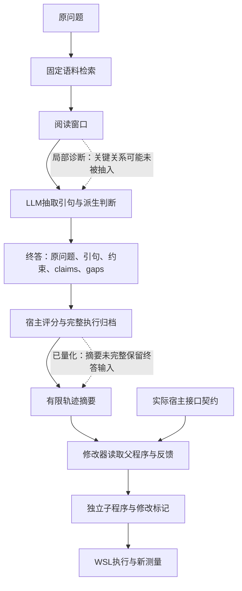

# 证据到答案、轨迹到修改：两条信息链的复核（2026-10-09）

## 当前判断

问题不能只概括为“检索结果没有传过去”。旧 12 题的复核发现两种不同的压缩：阅读器将原文抽成引句，修改器反馈再将真实执行状态抽成短摘要。文档和引句身份能够传递，仍可能遗漏答案所需关系，或者让修改器看不到实际终答输入。

本报告审计全部旧 12 题、全部 72 次固定前缀终答，没有按正负收益筛选。此诊断零 API。另行授权的四提案试跑只测试共同宿主契约，不接入本报告的反馈草案；[冻结范围](v3_runtime_contract_trial_20261009.md)。

## 1. 两条链路

“合法引句”仅表示原文位置可核验；“来自支持文档”仅表示文档身份命中。两者都不能机械证明答案有充分支持。

## 2. 问答链路的机械核对

| 项目 | 结果 | 能说明什么 |
|---|---:|---|
| 标注支持文档 | 36 篇 | 全 12 题的分母 |
| 实际检索到的支持文档 | 30/36 | 六篇在最早阶段缺失 |
| 已检索到的支持文档进入阅读、引句、终答 | 各 30/36 | 后续没有再丢文档身份，不代表每篇关键关系都保留 |
| 所有支持文档均贯穿的题 | 8/12 | 覆盖完整仍不等于语义充分 |
| 完整覆盖但六次新终答均拒答的题 | Q04、Q11、Q12 | 值得核对引句内容，不能直接判模型过度保守 |
| 终答引句 | 57 条 | 引句本身原样可追溯 |
| 36 份程序—题目终答输入的原文邻域扩展 | 0 | 本轮仍是抽取引句而非带邻域原文 |
| 返回答案逐字等于最终模型原始答案 | 72/72 | 排除本轮候选用后处理改写答案的解释 |

缺文档仅见 Q05（1 篇）、Q07（2 篇）、Q09（2 篇）、Q10（1 篇）。这一分布不能用来事后筛掉难题。

Q06 根程序两次终答输入完全一致，一次拒答、一次 EM 满分；两个子程序四次均拒答。因此差值确实包含生成波动，也不能因子程序更保守就推断其更正确。Q03 的局部 F1 改善对应预测比唯一参考多一个词的现象；字符串差本身不能裁定合法别名。

用户授权后已完成全部 12 题原文复核。性质是看过结果和参考的助手事后诊断，不是独立盲审，不产生替代 gold，也不改旧评分或剔除样本。机械审计原来的未知字段保持历史状态，新增意见另存记录。

| 题目 | 实际阅读全文 | 最终引句 | 本次定位（事后判断） |
|---|---|---|---|
| Q01 | 可形成答案链 | 可形成答案链 | 表达粒度与参考字符串的差异，不能归为传输失败 |
| Q02 | 有歧义 | 有歧义 | 问题与参考可能采用不同范围，需独立裁定 |
| Q03 | 可形成答案链 | 可形成答案链 | 全称／简称及额外词造成部分分差，保留原评分 |
| Q04 | 可形成答案链 | 不足 | 抽取的关系片段漏掉紧邻的关键值；claim 有该值而合法引句没有 |
| Q05 | 不足 | 不足 | 当前缺关键事实，不能靠放松终答拒答补齐 |
| Q06 | 可形成答案链 | 可形成答案链 | 原问题要求年份，模型自报缺口要求更精确时间；是否导致拒答仍待干预 |
| Q07 | 有歧义 | 有歧义 | 实体与关系连接存在范围疑点，不能只凭同名串链 |
| Q08 | 可形成答案链 | 可形成答案链 | 模型有 gap 自报但六次均命中，说明 gap 不能自动否决回答 |
| Q09 | 不足 | 不足 | 当前缺必要人物关系，参考链的范围也有待核对 |
| Q10 | 不足 | 不足 | 当前缺必要时间事实，参考链另有实体切换疑点 |
| Q11 | 有歧义 | 有歧义 | 问题预设与间接关系不够明确，不能判定为无故拒答 |
| Q12 | 有歧义 | 有歧义 | 一项自报缺口已被原引句覆盖，冲突混淆不同统计口径；整条链仍有间接关系 |

最终引句分为可形成答案链 4／不足 4／有歧义 4；实际阅读全文为 5／3／4。这些是开发诊断计数，不能当成独立正确率、监督标签或质量门槛。Q04 提供了明确的局部抽取损失证据；Q06／Q12 提供了前序判断需复核的例子，尚未证明删除或弱化判断一定提高成绩。

## 3. 修改器实际看到多少信息

从旧完整请求和 12 题冻结执行状态重算：

| 信息 | 原实际状态 | 旧 trace 展示 |
|---|---:|---:|
| 阅读阶段合法引句出现记录（可能重复） | 64 次 | 21 次样例 |
| 最终输入的引句 | 57 条 | 20 条在结构化引句样本中完整保留 |
| 最终 constraints／claims | 实际传给终答 | 未作为完整结构化字段提供 |

独立复算确认：若搜索旧案例的任意字符串，另有 3 条终答引句在其他字段或片段中完整出现，共 23/57。因此不能说余下 37 条文字全部不可见。64 次出现记录在每轮去重后为 60，跨轮去重为 57。

旧 trace 省略 43 次引句出现记录、5,738 个引句字符。这是现有摘要规则的结果，不是网络丢包。64 次出现记录与 57 条终答引句不是同一分母；字符省略量也不能当成事实丢失量。

代码定位：`v3/diagnostics.py` 的 execution_flow 采用每轮引句样例等上限；`v3/feedback_conditions.py` 的模型细节只保留 gaps／conflicts。对终答模块的修改而言，完整终答状态字段比大量计数、哈希和短样例更贴近被修改对象。这是可检验的设计判断，不是已测得的收益。

## 4. 离线投影的容量结果

一个未接入运行的草案，保留全部共同问题、预测、分数和父源码，把反馈重点改为完整最终 constraints、claims、evidence、gaps、conflicts 及各轮进度。

| 完整 provider 请求 | 字节数 | 距 120,000 上限 |
|---|---:|---:|
| 旧 trace 加共同宿主契约 | 119,055 | 945 |
| 终答输入优先的草案 | 106,820 | 13,180 |

草案保留全部 57 条终答引句及七个终答状态字段（constraints、claims、evidence、gaps、conflicts、stop_reason、unresolved_conflict_count）。原问题另在共同案例字段保留。它没有复制该终答请求中的 instructions、stage_instructions、additional_guidance、output_schema，不能称为完整终答请求。这表明问题并非只能通过扩大输入限额解决。但草案增加终答状态、移除部分旧轨迹元数据，**不是无损压缩，也不是同信息量对照**。它未发送 API，未接入 ProgramDeveloper，未改变已授权试跑。

独立复算已验证实际请求构造器的上述字节数、共同字段、全部 57 条 evidence 的值与顺序；并修正原草案将完整请求哈希命名为反馈文件哈希的问题。原草案保留，报告采用新增 verified_audit。

### 原文邻域的零 API 检查

保持已有 256 字符规则，不调整半径：全 12 题 57 条引句中，56 条有可恢复的原窗口邻域，56 条全部容纳，0 条因预算舍弃；剩余一条已覆盖其原窗口。最大终答请求 11,799 字节。除 context 附加字段外，其余输入逐值不变。

Q04 的原引句区间为 [91,146)，复核标记的完整关系区间为 [70,147)；既有邻域恢复至 [0,402)，原文和哈希验证覆盖该片段。这只证明信息能恢复，尚未证明模型能用它答对。

按旧冻结价格和原保守公式，全 12 题两臂各两轮的 48 次终答费用上界为 ¥0.95874；这是离线容量估算，不是本轮已授权试跑的一部分，也没有发起这些调用。

## 5. 文献能支持什么

[Sufficient Context](https://arxiv.org/html/2411.06037v3#S3.SS1) 将“给定材料是否足以回答”与“模型是否答对”分开；允许组合已给事实，但不能凭空补关系。它还显示单凭不足判断强制拒答并不保证总体效果。这里借鉴的是分层诊断，不引入新的自动裁判硬门槛。

[IRCoT](https://aclanthology.org/2023.acl-long.557/) 把检索推理与最终阅读回答区分开，支持重新从证据综合答案这一候选方向。其模型、检索和示例设置与当前系统不同，不能把论文效果直接当作本项目修复证明。

## 6. 下一步选择规则

1. 先完成当前冻结的四提案试跑，完整报告所有机会和有效子程序；不在中途换反馈。
2. 若原文复核确认“窗口有关系、引句没有”，优先单因素测试已有的有限原文邻域恢复，固定检索、引用、评分和题目；不同时改拒答提示。
3. 若主要问题是引句足够而派生缺口要求过严，再单独测终答重新综合证据、将先前推断作为假设的方式；不把全部 gaps 当成错误。
4. 修改器下一版本可比较案例反馈与完整终答状态反馈，明确改变信息条件；不将有限 trace 的结果泛化为所有执行反馈无效。
5. 开发题诊断完成后，才冻结方案进入尚未测量的新面板。旧 12 题不能提供跨题泛化证据，当前不启动经验选择或元重加权。

[机械与容量汇总](v3_evidence_feedback_review_20261009.json) · [72 次真实终答结果](v3_program_suffix_result_20261009.md)
