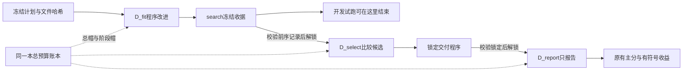

# 程序改进分阶段入口：实现与验收

日期：2026-10-09。对应第一阶段论文计划P4第1项。本次不改问答算法、模型、评分、选父规则或反馈内容，没有新增付费调用。

## 1. 解决的实际缺口

此前 `EvolutionRunner.run()` 会依次跑完开发、选择、报告；实时入口预检会解析三个角色的参考答案。仅验证修改器也必须携带正式保留面板，不适合当前“先在已曝光题上试跑，再决定正式规模”的安排。

新入口支持两种冻结范围：

- `phase_order=["search"]`：只绑定真实D_fit，完成搜索冻结就结束；不要求伪造选择或报告面板。
- `phase_order=["search","select","report"]`：事先绑定全生命周期，但每次调用必须明确一个阶段，不能自动串完。

`search`结束只说明候选开发测量完成，不能称交付或正式报告已完成。旧schema1/2的完整运行方式、缓存bank和报告格式保留；其历史冻结源码哈希不能被当前版本冒充。



## 2. 接口与数据边界

正式入口新增 `rag-rsi-live-evolution-3`，沿用原schema2控制字段，增加 `phase_order` 和 `reference_groups_file`。后者绑定一个不含答案的准备元数据文件：

```json
{
  "schema": "rag-rsi-role-reference-groups-1",
  "groups": {"D_fit": {"question-id": "source-group-or-null"}}
}
```

组值必须是真实参考中 `pair_group_id` 或回退 `source_question_id` 的字符串，缺失时用JSON `null`，不是字符串"null"。完整生命周期覆盖全部角色和题号；它用于提前检查跨角色来源组重叠。进入某阶段解析参考后，再核对组身份一致。元数据不是新的独立性证明，仍受原准备器的历史盘点及直接重叠口径限制。

预检可以读取公开题目与组元数据，并对参考文件**读取原始字节计算哈希**；它不解析参考JSON。不能把这一点写成“完全没有读取参考文件”。运行时：

1. 先验证计划、运行源码、输入哈希、此前请求及账本。
2. 验证所需前序阶段收据及其绑定的文件。
3. 只解析当前阶段的参考答案，核对身份、题号、组和可评分性。
4. 首次确实需要新模型请求时，才读取凭据、建立传输。

完整计划的公开保留题目可被宿主读入做防重检查，但不会进入修改器反馈。仅搜索计划根本不包含后两个面板。

核心新增 `run_phase(phase)` 与只检查、不解锁答案的 `check_phase(phase)`。新生命周期调用旧 `run()` 会拒绝。三阶段沿用同一测量实现、归档、隔离与评分，不另建搜索系统。

## 3. 冻结、恢复和预算

每阶段完成时保存 `phase_search.json`、`phase_select.json`、`phase_report.json`。收据绑定：运行清单、归档源码和谱系、搜索顺序、步骤记录、已有测量JSON清单、前序收据，以及选择锁或报告。另有收据自身哈希。

恢复完成阶段只做完整性验证并返回原结果；不重调修改器、不重新测量、不解锁参考、不建立传输。未完成阶段沿用原请求检查点与逐题测量缓存，保存后崩溃可以续上，未知物理请求结果仍停止，不能重试成新请求或记零。

测试发现过一项真实缺口：删除搜索收据中的某个测量承诺后，原验证只检查剩余承诺。已补测量清单和必须包含的前序收据，并用反例验证。收据是受信宿主上的完整性检查，**不是数字签名**；不声称可抵抗宿主同时篡改全部材料并重算所有哈希。

保持同一个运行账本，每次请求同时计入 `run` 和 `phase:search/select/report`，不能靠换阶段重新获得预算。阶段调用帽为：

- 搜索：`(E+1) × N_fit × R × H + E`。
- 选择：`min(K,E+1) × N_select × R × H`。
- 报告：`2 × N_report × R × H`。

仅搜索计划只有第一项。完整计划总帽仍是三项之和；费用使用相同完整请求输入、各类输出和价格包络。缓存复用可能减少实际调用，不能算独立重复。

schema3命令需显式阶段，例如 `python -m code_rsi.live_evolution preflight --plan <冻结文件> --phase search`。实际执行另需原有 `--execute` 与准确计划哈希。预检结果明确 `phase_prerequisites_checked=false`：预检通过说明静态方案可行，不代表前序阶段已经完成、预算已获批准或已调用模型。

## 4. 验收证据

新增核心阶段测试24项、实时入口测试16项；覆盖只用D_fit、惰性参考解析、越级拒绝、记录篡改、收据遗漏、各阶段崩溃恢复、完成阶段零新请求、同一本账本双作用域、未知请求阻止继续。

完整回归894项：893通过、1项显式WSL回归跳过，耗时179.226秒；另有下述实际隔离演示。跳过的测试不能计为通过。[机器可读验收摘要](v3_evolution_phases_20261009.json)。

本次额外进行了两组**真实WSL隔离、脚本模型**演示：

| 演示 | 实际隔离测量数 | 额外结论 |
|---|---:|---|
| 核心三阶段 | 6 | 各阶段仅解锁自己的参考；恢复不新增解锁 |
| 新实时入口三阶段 | 5 | 同一本阶段账本；脚本调用7/6/2；重复执行三阶段不建立新传输 |

第二组报告赢家为根程序，交付与根使用同一已冻结测量身份，因此报告没有重复购买相同根结果。两组的执行与答案来源校验全部通过，外部API为0，凭据读取为0。虚构脚本知道答案和改动，**没有真实修改器或质量收益证据**。原始合成产物在本地 `runs/stage_one_paper_20261009/phase_wsl` 与 `phase_live_wsl`，公开只提交摘要。

已用12题的cases/trace单搜索参数也通过新入口静态预检：每条件4次提案，结构上限424调用，费用包络¥110.596352，单搜索硬帽草案¥110.60。两次预检均未创建执行目录、未绑定正式保留面板、未解锁参考或读取凭据。准备不含答案的组元数据时，可信准备步骤本地读取了这些已用题的参考，须与预检本身区分。这还不是配对区组编排已完成、出站反馈尺寸已通过或预算已批准。

## 5. 当前论文进度与剩余事项

| 项目 | 当前状态 |
|---|---|
| 三阶段论文路线、主要比较与数据用途 | 已写入主计划 |
| 96/107/168容量版本及曝光口径 | 已完成准备，未新增模型测量 |
| 开发搜索可单独结束 | 本次实现并验收 |
| 同一区组cases/trace共享冻结根反馈、跨区组独立 | 试跑编排尚未完成；不能以各自重新跑根冒充配对共享 |
| 12例完整修改器请求大小 | 仍须实际出站验收，不对trace单臂随意截短 |
| 连续受控反馈、prompt_only编辑限制、伪候选与搜索层统计 | 待按原计划逐项实现；未在本次一起改 |
| CB/R0/H正式统一测量接线 | 组件有了，完整入口尚未完成 |
| 新16提案的真实试跑 | 草案仍未可执行、未获新增授权、未启动 |

此次只移除了“试跑必须消费保留集”的障碍，没有把第一阶段论文或完整双循环宣告完成。下一步先补试跑编排和完整反馈大小验收，给出具体可审的真实调用计划，再申请该范围预算。原试跑草案的¥443为保守硬帽建议，既不是预计账单，也不是本轮授权。
