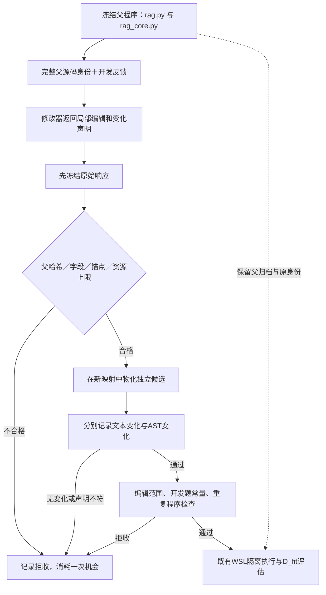

# Exact edits：把修改意图落成独立子程序

更新：2026-10-09。当前状态：**用户已授权本轮范围；兼容修复已完成并重新冻结，最终入口29项通过，准备启动。** 这份文档记录工程改动与试跑契约，不报告尚未发生的真实收益。此前私有草案保留原样，不能在生产源码变化后继续作为可执行计划。

## 1. 这次修什么

上一轮12道已用开发题、两区组、16次提案机会全部完成，13次响应不是合法JSON，3次合法响应没有AST变化，接受子程序为0。已收到响应均正常结束，不能把失败简单归因于输出截断。部分文字说明声称改了流程，实际返回源码仍与父程序AST相同。[旧轮完整结果](v3_paired_modifier_result_20261009.md)

本次让修改器返回明确的局部替换，由宿主在父程序副本上构造独立候选，再分别核对声明、源码变化和AST变化。它解决的是“提案是否真实落地且可追溯”；RAG质量、失败反馈的价值和完整自改进闭环仍需真实测量。

## 2. 父程序、提案与子程序怎样隔离

父源码映射不就地修改；每个编辑都定位于原始父文件，然后按位置从右到左应用。不会让前一条编辑创造后一条编辑的锚点。候选归档与父节点独立关联，不能以覆盖父文件来冒充新节点。这里是宿主归档与校验约束，不是一般安全性证明；候选仍须在既有隔离沙箱运行。

## 3. 三层变化标记

| 层级 | 字段 | 来源与含义 |
|---|---|---|
| 模型声明 | `change_status` | `modified`或`no_change`，只记录模型意图 |
| 完整源码变化 | `source_changed` | 宿主比较完整父子源码文本，保留换行和Unicode |
| AST结构变化 | `ast_changed` | 宿主解析后比较AST；不证明实际行为或答案质量变化 |

`no_change`必须带空编辑列表并说明原因；它形成可审计回执，随后拒收，仍占用一次提案机会。`modified`必须有实际编辑；仅加空白等“文本变、AST不变”的候选不会执行。无法物化的非法锚点或父哈希失配属于结构拒收，不伪造子程序、分数或测量结果。纯文本编辑也可能让多个替换相互抵消，最终是否改变由宿主计算。

`mechanism`继续作为开发者的解释保留，不升级成已验证事实。实际模块归因仍由AST范围观察决定；声明的`intended_target_module`不构成因果证明。

## 4. 版本与精确编辑契约

- 提案协议：`rag-rsi-proposal-protocol-1`，支持显式`whole_files`或`exact_edits`。
- 分阶段入口：`rag-rsi-live-evolution-5`，同时冻结编辑政策和提案表示。
- 配对入口：`rag-rsi-paired-development-2`，使用对应schema5的仅搜索模板。
- 旧协议保留兼容入口与原提示合同；新版本不能接管旧冻结运行。

本轮使用`program`编辑政策与`exact_edits`表示。最多8条编辑，全部`old`与`new`合计最多12,000字符；仍只允许`rag.py`和`rag_core.py`。这不是将搜索限制为提示词修改。

响应必须包含完整父源码身份、`change_status`、`edits`、`mechanism`和意图模块。每条编辑只有`file`、`old`、`new`三个字段；`old`非空且必须在原父文件中恰好出现一次，包括重叠匹配也计为多次。编辑区间不得重叠，相邻区间允许；允许删除，插入须依附唯一的非空旧片段。不使用模糊匹配、正则补丁、自动修复或代码执行来寻找锚点。

父子源身份使用`budget.digest`对完整文件名到源码文本映射计算哈希，并非单个文件原始字节SHA。物化回执只保存文件、字符范围、旧新片段哈希和父子身份，不将源码摘录复制到公开收据。原始模型响应只留私有运行目录。

协议同时进入计划、模型身份、系统提示、用户负载、开发者快照与恢复检查。原响应、物化回执和变化回执会在恢复时重新核验；缺失或漂移不得转成新的购买。每个提案槽仍有独立请求银行，两条件共用同一区组的根测量。

## 5. 已有验证与正在补的兼容项

已完成schema5三阶段的真实WSL合成验证：4次提案，1次明确不修改、1次仅文本变化、1次父哈希错误、1次真实核心AST变化；前三次拒收，1个候选允许执行。总计6次真实隔离测量、13次脚本响应；答案来源与执行校验全部通过，父子程序身份不同，完成阶段恢复新增调用为0。题目与响应是合成材料，外部API调用、凭据读取均为0。这是工程证据，不是模型代码改进成绩。

首次全量运行1028项，报告83个错误、1个失败、1项跳过。83个错误均来自旧请求形状缺少新属性；已添加旧协议默认兼容，相关5个模块共102项复测全部通过。1个失败来自全量启动后才修正的重复锚点测试材料，最终入口套件另行复测。首次失败日志保留，不将其称为全量通过；修复后另有34项请求预算／编辑协议测试通过，以及6次真实WSL合成测量通过。

兼容修复后的执行计划已另行冻结：`f66896338a454a2a9302c8a495126ae3ae23c49c406d8b1fae678d7a63ef730a`。相比原草案，仅更新运行源码哈希，不变更题目、模型、请求内容、评估规则、提案次数和授权上限。旧草案不改写、不执行。最终入口29项全部通过；修复后相关验证合计165项通过。未将首次失败全量记录改写为通过。

## 6. 已授权的小规模真实试跑

| 项目 | 固定范围 |
|---|---|
| 数据 | 12道已用MuSiQue D_fit题，2/3/4跳各4题 |
| 区组与条件 | 1区组；cases与trace两条件 |
| 提案机会 | 每条件2次，共4次，拒收也占机会 |
| 根测量 | 区组内共享一次；不导入旧轮回答替代新根 |
| 评估 | 每程序每题1次；原F1、模型、温度、检索和根配置保持 |
| 记忆与选父 | 记忆关闭；固定根与固定意图模块 |
| 请求上限 | 每完整请求120,000字节；真实根后，两条件一起检查后才准许首个提案 |
| 调用硬帽 | 最多424次新调用 |
| 新增费用硬帽 | ¥110.60；不是预计账单 |
| 授权状态 | 用户已明确授权；修复和重新冻结完成，最终入口29项通过，准备启动 |

最坏调用数为`12×7 + 2×(2×12×7 + 2) = 424`：420次问答流程调用，加4次开发调用。费用按每次最多120,000输入字节加1,024保守余量、问答输出上限2,200、开发输出18,000、输入每百万¥2与输出每百万¥8计算：

`[(120000+1024)×424×2 + (420×2200+4×18000)×8] / 1000000 = ¥110.596352`。

此前两轮共154次、保守结算¥1.74111468；加本轮硬帽，累计最多578次、¥112.34111468，仍在累计1,566次／¥399内。旧未知请求维持原记录，不清除、不重购。本次获得了新的协议范围授权，不能把余额自动解释成任何未来实验都获准。

本轮只绑定D_fit，未绑定或使用D_select/D_report。不因拒收增加提案机会；遇到未知物理结果停止并保留待核对记录。所有尺度、源码身份和发送范围以修复后重新冻结的计划为准，不能执行已失配的历史计划。

## 7. 历史完整请求尺寸投影

使用上一轮两个已封存根的完整反馈，离线套入新系统提示、协议和完整父哈希，没有调用`model.complete`或传输层：

| 历史根 | cases完整请求字节 | trace完整请求字节 | trace剩余空间 |
|---|---:|---:|---:|
| 区组0 | 46,243 | 109,478 | 10,522 |
| 区组1 | 46,263 | 112,986 | 7,014 |

均包含全部12个案例，未裁剪源码或反馈，去掉trace专有过程信息后的共同负载一致。这只说明两份历史状态能装入新格式；新根轨迹可能不同，仍须当场通过两条件联合尺寸门槛。兼容修复后的新源码与计划须重新核对，本表不是新根已通过的凭证。

## 8. 试跑结束后怎样报告

以固定4次机会为分母，分别报告合法响应数、明确不修改数、物化成功数、文本变化数、AST变化数、各类拒收数、允许执行数、技术有效测量数及费用。候选若通过执行，才报告与同一区组根的D_fit逐题配对差，保留负结果；零接受候选时收益应标为不可估计。

旧轮16次机会和本轮4次机会并非等机会、等预算或独立任务比较；两轮还改变了提案表示，不能用接受率变化直接宣布格式具有因果效果，更不能宣布trace反馈优于cases反馈。当前任务是检查接口修复能否产生真实可执行的新程序。即使成功，也不代表新题泛化、最终交付优势、经验选择或完整双循环已验证。

## 9. 文献给出的动机与边界

[SWE-agent](https://arxiv.org/abs/2405.15793)研究面向模型的代码查看、编辑和测试接口，支持先改进编辑交互这一方向；没有直接验证本项目的精确编辑JSON。

[SWE-Edit](https://arxiv.org/abs/2604.26102)把查看与编辑拆分，并研究编辑格式选择。它支持把编辑可靠性作为独立问题处理；本轮没有实现其专门Viewer/Editor子代理或训练方法，不能宣称复现。

[Aider官方编辑格式说明](https://aider.chat/docs/more/edit-formats.html)区分整文件与搜索替换格式，也强调不同模型适合不同格式。局部替换可以减少返回完整文件的负担，但唯一锚点、转义与格式遵循仍可能失败；它不是质量提升保证。

本轮保留RAG的检索、引句来源、终答来源和角色隔离约束，仅改变开发提案如何落成候选。公开仓库只保存实现、聚合结果和哈希；原始题目、参考、上下文、响应和账本仍保留本地。
