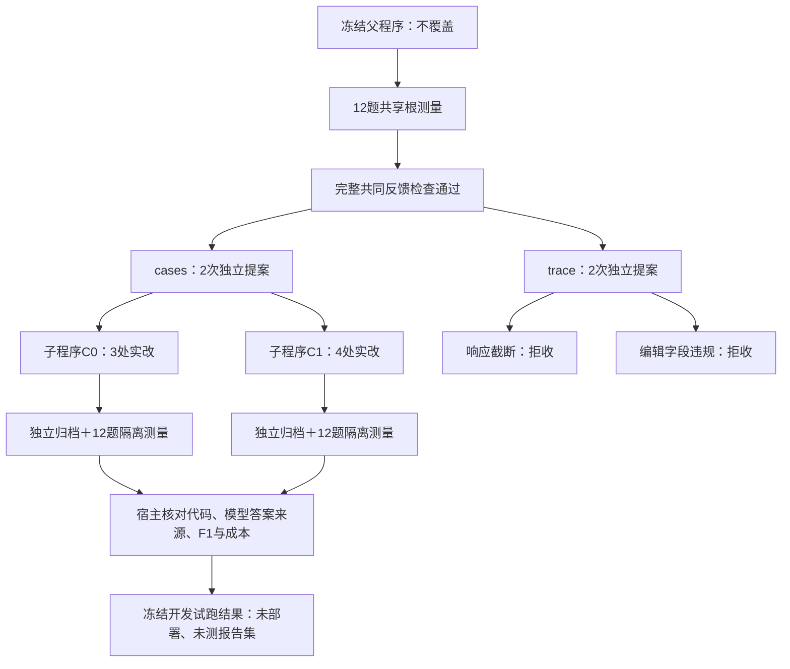

# 局部补丁真实试跑：首次产生两个可执行子程序，质量收益尚未证实

日期：2026-10-09。执行源码提交 `c761403`，分支 `codex/v3-paper-controls`。冻结计划：`f66896338a454a2a9302c8a495126ae3ae23c49c406d8b1fae678d7a63ef730a`。

**这次跨过了“修改器说改了，实际代码没变”的工程瓶颈。** 4次真实提案产生2个独立子程序，均完成12题隔离测量；另2次拒收。两子程序的平均F1均比本轮父程序高0.93个百分点，但同题预测完全一致，并存在退步题与引用来源通过率下降，不能宣称稳定质量提升、轨迹反馈有效或完整自改进成功。

新增114次调用，费用 **¥0.59379352**。连同此前两轮，累计268次、保守费用 **¥2.33490820**，低于授权累计1,566次／¥399。本轮无待结算、无预算告警；最早一轮的未知请求仍按原记录与保守费用保留。

[机器结果与来源哈希](v3_exact_edits_result_20261009.json) · [独立账本与36题单元复算](v3_exact_edits_independent_audit_20261009.json) · [编辑协议与工程验收](v3_exact_edits_20261009.md) · [独立代码审计](v3_exact_edits_patch_audit_20261009.json) · [旧16次提案结果](v3_paired_modifier_result_20261009.md)

## 1. 按授权实际执行了什么

- 12道已经使用过的MuSiQue开发题，2/3/4跳各4题；每程序每题测一次。
- 一个配对区组；案例反馈cases与增加执行轨迹的trace各2次提案机会。
- 只更换提案表示为局部精确编辑；保留原模型、温度、检索、根程序、评分和固定选父规则。
- 每个提案从同一冻结根程序出发，两个成功候选是兄弟节点，不是第二个接着修第一个。
- 只用D_fit；没有绑定或消费D_select、D_report、新面板或其他封存数据。
- 新增上限424次／¥110.60是保守硬帽，不是实际账单；不因拒收自动追加机会。

这不是与旧16次机会等预算、等机会的正式比较；也不是独立新题确认。局部编辑协议是否具有稳定因果优势，需要另行设计对照。

## 2. 父子程序怎样分开，以及本轮走到了哪里

模型的`modified`声明、实际源码变化和AST变化分别记录。C0/C1三项均成立，完整父源码身份保持不变；子程序各有独立程序身份、代码差异、物化收据和执行记录。只有通过静态检查才进入隔离执行，AST变化本身不等于行为或质量改善。

## 3. 四次机会逐项结果

| 顺序 | 条件／槽位 | 响应与实际代码 | 最终处理 |
|---|---|---|---|
| 1 | cases／0 | 3条实改，源码和AST改变 | 子程序C0，12题技术有效测量 |
| 2 | trace／0 | 供应商以length结束，输出达到18,000 tokens上限 | 截断拒收，没有修补或重新购买 |
| 3 | trace／1 | JSON可解析；5条编辑均含未允许的old_occurrences字段 | 精确契约拒收，没有执行 |
| 4 | cases／1 | 4条实改，源码和AST改变 | 子程序C1，12题技术有效测量 |

trace／1的进一步静态复核还发现空修改，以及宿主不支持的`answer_retry`阶段。即便只删多余字段，也不能得到符合原协议的可执行程序。因此这不是“格式检查挡住了已可运行的好方案”。原始失败保留，未替模型补写后宣称成功。

本轮4次机会中，2次物化并进入测量；没有明确`no_change`响应。不能将两次拒收填成问答零分，再计算cases与trace的质量差。

## 4. 子程序到底改了什么

### C0：更保守的终答提示＋桥实体输入＋弱诊断标记

三处修改全部落在`rag_core.py`，净增944字符；包装程序未变。它强化逐跳证据要求，把已记录桥实体传给终答，并在引句与桥实体数量不足时降低“证据充分”的标记。

但修改器解释中的“强制拒答”没有落实：新增判断没有强制改变答案字符串、可用性或弃答状态。引句数量也不是事实覆盖证明，一条引句可能覆盖多个关系，多条引句也可能重复同一关系。桥实体的字面接地不等于中间关系已经验证。新增字段还未纳入原压缩删除顺序，紧预算时可能挤占证据空间。

所以，C0可以称为真实代码变化，不能称为已经实现可靠的逐跳验证或防猜测。

### C1：终答提示＋桥实体输入，并补齐字段压缩处理

四处修改全部落在`rag_core.py`，净增640字符；包装程序、检索和模型调用上限不变。它强化终答提示、增加桥实体输入，并把该字段纳入压缩与遗漏计数，接口处理更完整。它仍依赖模型判断关系是否支持答案，没有新增宿主语义证明。

C1来自原根的独立提案，不能表述为修改器读了C0失败后继续修复。两候选都包含对主流程函数的改变，实际模块归因保守记为unknown，未将意图标签当成单模块因果收益。

## 5. 完整质量结果

| 指标 | 本轮根程序 | C0 | C1 |
|---|---:|---:|---:|
| D_fit平均Answer F1 | 31.02% | 31.94% | 31.94% |
| 相对根F1差 | — | +0.93个百分点 | +0.93个百分点 |
| EM命中 | 2/12 | 3/12 | 3/12 |
| 拒答 | 6/12 | 6/12 | 6/12 |
| 执行成功 | 12/12 | 12/12 | 12/12 |
| 答案确来自观察到的模型输出 | 12/12 | 12/12 | 12/12 |
| 引用来源校验通过 | 11/12 | 10/12 | 9/12 |
| 逻辑模型调用 | 51 | 47 | 47 |

两个候选各有2题F1上升、1题下降、9题不变。逐题差是一个+1、一个+1/9、一个−1，其余零；小幅净收益主要来自正负大变化抵消。两候选对全部12题的预测字符串完全相同，不能当作两次独立复现。

引用来源通过只说明引用可核对，不证明语义上支持答案；其下降不能被小幅平均F1上升掩盖。技术有效允许分析这些测量，不等于候选达到部署标准。

本轮整条问答流程重新测量，根和候选的随机回答、规划与阅读波动没有被完全消除；同臂候选又会共享相同中间请求的缓存结果。因而当前差值是开发观测，不是终答补丁的纯因果效应。具体地，根对每个子程序仅3/12题的最终证据完全相同，仅1/12题的上游模型请求与响应全同；两个子程序之间，上游、最终证据、预测与逐题F1则全部相同。未做新题确认，也未用该结果选择最终交付程序。

## 6. 反馈是否完整传过去

真实根测量完成后，宿主核验两个条件的完整请求体：cases为46,254字节，trace为113,741字节，都低于120,000字节上限。12个案例未被裁剪；去掉trace专有执行轨迹后，共同负载完全一致。根测量在区组内只付费一次。

这证明内容确实发出，不证明模型读懂或利用了它。此次trace两次都没有完成可执行候选，因此还无法估计轨迹反馈带来的质量贡献。

## 7. 成本、缓存与停止状态

| 用途 | 实际新调用 | 费用 |
|---|---:|---:|
| 区组共享根测量 | 51 | ¥0.17058288 |
| cases提案与两子程序测量 | 61 | ¥0.19959048 |
| trace两次提案 | 2 | ¥0.22362016 |
| 合计 | 114 | ¥0.59379352 |

阶段计数为规划24、阅读50、终答36、修改器4。逻辑调用与付费物理调用分别报告；两个兄弟精确共享35个规划／阅读请求缓存，24个终答则各自新调用；根测量单独支付51次。缓存命中不是新API调用，更不能当独立重复。首笔预留到最后结算的账本跨度约300.6秒，不含前面的代码与测试工作。

独立审计核对了当前源码绑定、计划、共享根、完整请求、父子归档与物化，重新计算36个测量单元的模型答案来源、EM与F1，均与记录一致。本轮114笔全部结算，pending为0、告警为0，有114个不同供应商响应ID，进程正常退出。历史未知请求没有删除或重新购买，仍包含在累计保守费用中。此次明确授权仅覆盖本轮，不自动扩展为继续购买未来实验。

## 8. 现在还卡在哪里，下一步怎样缩小问题

1. **代码输出可靠性仍未解决。** 局部编辑已能产生真实子程序，但4次只有2次通过，长轨迹条件仍会截断或违背工具契约。下一版应把允许调用的阶段、编辑字段和资源预留讲清楚，并让结构检查反馈用于明确的新修复回合；不要直接放宽解析或在宿主偷偷修好失败提案。
2. **修改说明与实现仍可能不一致。** 继续保留声明、实际差异、执行行为三层。对“强制拒答”“重试”“验证全部约束”等具体承诺，检查代码是否真的接入最终决策路径；不以说明文本给奖励。
3. **收益信号依然不足。** 本轮仅12道旧题、一次测量，小幅F1正差伴随退步与引用退化。下一步先固定候选和中间状态做可控验证，并保留根程序重复测量；只有接口与测量稳定后再设计更大、独立的新题对照。
4. **当前没有理由启动经验学习。** 两个兄弟候选不是连续反馈演化；trace条件也没有质量测量。第一篇仍须检验程序修改、执行反馈与候选评价的跨题价值，之后再推进原双循环目标。

这次的可交付进展是：父程序与子程序分开保存，真实模型能够给出实际局部代码修改，宿主完成物化、检查、隔离测量和有符号结果记录。质量、反馈机制和经验循环的有效性，继续保持未证实。
