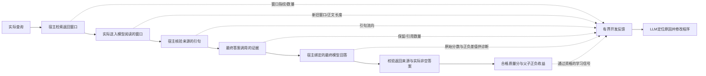

# 让修改器看见检索到答案的实际链路（反馈 v3）

状态：本页对应独立工作区 `rsi-agent-feedback` 的 `codex/v3-feedback-grounding` 分支。主目录 `rsi-agent` 的上下文轮换复测仍冻结在 `be43a19`，没有换用本页的新源码。最新修复及验证证据见[2026-10-08 审查修复记录](v3_review_fixes_20261008.md)；本页不报告新的真实 LLM 演化结果。

## 直接解决的问题

修改器原来收到题目、分数、粗粒度故障标记和至多两段短引文。它不一定知道查询是否变化、后续文档有没有进入阅读、已读引文有没有传到答案模型。即使LLM能改通用代码，缺少这些执行事实，也容易改错位置。

本次沿用现有修改器，补一条有界、可追溯的宿主反馈链：

引句核验只确认逐字来源，不证明它足以回答问题。答案指标定义未变，但进入质量奖励和模块经验前增加了来源资格：必须是完整的 `execution-3` 宿主收据，返回答案来自最后一次成功的回答调用，实际字符串非空，且执行和可用标记均有效。未通过时仍保留原分数及正负差值用于诊断，不把它们当作学习收益。

反馈 schema 为 `rag-rsi-v3-feedback-3`。外发说明分别使用 `raw_reference_objects_not_sent=true` 和 `fit_feedback_can_reveal_accepted_answers=true`：原始参考对象没有发给修改器，但 D_fit 的预测、得分和父子反馈可能让修改器推断可接受答案。因此不能把“不发参考对象”写成“不泄露任何答案信息”；D_select、D_report 仍不得进入修改反馈。

## 借鉴论文的具体部分

GEPA把执行轨迹、工具调用与工具结果用于自然语言反思，再提出可验证的修改。这里借鉴的是把错误发生过程交给修改器，而非只交一个标量分数。[GEPA](https://arxiv.org/abs/2507.19457)

TextGrad把文本反馈传回具体组件；`optimize_anything`进一步将优化对象扩展到通用文本参数。我们的对应做法是让开发反馈指向RAG的查询、入窗、引用或答案阶段，继续修改已有可执行程序。这是工程迁移，不是复现这些论文的效果或照搬完整优化器。[TextGrad](https://arxiv.org/abs/2406.07496) · [optimize_anything](https://arxiv.org/abs/2605.19633)

## 新增的信息

宿主的search/read事件新增窗口指纹：文档ID、字符区间和正文SHA256。日志不重复保存全文，单事件最多记录30个指纹；真实返回数量另存。异常返回更多窗口时保留原RPC行为，但明确标记观测不完整。

开发反馈的 `execution_flow` 包含：

- 完整调用计数，以及每次阅读前实际执行过的查询样例。
- 实际入窗数量、字符数、新窗口和复用窗口数量。窗口身份按文档、区间、文本哈希确定，不按可变的source_id判断。
- 仅在返回窗口观测完整时，给出已原样呈现、区间部分重叠和未呈现的数量。部分重叠不能被当作完整原文已经呈现，也不能被断言为全部丢失。
- 最终答案调用得到的引文、从已读材料保留的引文，以及最终引用数量；保留失败与语义不足分别表达。
- 被省略的样例数量、文字截断标记与大小上限。每份flow最多6000个UTF-8 JSON字节；统计覆盖原始记录，样例只是有界展示。

信息来自宿主事件和宿主验证过的阅读/答案观测。候选程序自报的source_ids、窗口数或“证据充分”等说法不能替代这些事实。模型对证据充分性的判断仍保留原有低可信标记。

当前程序具备来源资格时，`score` 才作为质量信号；父子双方均合格时，`signed_delta` 和 `paired_summary` 才供学习，负收益不截为零。相应资格不满足或只有旧收据时，对应学习字段为空，原始数值留在 `raw_score`、`raw_signed_delta`、`raw_paired_summary` 等诊断字段。

追加父流程时优先使用同一重复编号；找不到时明示为非配对代表，不能当作严格控制变量的因果证据。flow 仍在案例选择之后附加。宿主另从父子完整源码计算 `actual_edit_scope`；提案的 `intended_target_module` 只记录意图。只有已核验的 `single_module` 范围才关联单模块经验，`mixed`、`unknown` 和无修改记录不提供单模块收益。该关联仍不证明因果。

## 旧日志的处理

旧搜索事件只有响应哈希，无法还原候选数量和候选窗口，因此这些字段保持 unknown。实际送入阅读的正文仍可用于识别重复窗口。`execution-2` 等历史收据也缺少当前答案来源绑定；即使带有 `valid_program=true`，仍只能供原始诊断，不能补写字段后升格为新协议的学习证据。采用新协议需要新冻结方案下重新执行。

首轮32份冻结收据的完整离线核对显示：16条循环轨迹共41次阅读，后续25次均重复先前窗口，新增窗口0；旧日志总计97次搜索均没有返回窗口清单。这个结果说明入窗停滞能够被定位，但不能补造检索候选的丢失比例。

上述 32 份收据的历史回放只分析已经发生的调用，不重新检索、不重答、不打开参考答案，也不把校准数据改标成训练用 D_fit。此次修复另做的四个公开查询只读检索对比见[审查修复记录](v3_review_fixes_20261008.md)，不与该历史回放混为同一实验。

## 与待执行实验的关系

主目录保留在 `be43a19`，原8题修复版的方案哈希与源码不变。新反馈在独立工作区开发并提交审阅，不能混入已经冻结的上下文轮换单因素复测。

后续真实程序改进实验若采用反馈 v3、当前检索后端或答案来源规则，必须重新冻结源码、外发范围、语料身份、评估协议和预算。要证明它有效，需要比较修改器提出的实际代码及锁定后报告题的结果；日志诊断和合成测试只验证实现契约。三臂统计接口已通过合成验证，见[新协议](v3_three_arm_protocol.md)；真实三臂比较、硬编码扫描和真实 LLM 演化尚未完成。

## 完整请求的容量与验证

flow的6000字节上限不足以保证完整开发请求不超限，因为父子各4份flow、完整源码、历史经验和JSON双层编码会叠加。现在在任何付费派发前计算与真实发送体一致的UTF-8字节数，优先缩短可选摘录，其次移除可选文字样例；保留全部已选案例、完整题目、正负分数、流程计数、决策、经验及完整源码。若仍超过120,000字节则明确停止，不截坏程序也不静默丢学习案例。

反馈 v2 阶段的历史合成压力记录中，汉字、四字节字符及大量引号的完整请求缩减前分别为133,875、152,835、175,171字节；缩减后为103,601、112,161、119,129字节。这些字节数属于当时源码，不能作为 v3 完整请求的当前测量值。另有更长合法源码案例验证第二级缩减；原payload不被原地修改。所有结果均为合成内容、零网络测试，不代表真实修改器能利用这些反馈改善程序。

历史反馈 v2 节点曾有全量 348 项测试通过；其真实 WSL 合成全链路 6 个单元均通过隔离，19 次脚本响应含 1 次开发调用，开发请求收到宿主 flow，重启不新增请求。该记录不代表当前修复后的测试总数；当前证据以[审查修复记录](v3_review_fixes_20261008.md)为准。第一轮真实模型收据没有重答或解锁参考。

检索截断、终答来源接纳和模块归因的原问题见[外部审查复核](v3_external_review_response_20261008.md)。当前分支已移除按字母序仅保留 60 词的静默截断，保留全部合法查询词、参数化 SQL 和 BM25 排序，并升版后端身份；也已加入宿主答案来源资格及实际编辑范围记录。修复不等于已证明任务成绩提高，也不据此启动付费试跑。
