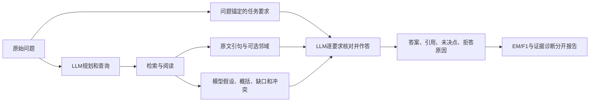

# 独立面板、闭卷对照与证据使用：审查回应和修改计划

日期：2026-10-09。适用分支：`codex/v3-experience-ablation`。这是最新研究路线；此前文档中的“下一步”是历史安排。真实结果、原始评分和旧冻结实验均不改写。

**决定：接受“补闭卷、扩大独立题组、检查证据使用”的优先级。旧24题保留为工程与案例诊断集，新的邻域付费复测暂不安排。先补跨实验曝光排除和依赖组抽样，再在新面板比较冻结根程序与一项改动。**

> 后续实现更新：闭卷组件与历史排除已完成，新面板按96/107/168另版冻结。本文第4节的全库闭包和均衡配额是当时待核验设想，已由实际容量审计修订；当前实现、统计对象及限制以[最新验收](v3_closed_book_panels_20261009.md)为准。旧24题待执行方案在新源码下不能通过原哈希预检。

## 1. 审查中需要校正的事实

1. a11aa81 的本地验收是共778项，777通过、1跳过，不是778通过再加1跳过。本次完成的完整回归是共811项，810通过、1跳过；额外4次实际WSL合成执行通过。合成通过不代表真实质量改善。
2. 58.51%→89.41%是单轮→循环的支持文档成员覆盖；support条件是100%。不能把89.41%写成“给足gold”的覆盖率。
3. 100%引句传输只证明已抽出的文本没有在传输时消失。来自每篇支持文档的一条引句，可能仍未包含必需关系。37.38%是当前阅读压缩、判断和终答协议下的诊断分数，不是模型推理能力的上限。
4. 所以当前优先诊断“阅读压缩—假设形成—终答”的决定成立，但“所有损失都在最终生成”“检索已经不是问题”仍不成立。
5. 当前既没有无证据直接作答条件，也没有逐题独立语义裁定。模型知识参与只是合理假设，不能宣布已证实训练数据记忆或污染。

依据：[三条件真实报告](v3_musique_calibration_result_20261009.md)、[终答对照](v3_answer_probe_result_20261009.md)、[案例复核](v3_quote_context_review_20261009.md)。

## 2. 先增加闭卷诊断，但不改变RAG任务契约

闭卷只给原始问题，使用相同模型、温度、输出长度和短答案评分；不提供检索结果、前序判断、参考答案或支持标注。提示明确允许使用自身知识、不确定时拒答；引用要求记为不适用。

不能把“只能依据引句回答”的提示连同空证据给模型，再把全部拒答称为模型闭卷能力。这种同提示空证据条件可以作为另一项拒答机制诊断，但不能替代正常闭卷。

新面板预注册三条件：

| 条件 | 材料与作用 | 比较地位 |
|---|---|---|
| CB | 原问题，允许自身知识，无检索 | 次要知识基线 |
| R0 | 冻结根程序的正常检索与完整终答状态 | 主基线 |
| R1 | 与R0共享完全相同前缀，只附加已读原文邻域 | 唯一主要干预 |

主比较为R1−R0，闭卷不参加部署选优。分别报告CB错/RAG对、CB对/RAG错、两者均对、两者均错，以及F1配对差、拒答和非拒答零分。

这些分类描述本次输入下的行为，不能给每个答案标记“来自参数记忆”或“来自证据”。要研究更强的来源因果问题，之后可在独立诊断子集做预注册证据移除或实体替换；不能把伪造文档混入正式评分。

## 3. 证据支持必须保留三层，不能由qrels直接下结论

| 层 | 可观察量 | 谁能确认、能确认到哪里 |
|---|---|---|
| 来源 | 引句、偏移、窗口身份、哈希 | 宿主可精确核验文本确实出现 |
| 覆盖 | 标注支持文档是否进入检索、阅读、终答 | 本地标注可核验成员覆盖，不等于关系充分 |
| 语义 | 引句及多跳关系是否真正支持答案 | 需要语义审查；模型审查必须明确为模型判断 |

零API可补的是前两层的交叉表。不能把“引用来自gold文档且EM=1”直接判为有证据支持，也不能把“不在gold中”直接判为幻觉。

语义审查表采用“支持／不支持或矛盾／无法判定”三类，分别看终答实际材料与完整已读窗口，并记录具体关系缺口。选择案例的分层和数量事先固定，审查时隐藏臂、分数和参考答案；判断证据支持可以看到待审答案，但不能先看标准答案。审查者来源如实记录，无独立审阅者时保留未裁定，不能由同模型自评产生硬真值。

EM/F1、证据支持和来源合法性分列，不合成新奖励，不回改旧标签。

## 4. 扩大样本前必须修准备器

现有`prepare_musique.py`只检查一次准备中的三个角色，没有历史曝光输入；配额按题数，角色内还允许共享子题/支持段。换种子或抽200行都不能保证200个新鲜独立组。

最低必要改动：

1. 加入冻结的历史曝光与保留角色清单。校准、提示修改、案例诊断用过的24题及关联题归开发曝光；旧D_select/D_report保持原角色，不能抽回开发。
2. 把旧可信准备脚本中的依赖分组正式化：题号、原题组和规范化问题防重；共享子题ID、规范化子题、支持段形成依赖连接，并取传递闭包。相同常见答案字符串不能单独当作统计依赖边。
3. 全部依赖组先固定角色，再按固定哈希抽代表题、按2/3/4跳分层。跨train/dev的连接也要处理；不能因为换了数据文件就当独立。
4. 同时输出题数、组数、每组大小、跳数、排除原因和源文件哈希。配额不足则报告不足，不看成绩换种子。
5. 可信准备器为分组读取标注是受控准备行为；标注不进入模型、修改器或普通检索输入。原评分和跨角色规则若要变，单独记版本。

这里的独立组指按已知共享关系隔离的依赖组，不保证穷尽全部依赖。若旧保留组与已用开发题形成关联，标记为受开发曝光影响并排除新确认；不自动改角色，也不因尚未调用API而继续称为新鲜。

建议下一版目标为D_fit 96组、D_select 120组、D_report 240组；每组先取一题，三个跳数尽量均衡。这是待可行性检查的设计目标，尚未抽样或付费，不是已具备这些独立组的声明。D_fit用于开发；D_select只比较少量预注册冻结版本并锁定；D_report仅一次正式报告。本轮报告集用过后不能再作为后续RSI的未触碰确认集。

240组是给旧试点约206组需求留余量，不是功效保证。循环对比曾估112组，删除判断对比曾估206组，均来自23组试点，邻域效应方差未知。预算受限时可先建立120组报告面板，但必须报告其检出力限制，不能把100–200当必然显著的数字。

## 5. 终答架构可以改，但逐项识别作用

建议的目标结构：

- 证据账本表示“来源已定位”，不是宿主认证事实为真。假设、概括、缺口与冲突显式标记为模型判断，不能冒充已验证证据。
- 规划要求引用原问题跨度，宿主核验跨度存在；模型新增桥接假设单列，不能自动升级为原题强制条件。跨度合法只能证明引用来自问题，不能机械证明语义没有被强化。例如引用整道题仍可能凭空加上current。
- 终答逐要求输出支持引用或“未决”，让LLM继续做多跳综合。拒答原因包含证据缺失、证据冲突、身份/时间歧义、关系支持不确定；不能写死为“只要每格填了引用就不许拒答”。引用号存在也不等于关系蕴含成立。
- 宿主核验字段、原题跨度、引用来源和引用号；语义正确性仍按明确的审查层处理。此结构用于减少无根据限制，不是在宿主硬编码答案。

本轮先测邻域；状态分层作为下一版本，与冻结R0单独比较。若要同轮比较两项机制，应明确做2×2设计并重新估样本/调用量，不能只有旧版与多改动新版两臂后分别宣称每项有效。

## 6. 邻域边界建议采纳为独立后续因素

固定256字符仍可能截词。可先定义向内对齐完整词、句/段落的确定性规则：不越过同一已读窗口和原半径，绝不缩掉原引句；没有合适边界时保留原引句并标注片段状态。明确字符索引、Unicode、句边界和回退规则。

这仍是输入变化，不因为“确定性”就不算实验因素。当前精确±256原型保持原定义，边界对齐另立版本，不能在旧24题上试几种规则按成绩择优，也不与状态重构同时悄悄加入。

## 7. 成本与运行安排

同意扩大有效样本：现有实际费用低，不应把小样本反复复核变成长期主线。但旧账单包含共享前缀和缓存命中，短终答账单不能当端到端单价，也不能当硬上限。

对每题最多K次的冻结正常流程，若R0/R1严格共享前缀、两次重复，则CB+R0+R1的物理调用上限为`2 × 题数 × (K+2)`；若不共享则为`2 × 题数 × (2K+1)`。例如K=5、200题分别为2,800或4,400次。K须从最终配置核验，不能假定一直为5。

最终冻结请求范围、输入/输出上限、调用帽和费用帽后再执行。按历史费用线性放大只能作低成本情景参考，实际API身份、价格与缓存命中另记。闭卷有新调用成本；“零成本”只适用于已有材料的本地统计。

先用小型合成面板检查入口；正式新面板按完整预注册顺序跑完，不看到中途显著就停止，也不按中途分数更换机制。主对比报告依赖组配对区间。旧24题的推进门槛和失败判定保持不变，新确认规则另行冻结，不能追认历史成功。

## 8. 演化与选优对照

根程序重复评估零假设应加入：冻结同一源码和配置，用独立请求bank做与候选数/重复次数一致的伪候选选择，再以选中的伪候选身份、使用新的独立请求bank，在独立报告题上重新运行同一冻结根程序。量化只靠重复和选最大值产生的赢家偏差；不能只看根程序一个标准差就宣称完成此对照。

最先检验的真实演化因素为F1案例反馈 vs F2执行轨迹反馈，固定修改器、提案机会、实际模块和成本帽。模块轮换/随机和经验选择另作对照；不同时打开经验、反馈升级和新终答流程。D_fit评估可比最终报告小，不能每个候选都消耗D_report。

## 9. 本次实际完成的工程工作

- 复用`answer_replay.py`、`answer_probe.py`，新增明确schema2的`full_state / quote_context`对照；旧schema1的删判断语义保留。
- 全24个正常loop/repeat0状态在当前默认代码下逐请求、逐完整结果复现；保留原顺序，不读分数筛选。旧源码不变，跨版本导入仅允许冻结维护源码。
- 24状态共138条原引句，138条均可附加邻域，逐引句新增39,552原文字符；最大完整provider请求14,876字节。除context外所有字段完全相同。该数字不同于旧support侧的78条引句。
- 两臂各两次的新终答方案已完成本地预检：最多96次，保守包络¥2.0421、硬帽¥3。**尚未发请求；依据最新审查保持不排期，不能当新面板或确认实验。**
- 完整测试811项：810通过、1跳过；实际WSL合成4个单元全部隔离、来源有效，恢复零重复调用。没有读取真实参考答案或凭据，没有新外部API费用。
- 新面板历史排除、闭卷入口、状态分层和边界吸附仍是待实现项，本文不将它们写成已经完成。

[工程预检和验证记录](v3_quote_context_probe_preparation_20261009.json)

## 10. 文献如何落实到本项目

- [MuSiQue（TACL 2022）](https://aclanthology.org/2022.tacl-1.31/)通过连接单跳题构造多跳任务并控制捷径；因此组成题依赖需要纳入分组，也不能保证今天的模型对任何题都没有已有知识。
- [Sufficient Context（2025修订版）](https://arxiv.org/abs/2411.06037)区分材料不足与模型未利用材料，也讨论不充分材料仍可改善回答的情况。这里保留上下文充分性、正确率和闭卷表现三条观测线，不把gold文档成员覆盖当作充分性。
- [ALCE（EMNLP 2023）](https://aclanthology.org/2023.emnlp-main.398/)把正确性与引用质量分开评估；本项目借鉴该分离原则，不把精确原文匹配冒充语义支持，不直接继承其自动评分器的可靠性。

**执行顺序：跨实验面板与闭卷契约 → 新面板可行性/预算冻结 → R0/R1单因素确认 → 单独状态分层 → 根程序重复选优与真实反馈演化。** 旧24题不再承担发现机制和证明泛化两种角色。
