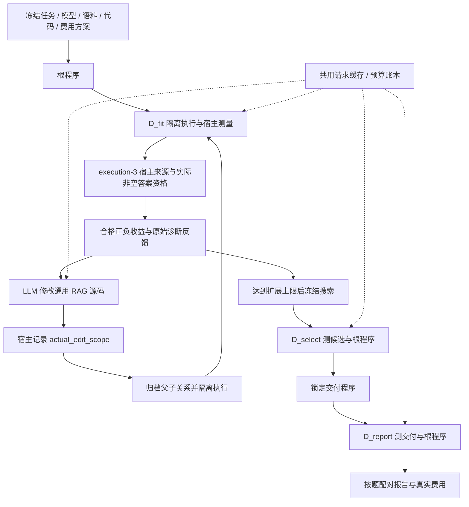

# v3 真实代码演化入口与离线准备（2026-10-08）

本页记录独立工作区 `rsi-agent-feedback`、分支 `codex/v3-feedback-grounding` 的入口与当前修复契约；没有新增付费实验结果。主目录 `rsi-agent` 的 `be43a19` 及原上下文轮换复测方案保持冻结，不会自动换用新分支源码。最新修复见[2026-10-08 审查修复记录](v3_review_fixes_20261008.md)，前一轮真实模型结果见[首轮校准报告](v3_calibration_result.md)。

## 本次补齐什么

之前已有 `ProgramDeveloper`、隔离执行和 `EvolutionRunner`，但命令行只接通两个固定流程的校准。新增 `code_rsi/live_evolution.py` 把同一套核心接到冻结方案、共享费用账本和正式执行入口，不重新实现搜索或评分。



修改器只能看到 D_fit 的公开问题、父程序源码和已有开发反馈。原始私有参考对象用于宿主评分，不直接传给回答器或修改器；但 D_fit 的预测、分数与父子反馈允许修改器推断可接受答案。反馈 v3 明示 `raw_reference_objects_not_sent=true` 和 `fit_feedback_can_reveal_accepted_answers=true`，不能将两者合并成“不泄露答案”的承诺。D_select 和 D_report 的反馈不参与修改程序。生成代码仍只能在既有 WSL 隔离环境运行。

当前执行使用 `rag-rsi-v3-execution-3`。宿主将最后一次成功回答调用的事件编号、请求/响应哈希、呈现证据与返回答案绑定；只有来源有效、执行成功、可用标记有效且实际答案非空时，才接纳质量分。父子双方均合格才产生可学习的 signed gain。旧收据或无效程序的原始正负差值保留作诊断，不能补写来源或仅凭旧 valid_program 标记升格。

修改器的 `intended_target_module` 只记录意图；宿主另算并校验父子源码的 `actual_edit_scope`。单模块范围才关联到相应模块经验；mixed/unknown 不进入单模块收益，意图与实际范围不符会被记录。该 AST 范围关联不是因果证明，完整程序比较仍需独立验证。

## 调用与费用的计算

设扩展尝试数为 E，每题重复 R 次，三个分组分别有 F/S/T 题，最多选 K 个候选，每次程序执行最多调用回答模型 C 次。最坏候选数 N=E+1。新入口按以下结构预算：

- 回答模型：`[(E+1)×F + min(K,E+1)×S + 2×T]×R×C` 次。
- 修改器：最多 E 次，输出上限独立计入。
- 完整请求的字节上限按保守 token 上界估算；全流程共用一个调用次数与人民币硬帽。

即使子程序增加内部规划或阅读，也受宿主 C 上限约束。不能用根程序平均调用次数预测任意子程序的最坏费用。失败提案仍可能付费，必须保留记录；相同请求缓存命中不重复收费。未知物理请求结果停止，不补成零分或自动重购。

## 使用方式

```powershell
python -B -m code_rsi.live_evolution preflight --plan <本地方案.json>
python -B -m code_rsi.live_evolution run --plan <本地方案.json> --execute --approved-plan-hash <方案哈希>
```

免费预检检查三个分组、参考身份、源码、模型设置、语料和预算；不会读取密钥或请求模型。演化预检需要在本地解析参考结构，以提前发现不可评分的输入；这与“全部生成后才打开参考”的固定流程校准是两个不同协议。

`--approved-plan-hash` 绑定具体方案，不替代实际用户授权。Python 层支持脚本 transport 注入供离线测试，命令行不开放任意传输器加载。正式入口只接固定 DeepSeek 配置；外部裁判暂不接入。

## 题库准备

保留 BrowseComp-Plus 作为固定大语料的困难检索任务；MuSiQue-Ans 可用于更容易定位证据组合问题的开发实验。它的题目通过单跳问题组合构成 2–4 跳依赖，提供题内段落。[官方论文](https://aclanthology.org/2022.tacl-1.31/)

新增本地构建器只读取显式给定的官方 Ans train/dev 文件，不下载题库或调用 API。先从 dev 固定报告集，再从 train 选开发与选择集；固定种子、跳数配额、身份与分解重叠规则。排除理由保留，配额不足就报告不足，不按模型成绩筛题或自动放宽。

公开文件只有问题与题内语料；答案、分解与证据标注保留本地。构建器检查跨角色的完整问题、单跳组成问题、支持段落及子答案重叠。这是额外的小面板隔离规则，不能仅因通过就声称复现论文全部数据构造过程。

本地构建命令如下。配额只是显式示例，不表示已批准对应规模的模型调用；每组按 2/3/4 跳顺序填写。

```powershell
python -B -m code_rsi.prepare_musique --train <官方train.jsonl> --dev <官方dev.jsonl> --out <项目runs下新目录> --seed <固定种子> --fit-quota 16,8,8 --select-quota 8,4,4 --report-quota 16,8,8
```

成功输出三个角色各自的 `public_tasks.json` / `private_references.json` 与总清单。顺序筛选不保证找到所有可能的可行划分；不足后更换种子或配额须记录为新方案。报告题还须核实未被过去的开发使用。若另用 SQuAD、NQ 等单跳源数据训练，应按[官方提醒](https://github.com/StonyBrookNLP/musique#data)排除 dev/test 所用单跳问题。

输入来源应固定到[官方发布脚本](https://github.com/StonyBrookNLP/musique/blob/922ac98f19a201998dbdae6d7f2887a5258dbdeb/download_data.sh)及具体下载文件的 SHA256。官方仓库提供[CC BY 4.0 许可](https://github.com/StonyBrookNLP/musique/blob/922ac98f19a201998dbdae6d7f2887a5258dbdeb/LICENSE)。当前工具没有改变在线任务为 MuSiQue-Full，也没有把题内段落拼成全局语料。

## 入口建立时的历史验证

- 入口建立时的历史节点全量离线测试 **311/311 通过**；其中正式入口新增19项，本地分组新增22项。该数字不是当前审查修复后的测试总数。
- 真实WSL完整流程：6个评测单元全部隔离执行通过；三个角色、搜索冻结与交付锁定均存在。19次脚本响应含1次修改，重启新增请求0。
- MuSiQue构建器产生的9道合成题（每角色3题，覆盖2/3/4跳）被正式预检实际读取，F1主指标无需代理标记。凭据、模型、网络、子进程调用均为0。
- 修复版8题复测仍为原冻结方案，哈希与运行源码未变；本次没有调用该方案。

上述 WSL 测试使用预设改动与已知虚构故事，不能证明真实修改器能力。该历史离线节点真实模型调用0、费用0；[机器可读验证摘要](v3_validation_summary.json)保留其与首轮真实实验的区别。反馈 v2 文档中的 348 项同样是后续历史节点，不能与此处 311 项或当前修复测试混记。当前证据统一见[审查修复记录](v3_review_fixes_20261008.md)。

## 仍未解决的研究问题

1. 真实修改器是否能提出有效通用代码，尚待有明确源码外发范围的真实实验。
2. [三臂统计接口](v3_three_arm_protocol.md)已通过合成验证，真实质量比较尚未完成；单次开发或选择胜出不代表稳定提升，需看锁定后的独立报告题、配对结果与真实成本。
3. 硬编码扫描尚未完成。原始参考对象未转发及宿主答案来源有效，都不能证明候选没有利用 D_fit 已暴露的答案信息。
4. 当前反馈仍是有界摘要，不能假定修改器看到了每轮完整材料；窗口截断和未知字段需保留限制。
5. `actual_edit_scope` 只关联语法范围，mixed/unknown 已排除单模块收益；即使 single_module 也不能当作因果效果证明。
6. BrowseComp 的内部 EM/F1 仍是代理评价，不能称官方模型裁判成绩。

当前分支已修复检索词静默截断，并升级检索后端、反馈与来源协议；它与 `be43a19` 冻结源码的身份不同。旧上下文轮换复测继续使用自己的原方案和源码哈希，新修复不得混入该单因素比较。若要执行当前分支的真实 LLM 演化或新的三臂实验，须另行冻结源码、分组、外发范围和预算；本页不表示这些实验已经完成或获准执行。
