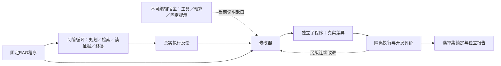

# 修改器为何没有可靠地产生改进：接口、输出与研究条件的分界

2026-10-09；只读核对代码`cef47c2`及已完成的全部4次局部编辑提案。**本轮新增API和费用均为0，未改生产源码、旧结果或待授权终答实验。**

新证据改变了下一步：不应先给修改器更多输出额度，也不应把所有失败归咎于轨迹反馈。最直接的缺口，是模型不知道不可编辑宿主的完整能力；另外确有重复输出。当前独立提案也没有形成“看上次错误后再修”的循环，这与协议一致。

[机器结果与来源哈希](v3_modifier_interface_findings_20261009.json) · [完整接口说明草案](v3_candidate_runtime_card_draft_20261009.json) · [待授权固定上游终答实验](v3_program_suffix_probe_20261009.md)

## 1. 三个有证据的结论

### 宿主接口没有传完整

4次实际出站请求都包含完整父源码、12题反馈和编辑规则，但仅包含`rag.py/rag_core.py`。源码里能看到本地`plan/read/answer`定义，却看不到宿主只允许这三个阶段的封闭接口、固定QA系统提示与输出额度。

trace第2次提案不仅调用`answer_retry`，还给本地指令和schema增加同名项目。这在可编辑程序内部看起来完整，却不能扩展外面的宿主；`execution.py`和模型服务都会拒绝该阶段。仅删掉多余编辑字段，仍不能让它工作。

本地脚本响应的宿主复现确认：`answer_retry`在模型调用前被拒收，新增调用0；`plan/read`不能吃掉保留的终答额度；同一个受支持的`answer`阶段在总额度还有余量时可以再次调用。**问题不是一概禁止二次回答，而是修改器必须使用真实支持的接口并保留预算。**

### 超长响应主要是重复输出

| 提案 | 请求字节 | 响应字符 | 输出tokens | 结果 |
|---|---:|---:|---:|---|
| cases 0 | 46,254 | 4,278 | 998 | 3条编辑，接受 |
| trace 0 | 113,741 | 83,861 | 18,000 | 输出截断，拒收 |
| trace 1 | 113,741 | 9,068 | 2,129 | 多余字段与无变化编辑，拒收 |
| cases 1 | 46,254 | 4,280 | 1,028 | 4条编辑，接受 |

trace 0的`edits[1].new`键出现129次，其中128个完整值是同一个606字符字符串；扣除首份，重复值的编码字符占全部响应约94.80%。最后一次值未写完。这里的128不是128个合法编辑；这是从未闭合JSON中做的词法计数，原提案仍然无效。

因此，这次截断不能简单解释成“一份正常补丁只差更多输出额度”。先提高18,000上限，很可能只是给同类重复更大空间，但这一风险推断仍不是下一次必然重复的证明。

trace 1全部5条编辑都增加`old_occurrences`，第3条还满足`old==new`。现有文字提示展示了字段形式，却没有把禁止额外/重复键、必须实改，以及总字符数计算方法放在一起讲清。模型仍应遵守原规则，缺说明不是追认旧输出的理由。

### 上次拒收没有传递，是独立提案条件的设计

trace第2次的宿主决策记录里有前一次拒收，但受控投影只传`operator/target_module/intended_target_module`，经验列表为空。同一条件两次请求体哈希完全相同。

这轮测的是“同一根、同一反馈下独立提出候选”，不是连续修复。若下一轮让修改器看到前次错误，或从子程序继续改，应另立条件并重新记录信息集；不能一边加入历史，一边仍声称和原独立提案完全同条件。

## 2. 先做的最小修改已经具体化

已制作一份由宿主提供的接口说明草案，两臂共用，包含：

- 可用服务及精确字段、仅允许的三个模型阶段；
- 真实调用上限、保留终答额度、模型输入和输出上限；
- 不可由候选改动的QA系统提示；
- 最后成功终答的来源要求，以及引句字面接地与语义支持的区别；
- 精确编辑的五个顶层字段、三个编辑字段、禁止额外与重复键；
- `sum(len(old)+len(new)) <= 12000`的字符定义、`old!=new`及一个不含真实题目的合法形状示例。

原始12题、所有轨迹和父源码都保留，仅添加共同说明。按实际请求字节验证：

| 条件 | 原请求 | 加说明后 | 120,000字节上限余量 |
|---|---:|---:|---:|
| cases | 46,254 | 51,594 | 68,406 |
| trace | 113,741 | 119,081 | 919 |

两种条件各2份请求均通过；这证明当前材料装得下，不证明模型会遵守。trace余量很小，新根产生反馈后必须重新核对，不能据此承诺任何后续面板都装得下，也不能只截短trace中的难题。

草案尚未接入生产，避免改变已经冻结并等待授权的终答实验。它不增加模型审阅、自动修补或免费重试；失败仍记一次提案机会。

## 3. 从论文借什么，不借什么

[SWE-Edit](https://arxiv.org/html/2604.26102v2#S3.SS1)把代码查看与编辑组织成独立角色，编辑器在干净上下文里接收源码及修改指令。若补齐接口后仍大量失败，下一候选是把现有修改器分成“分析失败→生成补丁”两个模型调用：分析器看cases/trace，编辑器只看源码、简短实施指令、接口说明和补丁格式。无需照搬完整Viewer或新增评审模型。这是本项目待验证设计，SWE-Bench的效果不能外推到RAG。

[GEPA](https://arxiv.org/abs/2507.19457)借鉴点是利用具体轨迹反馈提出并实际测量改动；反思说明不等于效果证据。它主要优化提示，不能把本项目自由Python编辑叫作直接复现。

[MIPRO](https://arxiv.org/abs/2406.11695)研究多阶段语言模型程序的提示与示例优化，让提案理解程序和数据，再由运行结果选择。我们可以借鉴模块输入/输出的明确交代；目前没有证据需要先引入更复杂的贝叶斯搜索或训练。

若测试“分析后编辑”，两个调用均应计费，失败仍消耗机会；单调用基线也应获得同一接口说明。要区分接口变清楚、上下文分离和多花调用三个因素，不能一次都改后归因于某篇算法。

## 4. 与完整研究目标的关系

当前最先要补的是修改器理解真实宿主，以及已有补丁是否在同样证据下有价值。MuSiQue继续作为非地板开发任务；BrowseComp保留难度确认。问答循环的规划、证据账本与终答模块继续由LLM做语义判断，宿主只管来源、执行、预算与评分。

经验选父、选模块和完整双循环目标保持，但第一篇论文仍先验证可靠程序改进单元。当前两个子程序不是连续改进证据，更不是经验策略有效证据。

## 5. 接下来按什么顺序

1. 完成已就绪的72次固定上游终答对照（新增硬帽¥1.30，仍待原问题授权），先检验两份已接受程序的价值。
2. 下一版修改器先统一加入接口说明与明确输出规则；保持模型、反馈、提案机会及其他条件不变，单独统计可执行提案率。
3. 若仍发生大量生成失败，再独立比较单调用与“分析后编辑”，而不是先提高输出上限。
4. 连续修复/非根继承按第一阶段正式E条件实施；独立根提案继续保留为I条件。后续经验学习按原三阶段路线推进。

本轮没有生成新质量结果，也没有动未使用面板。待授权计划哈希和预检仍一致。四次提案只支持上述具体故障定位，不支持“轨迹反馈有害”“接口说明已经有效”等总体结论。
