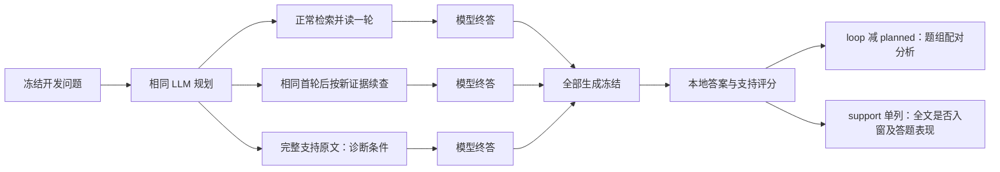

# MuSiQue 开发校准与支持材料诊断

本方案用于回答“当前系统能否产生可修复的非地板差异，以及损失主要发生在找材料还是用材料”。它不包含修改器调用，不验证 RSI、经验选择或独立泛化。真实执行前需要新的数据范围与费用授权。

## 数据和三种条件

只使用已冻结 D_fit 24 题，2/3/4 跳各 8 题；同题每条件重复 2 次，共 144 个结果。D_select 12 题、D_report 24 题保持未测量。本面板已参与本地准备与零 API 检索诊断，因此称开发校准，不称独立确认。

| 条件 | 程序 | 材料来源 | 作用 |
|---|---|---|---|
| planned | 规划后一次阅读与终答 | 完整题内原始文档，LocalCorpus 词重叠检索 | 正常基线 |
| loop | 同样规划与首轮，最多三次阅读 | 同一个题内后端，LLM 根据已读证据提出后续查询 | 唯一主比较 |
| support | 同样的规划、一次阅读与终答 | 宿主按冻结支持标注提供全部支持原文 | 独立诊断，不能交付或训练 |

支持材料诊断保留原 question_id、docid、公开标题与正文、原文档顺序。生成器只读已冻结的支持 ID 投影与原公开材料，不解析答案、别名或分解题。投影来自私有支持标注，这是一项明确的特权诊断，不能笼统说“完全没用标签”。正常两臂的后端不接触该投影。

## 固定参数与来源核验

沿用 deepseek-flash、temperature=0、thinking=disabled。冻结计划记录接口模型名和请求参数，但这不能保证服务商未来不更新同名权重；响应模型身份与调用时间继续落账。

每轮最多两条查询，每查询至多五篇，最多三次阅读，连续两次无证据进展停止；模型总上限 7、搜索 8、read 工具 8。每篇最多 6,000 字符、单轮正文 24,000 字符、payload 64,000 字符、完整 API body 120,000 UTF-8 字节。plan/read/answer 输出上限分别 1,200/2,200/800 token。

同题同重复的三个条件共用**精确请求正文**缓存；不同重复使用不同 bank。正常两臂的 plan 与首轮 read 请求、响应哈希必须一致。缺失或不一致时保留原始结果，关闭主要机制推断。它测的是共享首轮后的条件差异，不代表两条完全独立轨迹的方差。

support 后端不靠查询词命中来筛文档，返回每篇支持原文的完整跨度。本批真实材料已做额外容量检查：普通首轮最大 5,832 payload 字符／6,977 请求字节；24 条各 1,000 个四字节 Unicode 字符的约束加两条长查询时，最大 31,622 字符／110,785 字节，均低于冻结上限。这是脚本压力检查，不是模型表现。预检检查材料容量，报告再逐篇核对真正送入阅读的 start=0、end=全文长度、原文及哈希。材料不全、阅读未完成或执行失败时，整个支持材料诊断标为不合格，不挑其中成功题重新计算“上限”。全文到达不等于语义充分或模型理解正确。

## 统计与决策

唯一预注册主指标为答案 F1，唯一主比较为 loop−planned。支持臂排除在该比较、重采样和交付选择之外。答案 EM、支持 F1、引用来源、交付率、证据各阶段覆盖和调用成本分列报告，不拼接新奖励。

同题先平均两次重复。共享子题 ID、规范化子题文本或原支持段的题目取传递闭包，当前得到 23 个已知依赖组；组整体重采样，题目等权。95% 配对区间、10,000 次 bootstrap、随机种子 20261008。目标差 0.10、power 0.80 仅用于事后方差下的近似设计敏感性，不是本批有足够功效的保证。两次重复可粗看分差波动，不能声称已精确估计噪声。

不按结果删题、不调折分、不将语义支持模型自报当事实标签，不复用封存角色调参。整批结果和诊断生成后按下列证据选择下一步：

- 正常流程差、给足材料后较好：优先定位正常检索和材料选择的可修复损失。
- 给足材料仍差：检查阅读漏抽、关系综合、拒答与任务判分，不能直接归因模型推理能力。
- 正常流程已接近饱和：这批题不适合证明搜索改进，另行冻结更合适难度；不在当前题上反复挑题。
- 正常流程有成功与失败、且诊断存在改进空间：再冻结一项 RAG 改动，随后检验真实代码演化和反馈贡献。

没有“至少答对多少就证明演化可行”的事后门槛。本轮即使 loop 获益，也只是流程校准证据。

## 调用与费用

逻辑调用上界为 24×2×(3+5+3)=528；144 个终答结果。硬上限按**完全不依赖请求共享节省**计算；真实物理调用、逻辑调用和缓存共享分别报告。

按 [DeepSeek 官方价格页](https://api-docs.deepseek.com/zh-cn/quick_start/pricing/) 2026-10-08 核对的峰时包络，每百万输入未命中 2 元、命中 0.04 元、输出 8 元；完整结构保守费用为 **¥134.329344**，拟定新增硬帽 **¥135**。这是极端输入与输出上界，不是预计账单。当前阶段 API 调用和新增费用均为零。

接口结果未知时停止、核账，不能盲重发或记零；已冻结完成单元恢复复用，不重新购买。当前题内后端不增加新的自动重试规则。旧 BrowseComp 无效结果不追认。

## 执行与验证

复用现有 `preflight / calibrate / grade` 入口、WSL、宿主收据、StructuredModel、预算账本和恢复检查。新增 MuSiQue schema 显式分支，旧 BrowseComp schema 语义保持。只有可信准备器使用 D_fit 支持标注构建诊断投影；模型生成与评分仍分阶段。

计划、来源、分组、材料和运行源码都有冻结绑定。具体计划哈希、最终测试和真实 WSL 合成验证见 [准备与验证摘要](v3_musique_calibration_preparation.json)。原始题目、参考及请求保留本地 runs，公开仓库仅存聚合与哈希。

本轮最终验证：632/632 全量通过，跳过0；真实 WSL 合成12单元全部隔离与答案来源通过，24次脚本响应、恢复新增0。真实模型调用0。上述准备计划哈希为 `a1539cbaf64512a3ce407e13cc024b8026d92b00cb2b04ae2d8f235259d3c697`。
