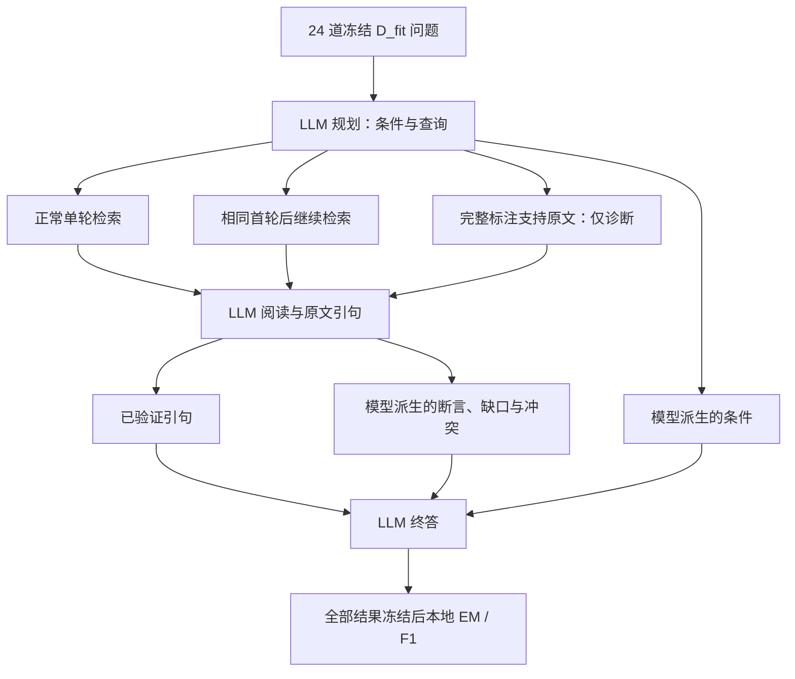

# MuSiQue 三条件真实校准报告（2026-10-09）

**这批开发题已出现非地板答案信号。循环的平均 F1 高于单轮，但区间跨零；给足支持原文仍只有 37.38% F1，后续应优先检验中间判断如何影响终答。** 本轮没有修改器或经验选择器调用，不能称为 RSI 已获得提升。

## 1. 实际执行与完整性

2026-10-09 北京时间 09:27 启动，09:37:55 完成生成冻结，09:37:57 完成本地评分。D_fit 24 题，2/3/4 跳各 8 题，每条件各两次，共 144 个结果；23 个已知依赖组。D_select、D_report 未用于模型测量。

| 核验项 | 结果 |
|---|---:|
| 完成并保留全部单元 | 144/144 |
| 隔离执行与终答来源核验 | 144/144 |
| 正常两臂规划和首轮阅读请求／响应一致 | 48/48 对 |
| support 条件完整支持原文进入阅读 | 48/48 |
| 请求与账本逐条结算 | 350/350，无 pending |
| 运行源码与冻结计划一致 | 26/26 |
| 主要比较及支持材料诊断 | 均通过协议核验 |

350 次真实调用，504 次逻辑调用，154 次共享避免重复购买。按冻结峰时价格包络计算的账本费用为 **¥1.12708076**，上限为 528 次／¥135。这是根据服务返回用量计算的费用，不是独立核验的服务商账单。共享请求使各臂的物理费用无法精确分摊。

全部响应模型名为 deepseek-flash，批内 system fingerprint 相同；这不保证服务商未来同名权重不变。温度、思考模式、评分、语料和上下文上限均未改变。真实参考仅在整个生成冻结后本地解析；支持标注在准备阶段被明确用于特权诊断，不能说全程未使用任何标签。

原始收据、参考、请求与账本均保留本地 ignored runs。公开数据见 [聚合结果与哈希](v3_musique_calibration_result_20261009.json)。

## 2. 答题结果

| 条件 | EM | 答案 F1 | 非拒答 | 逻辑调用 |
|---|---:|---:|---:|---:|
| 规划后单轮 | 9/48（18.75%） | 22.22% | 15/48 | 144 |
| 动态循环 | 13/48（27.08%） | 32.41% | 20/48 | 216 |
| 完整支持原文（诊断） | 13/48（27.08%） | 37.38% | 24/48 | 144 |

这里的 48 是 24 题各两次，不是 48 道独立题。100% 合格输出包含明确拒答，不代表 100% 实际作答。EM/F1 沿用冻结评分器，没有根据这些结果调整别名、评分或拒答门槛。

主比较 loop−planned：答案 F1 **+10.185 个百分点**。按题内两次均值、23 个预注册依赖组、10,000 次配对 bootstrap，95% 区间为 **[−4.167，+26.089] 个百分点**。区间跨零，不能宣称稳定优于基线。24 题中 4 题正差、18 题零差、2 题负差；不能只展示改善题。

循环使用 216 次逻辑模型调用，单轮 144 次，增加 50%；它们具有相同资源上限，但实际消耗不同。本轮不是等实际成本的搜索效率证明。support 只提供诊断，不能选择交付，更不能将其分数看作保证可达的数学上限。

当前方差下的粗略设计敏感性：80% power 对应最小可检差约 22.05 个百分点；检测 10 个百分点差的近似需求为 112 个依赖组。该估计依赖独立组和相似分布，不是立即扩大到该规模的建议，也不是功效保证。

## 3. 材料到答案的链路

| 文档级阶段召回均值 | 单轮 | 循环 | 支持原文 |
|---|---:|---:|---:|
| 检索找到 | 58.51% | 89.41% | 100.00% |
| 阅读入窗 | 58.51% | 89.41% | 100.00% |
| 阅读形成合法引句 | 57.81% | 88.19% | 98.09% |
| 终答输入中的引句 | 57.81% | 88.19% | 98.09% |

表中召回是**标注支持文档成员覆盖**：有来自某篇支持文档的一条引句就计入终答覆盖，不代表完整关键关系或整篇原文已到终答。原文是否真实支持模型断言，不能由这一指标代替。

support 的 48 次完整原文均进入阅读；45 次终答输入至少含每个支持文档的一条引句。这 45 次中仍有 32 次 EM 不正确，其中 23 次 F1 为零且全部拒答。现有数据支持继续检查证据理解与判断过程，不能直接断定全部是模型推理不足。

已验证引句向终答传输的保留率是 planned 150/150、loop 272/272、support 156/156。没有观察到这一段传输丢失。此前“新窗口到不了阅读”“抽出的引句到不了终答”已不是这批结果的解释。

## 4. 重复性与拒答

| 诊断 | 单轮 | 循环 | 支持原文 |
|---|---:|---:|---:|
| 拒答 | 33/48 | 28/48 | 24/48 |
| 非拒答但 EM 错误 | 6/48 | 7/48 | 11/48 |
| 非拒答且 F1=0 | 2/48 | 2/48 | 2/48 |
| 两次答案字符串一致 | 23/24 | 19/24 | 22/24 |
| 两次 EM 状态一致 | 23/24 | 19/24 | 23/24 |

拒答依据实际返回字符串 `Insufficient information` 识别，模型自述的 evidence_gap 等不作为事实真值。两次重复只能粗看不稳定性；循环分歧较多也同时包含后续查询路径不同，不能全部归为固定输入下的生成噪声。

非拒答但 EM 错误的 6/7/11 次中，分别有 4/5/9 次得到部分 F1。这说明答案表达与规则匹配值得检查，但不能据此将所有部分 F1 都判为语义正确，也没有回改任何分数。

## 5. 三个固定案例说明了不同问题

事后机制审查按题号字典序取最前 3 个 support 两次均 EM 失败案例；匿名标签按冻结计划顺序。它们用于定位具体问题，不估计全体失败原因比例。

- **Q09，额外时间要求。** 原问题没有明确要求“当前”，规划却加入 current 限定。完整材料与最终引句包含目标关系及对应实体，阅读随后形成“无法确认现任”的缺口，两次均拒答。可观察到额外限定沿链路传播；尚未通过干预证明删除它就能修复。
- **Q02，答案粒度。** 返回参考地点并附加上级地区，材料支持该表达，但 EM=0、F1=0.5。这是一个评分与表达匹配案例，不能概括为没找到证据。应另测最简答案格式，不能事后放宽原评分。
- **Q03，任务证据契约。** 标注材料说明实体和体育组织归属，却未明确给出所问的地理归属。组织成员关系不必然等于地理关系；当前严格逐句支持规则下的拒答不能自动叫模型失败。标注支持材料与系统拒答契约仍可能存在差异。

三个案例的引句均可在原文定位，也都到达终答。宿主未强制把模型正确答案改成拒答；终答阶段会看到规划／阅读产生的 constraints、claims、gaps 和 conflicts，它们目前与原文引句同时影响模型决定。

## 6. 下一项最小实验

优先检验 **模型中间判断是否锚定终答**，暂不同时升级检索、换模型、扩大题量或改主评分。

另立版本，固定已发生的检索与阅读、原问题、已验证引句、模型及 EM/F1，比较完整终答输入与减少派生判断块的终答输入。派生块具体包含哪些字段、如何处理与其关联的计数和 stop_reason，必须在执行前完整冻结；不能只删 gaps 却通过其他字段把相同判断带回去。这个对照测的是该判断块的总影响，不自动证明哪个字段单独有因果作用。

同时报告 F1、EM、拒答、非拒答但 F1=0 的次数；“更敢回答”不算成功。不给新答案或额外材料，不重检索、不重阅读，所有原始指标保留。该对照当前尚未实施或调用 API，也不属于本轮已结束的三条件测量。

时间语义契约、短答案格式和语义评分审查保持独立后续因素。若局部输入干预有效，再在新题冻结确认，随后进入真实代码演化及总分／案例／轨迹反馈对照。不能从本轮流程校准直接跳到经验选择或元重加权有效的结论。

## 7. 题库选择的更新结论

MuSiQue 更适合当前阶段的受控多跳机制开发：本批已经有正确、部分正确和失败结果，能够观察差异。但“换题库”没有自动解决拒答、任务契约和答案表达问题；也没有证明所有 MuSiQue 题都会产生可学习信号。[MuSiQue 原论文](https://aclanthology.org/2022.tacl-1.31/)

BrowseComp 保留为困难检索和迁移任务。本批的题内文档、任务难度与评分不同，不能用 32.41% 对比旧 BrowseComp 近零分，宣称模型跨任务性能提升。之前 qrels 覆盖偏低的检索诊断仍有效，后续应独立改变检索条件再验证。

## 8. 溯源与验证边界

- 运行源码：528825f；启动时文档提交：917b9bc。运行期间只更新状态文档，26 份源码摘要保持一致。
- 计划哈希：`a1539cbaf64512a3ce407e13cc024b8026d92b00cb2b04ae2d8f235259d3c697`。
- [冻结协议](v3_musique_calibration_protocol.md) · [准备与632项验收](v3_musique_calibration_preparation.json) · [公开聚合与原始文件哈希](v3_musique_calibration_result_20261009.json)。
- 另写的本地审计脚本核验144单元、48首轮对、48支持条件、26源码与350结算请求，并独立重算均值和区间；脚本与结果 SHA 已列入公开 JSON。它是程序审计，不冒充人工事实裁定。
- 原始冻结结果未回写；未删失败／拒答题，未使用 D_select/D_report 选择本轮结果，未运行修改器或训练选择器。
