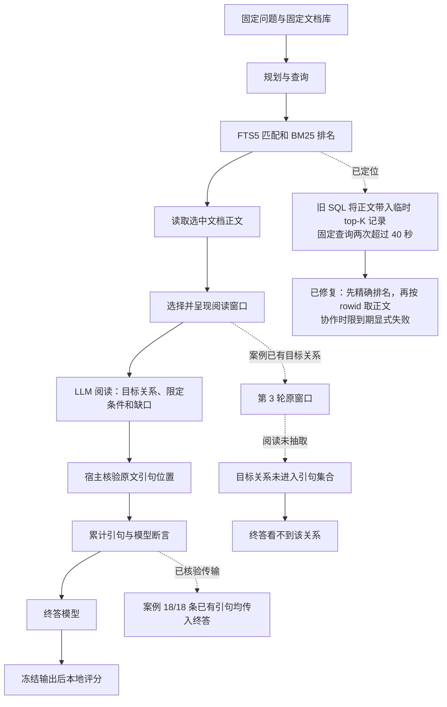

# 新 16 题后续诊断与修复：检索时限及阅读断点

日期：2026-10-08。性质：已用材料上的零 API 工程与语义诊断；本轮新增模型调用 0 次。

**当前已定位两处不同问题：检索侧的 SQL 工作方式会让一个固定查询超时；阅读侧存在“原窗口已有目标关系，但模型没有抽出”的真实案例。检索修复已实现并完成局部验证，阅读改法尚未进行模型对照。原 16 题实验仍为 `protocol_invalid`，不能因修复代码而追认旧比较有效，也不能宣布答案质量已经提升。**

[原 16 题结果](v3_new16_result.md) · [原冻结协议](v3_new16_protocol.md) · [本轮机器可读证据](v3_new16_followup_20261008.json)

## 1. 本轮做了什么，以及没有得到什么结论

之前的付费测量已完成全部 96 个执行单元、生成冻结、参考取得和本地评分；一次检索服务超时使整体比较不满足原冻结资格规则。原问题单轮、规划单轮、规划后循环的 EM 命中分别为 0/32、1/32、1/32，两个命中来自同题同重复；它们仍只作诊断。

本轮只使用已用轨迹与固定本地语料，未读取凭据、未请求外部模型、未获取新题或新参考、未改写旧结果。完成的工作包括：

1. 重建超时单元的既有查询，并以该单元前两个正常查询作对照。
2. 分开测量匹配、排名、正文读取和窗口定位，核对 SQL 执行结构。
3. 实现保留原检索语义的两阶段读取，并接入协作式检索时限。
4. 在阅读内容前冻结四个案例，逐层检查原窗口、模型原始阅读回复、宿主接纳的引句和终答输入。
5. 根据案例修正下一步方向：优先验证阅读提示；暂不把冲突状态、最终评分或选择器作为本轮主改动。

## 2. 从整体流程到局部断点

这次不支持把瓶颈统称为“新上下文没传到回答器”。新窗口已到阅读器，已有引句也基本到终答；但**从原文中选出真正回答问题的关系**仍可能失败。材料呈现、正确抽取、语义充分和最终答对必须分别检查。

## 3. 检索侧：定位到 SQL 正文处理开销

超时案例使用匿名编号 Q13、循环臂、第 0 次重复。重建的第 3 次查询有 101 个字符、12 个不同词，未公开查询内容。两个此前正常查询作为固定对照。

| 查询 | OR 匹配文档数 | 旧 SQL | 两阶段排名 | 选中正文读取 | 窗口定位 |
|---|---:|---:|---:|---:|---:|
| Q13 第 1 次 | 78,210 | 0.865 秒 | 0.461 秒 | 0.0014 秒 | 0.041 秒 |
| Q13 第 2 次 | 91,403 | 1.503 秒 | 0.578 秒 | 0.0018 秒 | 0.068 秒 |
| Q13 第 3 次 | 80,901 | 两次均在 40 秒中断 | 0.416 秒 | 0.0010 秒 | 0.043 秒 |

第 3 次的两阶段排名时间来自带显式只读事务的热缓存复测；其输出与此前 2.671 秒的两阶段运行完全相同。缓存条件未受控，这些数字不能被包装成普遍加速倍数或吞吐基准。

SQLite 字节码显示，旧实现的临时 top-K 记录携带完整 `docs.text`，修复后只携带排名所需身份和分数，最终只为保留结果取正文。这是**有界 top-K 工作记录中的大正文处理问题**，不等于证实全部匹配文档正文都被完整物化。两个正常对照也匹配大量文档，因此不能仅以 OR 命中文档多解释故障。

### 已实现的修复

- 保留全部查询词、原 OR 匹配表达式、BM25 排名、文档编号平局顺序和排除文档的预取规则。
- 在同一只读事务内，先取得 `(rowid, docid, score)`，再按最终排名读取正文。
- 使用原窗口选择规则、原文偏移和原文档哈希；没有顺便替换检索器或窗口算法。
- SQLite VM 使用进度回调检查剩余时限；Python 窗口循环及读取边界也检查时限。
- 宿主将执行剩余预算传给支持时限的检索/读取后端；到期抛出明确异常，不返回空列表、不将未知执行填成答错。
- 后端身份更新为新版本，不能用新实现冒充旧冻结源码继续测量。

### 输出一致性的两个分母

**2/2 旧—新一致：** 两个正常对照的排名、分数和完整输出字典完全一致，包含窗口、偏移及文档哈希。

**3/3 新实现—既有诊断输出一致：** 修复后的生产入口在三个既有查询上都完成，输出哈希均等于此前两阶段诊断结果。其中第 3 个只能与两阶段诊断输出比较；旧 SQL 从未返回结果，因此没有“第 3 个旧—新完全一致”的证据。

生产验证中三个查询分别耗时约 2.899、2.844、3.009 秒。每个子进程先核对了完整冻结语料哈希，这会影响页面缓存，不能与上表的热缓存时间直接计算加速比。

### 时限验证的边界

在真实语料上设置 0.01 秒协作时限，检索约 0.01157 秒后抛出 `RetrievalTimeoutError`，没有返回空结果替代；验证进程正常结束，监督程序核实全部工作进程已回收。

这证明真实检索路径能响应协作时限，**不证明任何磁盘阻塞或原生操作都能在严格操作系统时限内取消**。原运行等待服务线程到期本身不证明底层 SQL 已停止；若要求所有 I/O 情况下的硬取消，仍需要独立进程级约束。原失败调用当时的精确剩余时间没有记录，本轮没有声称重建了其完整计时。

## 4. 阅读侧：目标关系在原窗口，漏在抽取环节

四例在查看语义内容前按既有结果和固定顺序选定，未因诊断结果替换。它们来自两道已用题，属于事后定位，不是盲审、人工裁定或独立效果确认，不能据此估计全体失败比例。

| 固定案例 | 阅读窗口数 | 各轮核验引句出现数 | 最终保留／传入 | 定位 |
|---|---:|---|---:|---|
| Q01 规划单轮，第 0 次重复 | 6 | 7 | 7/7 | 抽出目标关系并命中代理答案；完整背景限定尚未全部验证 |
| Q01 规划单轮，第 1 次重复 | 7 | 7 | 7/7 | 相关文档仅呈现中段，目标关系位于未呈现的开头 |
| Q01 循环，第 1 次重复 | 16 | 7、7、6 | 18/18 | 后续看到文档开头的目标关系，阅读未抽取 |
| Q02 循环，第 0 次重复 | 11 | 0、0 | 0/0 | 已呈现材料主要是泛主题及目录，未发现目标事实链 |

逐轮 20 次核验出现允许跨轮重复，对应 18 条唯一保留引句，不能将两者视为矛盾计数。

Q01 循环第 3 轮已收到包含目标关系的原窗口。检查发现：

- 目标关系可以由该窗口中的对话语义辨认，并非用参考答案字符串命中作判断。
- 相应原文片段能通过现有精确引句位置校验。
- 阅读模型的原始回复根本没有提出该片段，因此不是宿主校验误拒。
- 最终保留的 18 条引句全部到达终答；它们没有包含目标关系，因此终答仍看不到它。
- 背景限定还有资料差异；不能把这个发现写成“所有条件都满足，改提示必然答对”。

同题的成功重复抽取过该关系，但两次重复的窗口和阅读回复不同，所以不能把这一差异归因于固定输入下的纯生成随机性。

### “原句存在”不等于“断言成立”

这个循环案例累计了多条“目标信息缺失”的模型断言，引用的一般说明、结束语或站点署名都真实存在，却不蕴含“正文没有目标关系”。这些断言继续进入后续 `known_claims`，因此状态里同时混入了事实与阅读失败的解释。

这支持把“本轮尚未找到”与事实断言区分。旧断言导致后续模型锚定仍是待验证假设；本轮没有做干预生成，不能声称因果已经证明。

### 本次不支持的两种解释

**不能把这些失败归因于陈旧冲突。** 被检查的三个失败案例 `conflicts` 都为空，反而成功案例有一项背景差异。追加式冲突结构可以另行改进，但当前证据不支持把它排在阅读漏抽之前。

**不能把“未被终答引用”算成“传输丢失”。** 一条引句可能已经呈现，只是无关、重复或最终弃答没有使用。全体循环结果中已有 326/335 条引句保留的旧计数，及本例的 18/18，衡量的是呈现；是否被引用、是否有用、是否足以回答是另外的问题。

Q02 的两轮 11 个呈现窗口未提供所需事实链，当前弃答有合理依据。这不证明整库没有答案，也不能单凭这个案例区分召回、排序和窗口定位的责任。

## 5. 可借鉴的论文机制

以下为已打开的一手论文或官方实现。迁移建议是本项目提出的待检验设计，不等于复现原论文或继承其效果。

| 工作 | 对当前问题有用的机制 | 本项目如何使用及限制 |
|---|---|---|
| [Sufficient Context，ICLR 2025](https://arxiv.org/html/2411.06037v3) | 将上下文是否足够与模型答对、答错、弃答分开分析 | 对比原窗口与抽取引句保留了哪些关系；不把同模型“证据不足”当真值。论文自动判断器的验证不保证适用于本题库 |
| [Self-RAG，ICLR 2024](https://selfrag.github.io/) | 分开判断检索必要性、材料相关性、内容支持和回答效用 | 阅读时围绕目标关系与限定条件组织证据；不把来源核验等同语义支持。其方法训练反思标记，给冻结模型改提示不能叫复现 |
| [CRAG，2024](https://arxiv.org/html/2401.15884v3) | 将材料拆分、筛选和重组，对不确定检索保留中间状态 | 若阅读提示仍漏抽，再单独测试有界原文邻域；不照搬其外部网页搜索和已训练检索判断器，也不立即新增裁判 |
| [IRCoT，ACL 2023](https://aclanthology.org/2023.acl-long.557/) | 检索利用此前取得的证据，解决下一步缺口 | 保留规划单轮与迭代的首轮一致性；后续查询应针对未完成关系。多循环不保证有收益，查询策略对照须匹配预算 |

它们共同支持更明确的证据组织和分层诊断，不支持现在直接放宽评分、取消拒答或训练复杂选择器。

## 6. 下一步：只做阅读提示的单因素诊断

推荐先准备一个小范围、冻结输入的对照规格；本轮不再付费，不启动新 API，不自动扩大数据或预算范围。拟议执行入口尚未实现或冻结，当前不是可运行方案，也未获得该新测量的授权。

拟议面板为上述 4 条已用执行，仍只有 2 道题。每条冻结最后一次 `read` 的完整输入及前缀状态；A 原提示与 B 修改提示都重新独立采样 2 次，不将旧缓存输出当新对照。规模为 16 次阅读与 16 次终答，最多 32 次模型调用。模型提出的新查询只记录，不执行。这个规模用于定位机制，不能支持全题库优劣结论。

**唯一变量：现有 `read` 阶段的通用提示。** 不改模型、温度、检索结果、引用校验、响应结构、最终回答提示、评分器或交付规则。先复用已经呈现的窗口与相同先前状态，比较原提示与修改提示：

1. 先明确问题要求回答的关系，再逐项查证必要限定；不要只抽背景相关句。
2. 要求把正文中的关系表达与页面元数据区分，引用应直接支撑所写断言。
3. “本轮窗口未找到”进入已有 `gaps`，不能仅凭局部缺席写成全局否定事实放进 `claims`。
4. 新窗口到来时重新核对旧缺口，不因为旧 `known_claims` 写过“不足”就跳过相关内容。
5. 保留缺失证据时的弃答；不得包含本例实体、目标答案、文档编号或固定字符偏移。

预先记录的观察量应包括：目标关系是否抽取、引句是否通过来源校验、真正未解决的限定是否仍被保留、无依据的“信息不存在”断言是否减少。只有随后另行冻结并授权这一新方案，才按固定终答流程测量，同时报告答对、答错、弃答与引用问题；只减少弃答不算成功。

这里先以固定输入检查阅读是否改变，不能直接宣称完整动态搜索流程改善。若有信号，再另立端到端版本。若仍漏抽，再讨论定向复读或有界原文邻域；若原窗口缺事实，则回到检索侧。不要同轮同时改状态结构、查询策略和最终答案提示。

## 7. 验证、产物与结论等级

| 验证项 | 当前状态 | 能证明什么 |
|---|---|---|
| 检索局部回归 | 13/13 通过，最近一次 0.279 秒 | SQL 取消、连接关闭、旧输出等价、事务、读取到期、宿主失败传播等工程行为 |
| 真实语料三个既有查询 | 3/3 与既有诊断完整输出哈希相同 | 新生产检索入口的既有案例一致性；其中只有两条有旧 SQL 返回值 |
| 真实语料短时限 | 显式超时，未返回空结果，工作进程已回收 | 协作时限路径实际生效；不证明普遍硬时限 |
| 阅读断点检查 | 固定四例完成 | 至少一条目标关系从原文到引句的漏抽；不能估计全题库比例 |
| 全量回归与 WSL 验证 | 540/540 通过，108.544 秒，跳过 0；开启真实 WSL 终答来源回归 | 本版完整工程回归通过，含实际 WSL 路径；不能代替新质量测量 |
| 独立实现审查与补充探针 | 审查通过；32 个合成等价探针通过 | 为检索语义保持提供补充工程证据；不与真实题目样本合并统计 |
| 新答案质量测量 | 未进行 | 没有新质量增益证据，原 `protocol_invalid` 不变 |

脱敏证据标识：

- 阅读分析文件 SHA-256：`56cea4bb4599dbaea4892b486b5c35294b3f5c2619989ad7abcda00aa9e8cd1f`。
- 检索生产验证文件 SHA-256：`e9dcd88b68a8b3c7cd87ab0b5bf8fb24723dac0cbbb234b6e8ee7df9125ad84d`。
- 真实时限验证文件 SHA-256：`4bba277cf89d1070aa58cf6bb1fa1888ca54a06ab6a0bf4bee84c43d9afc04af`。

原始问题、答案、检索片段、API 消息和本地私人路径不进入本报告。当前完成的是可核对的故障定位与检索工程修复；阅读提示效果、端到端质量改善、经验选择及程序演化收益仍需各自的实证。
