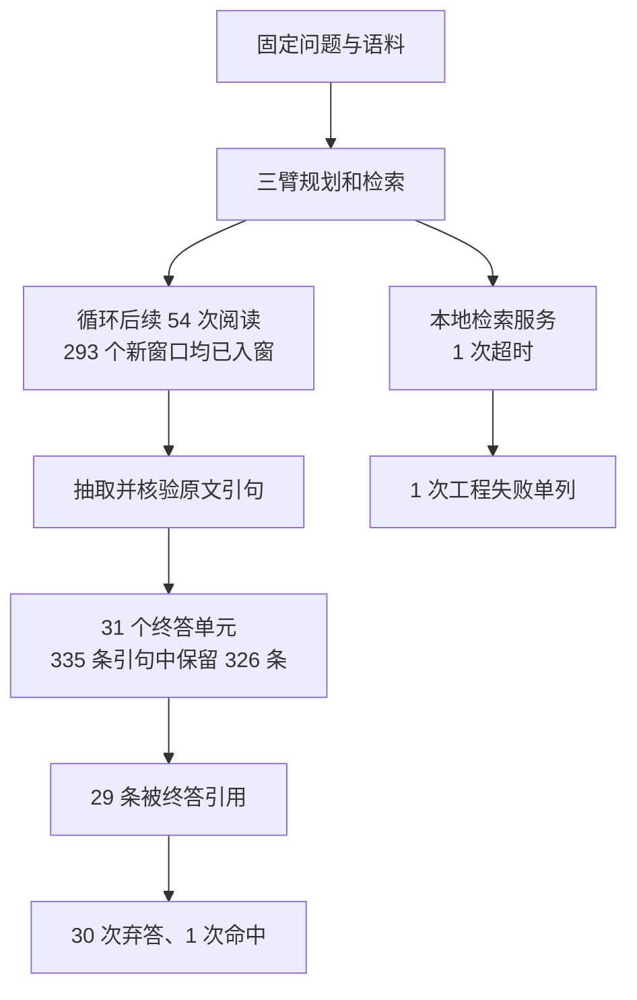

# 新 16 题三臂真实校准报告

日期：2026-10-08。运行源码：`7cc8163`，开发分支：`codex/v3-feedback-grounding`。原主工作区 `be43a19` 和旧结果保持冻结。

**结论：旧的后续窗口入窗阻塞已在这批真实轨迹中解除，但仍没有可靠的质量提升证据。循环增加了新材料和引句，却没有比规划单轮多答对题。另有一次检索服务超时，按预先冻结的资格规则，本轮整体比较为 `protocol_invalid`，数值只作诊断。**

这不是“实验没跑完”：96 个单元已经全部结束、生成冻结、参考取得和本地评分完成；其中一个单元以工程失败结束。也不是 RSI 演化有效的证明：本轮只比较固定 RAG 流程，没有训练选择器或让修改器改程序。

[完整脱敏数据](v3_new16_result.json) · [运行终态](v3_new16_run_status.json) · [冻结方案](v3_new16_protocol.md) · [审查回应与修复顺序](v3_review_followup_20261008.md)

## 1. 如何回应本次审查

| 审查意见 | 已落实内容 | 当前证据边界 |
| --- | --- | --- |
| 字母序截断污染比较 | 保留完整查询词，仍用原 FTS5 BM25；没有顺便更换检索器 | 取消了人为丢词，但不代表检索能力足够，也未证明运行耗时合适 |
| 规划与循环混淆 | A 原问题单轮；B 规划单轮；C 规划后循环 | 32/32 组 B/C 的规划及首读请求、响应一致；没有混用两种起点 |
| target_module 自报归因 | 宿主记录实际 AST/配置范围，混合改动不记单模块收益 | 归因约束已实现，模块选择器的真实效果尚未验证 |
| 终答可能硬编码 | 绑定最后成功模型终答，增加 D_fit 特异常量检查 | 检查是有限防护，不证明任意程序都不可能作弊 |
| 缺统计和新题 | 预先抽取 16 题，每臂两次；题内平均、配对统计方案冻结 | 有一次不合格执行，按原规则不生成合格区间、不分析成功子集 |
| 停滞设置不明 | 本轮实际冻结 max_stagnant_rounds=2 | 默认值不代表本次配置；没有运行中修改 |

本次参考获取改为：先只取得问题，完成所有生成和账本核验之后才取得对应参考。问题和参考均锁定官方版本，只解码所选 16 题。源码与测试此前通过 527 项本地 v3 测试（含真实 WSL 来源回归），源码提交的 GitHub CI 通过；这些测试证明工程行为，不代替本次真实数据。

## 2. 面板、调用与费用

- 16 题 × 3 臂 × 2 次重复 = **96 个结果**；统计题目单位仍为 16。
- 从此前题号盘点差集中按固定种子选题，排除已用/已接触的 72 个题号；未按答案或检索好坏筛选。
- 完成有限词面重叠检查；历史记录有覆盖缺口，所以仍是探索性新面板，不能称全历史独立确认。
- `deepseek-flash`、温度 0、thinking 关闭；返回身份也是 `deepseek-flash`，不能由这个别名证明服务端权重版本永远不变。
- 固定语料 100,195 篇；每轮最多 2 查询、每查询 5 结果、正文窗口 24,000 字符，C 最多 3 轮。
- 三臂共 **309 次逻辑调用**，实际购买 **245 次**；64 次差额来自 32 组 B/C 的规划和首次阅读复用。
- 测量账本按冻结价格和返回 usage 核算 **¥2.26932328**；启动故障保守占用另计 **¥0.015326**，合计 **¥2.28464928**，低于批准的 ¥82。
- 从首个正式预约到最后结算约 **33.2 分钟**。245 次均已结算，没有待确认模型请求。

金额不是独立核验过的供应商账单。共享请求使物理费用不能可靠按三臂分别归属；不能制造“各臂真实费用比”。三臂也不是相同实际调用成本。

## 3. 完整面板的原始结果

以下均是内部 EM/F1 代理分，不是 BrowseComp 官方模型裁判成绩；全局协议无效，不能据此作正式效果推断。

| 指标 | A：原问题单轮 | B：规划单轮 | C：规划后循环 |
| --- | ---: | ---: | ---: |
| 结果数 | 32 | 32 | 32 |
| 有效执行与终答来源 | 32 | 32 | 31 |
| EM 命中 | 0 | 1 | 1 |
| EM / F1 原始均值 | 0 | 0.03125 | 0.03125 |
| 固定规则识别的弃答 | 32 | 31 | 30 |
| 工程失败／空终答 | 0 | 0 | 1 |
| 逻辑模型调用 | 64 | 96 | 149 |
| 两次终答文本完全一致的题数 | 16/16 | 15/16 | 14/16 |

B 和 C 的命中均来自匿名 **Q01、第 0 次重复**。该题另一重复均未命中；两次正确输出的引用均通过宿主来源核验。它们不是两道题上的成功，也不是稳定的跨重复收益。

- **B−A 原始差值 +3.125 个百分点**：1 题正、15 题零；仅一轮正、另一轮零。
- **C−B 原始差值 0**：所有题、两次重复的原始差均为零；C 比 B 多 53 次逻辑调用，没有新增命中。
- A 的两次输出完全一致来自全部弃答，不能把这种一致性称为高质量稳定性。
- `delivery_rate` 在程序里表示非空终答，不表示不弃答，更不表示答对。

上述只能描述这批结果。“循环本来就无效”“规划已经有效”都超出了证据。

## 4. 新材料到底有没有传过去

### 4.1 入窗环节：有真实修复证据

C 有 31/32 条轨迹进入后续阅读；另一条在第三次检索服务超时。**54/54 次后续阅读均收到新窗口，合计 293 个，复用旧窗口计数为 0。** 这些是按执行单元统计的来源窗口，不是 293 篇互不重复的文档。

与旧 8 题运行中“首轮后新增来源进入阅读为 0”的具体故障相比，这批轨迹已证实新材料可以进入后续阅读。两批题目和版本不同，不能把这些计数直接当质量提升幅度。

后续查询返回的窗口出现次数共 540：211 次完整呈现、111 次部分重叠、218 次没有呈现。它们可能来自重复文档；未呈现也不自动等于丢失正确证据，需要核对具体事实后才能判定。54 行后续阅读计数完整；摘要中的样例截断不表示这些计数缺失。

### 4.2 引句到终答：没有大面积漏传

在有终答的 31 条 C 轨迹上：

| 环节 | 数量 |
| --- | ---: |
| 终答前已核验引句 | 335 |
| 实际呈现给终答 | 326 |
| 未保留 | 9 |
| 被终答引用 | 29 |

保留率约 97.3%。另外 1 个失败结果的终答环节未知，未填零。引句少量被裁剪值得诊断，但现有计数不支持“主要是已抽取引句没有传给回答器”。

29 条被引用也不能解释为其余引句无用或传输失败：大部分结果弃答，而且回答只需引用必要证据。来源合法只说明引句来自提供的文本，不能证明它满足题目的全部限定条件。

### 4.3 当前真正没有分清的环节

A/B/C 分别有 17/18/12 个结果没有可核验阅读引句。更多搜索减少了一部分空证据情况，但命中没有随之增加。仍需分别检查：

1. 检索返回的材料是否本身缺少目标事实；
2. 材料有关键事实，但当前逐轮阅读没有抽到；
3. 引句里已有足够事实，但终答被缺口、冲突或拒答判断压住。

最终回答只见结构化声明和引句，不见完整阅读窗口。因此“有原文没抽出来”和“抽出来但没答”必须分开诊断。模型自报 `evidence_insufficient` 不是独立事实标签。

另一个源码风险：缺口每轮更新，但 `conflicts` 目前只追加，没有明确的已解决状态。旧冲突可能继续影响最终判断；这只是待检验机制，尚不能说它解释了本次全部弃答。

## 5. 两类运行问题分别记账

### 临时启动器问题

本地临时包装器缺少 Windows main guard，spawn 子进程在进程准备期间重入主流程，被运行锁拒绝，网络目标函数未执行。原包装器、pending 缓存、账本和异常均保留并归档；没有伪造返回或改写账本。随后使用已有正式 CLI，冻结源码和计划不变。

原 ¥0.015326 保守预约没有从历史记录中删掉。这种恢复依赖明确的发送前失败证据，不能用于普通 API 超时。

### 真正测量中的检索超时

匿名 Q13、第 0 次重复、C 臂在第三次 search 超时。两次已完成模型调用正常结算，宿主返回 `trusted_handler_timeout`。这是本地服务失败，不是模型答错；本轮没有重跑替换该结果。

冻结规则要求全部单元合格，因此完整面板仍为 `protocol_invalid`。32/32 组 B/C 首轮请求一致是成立的事实，但不能据此越过执行资格门槛。没有输出合格置信区间或最小可检出差异，也没有通过删除失败单元救出“成功结果”。

## 6. 建议的下一步：先定位，再单因素验证

### 优先级 1：零 API 检索耗时诊断

在归档轨迹和固定语料上定位超时发生于 SQL 排名、正文载入还是窗口选择。检索服务应有能取消底层工作的硬时限，不能只让调用方停止等待。先验证相同输入的结果集合和排序不变；若改为 IDF 选词或停用词处理，那是新检索策略，要另立版本。

### 优先级 2：固定案例的三层证据检查

使用本轮已经接触的材料，在查看内容前按观测失败类别和固定顺序取小组：无引句、有引句仍弃答、唯一命中及其失败重复。记录原窗口、抽取引句、终答输入分别能支持哪些限定条件；标注不确定项，不以模型再次说“不足”充当真值。先做本地可复核检查，不追加审阅模型调用。

### 优先级 3：只改被证实的瓶颈

| 检查结果 | 下一项独立对照 |
| --- | --- |
| 返回材料就没有关键事实 | 查询/候选检索策略；一次只改一个因素 |
| 原文有事实、引句缺失 | 阅读抽取或给终答补一个有界原文邻域；保留来源锚定 |
| 引句已经足够、终答仍弃答 | 冲突状态的更新/解决机制，或终答证据核验方式；不要简单取消拒答 |
| 多个层级都不清楚 | 继续将结果标为未定位，不启动复杂选择器来拟合它 |

现在不宜同时换题库、检索器、答案提示和评分。MuSiQue 可以作为单独侧轨，但不能用换题库来证明 BrowseComp 上的机制问题已经解决。经验选择器和元重加权继续不作为本阶段主实验。

## 7. 交付与证据等级

真实调用、冻结、参考获取、本地评分和脱敏报告全部完成；原始材料仅保留本地 `runs/bcp_three_arm_new16_20261008/`。公开 JSON 只含匿名编号、计数和哈希，不含问题、参考、模型正文或密钥。

目前能成立的结论是：**入窗链路已在新面板上真实运行；大部分已抽取引句已传给终答；稳定质量收益仍未出现，检索时限与证据语义充分性是下一步需要分别定位的问题。**
