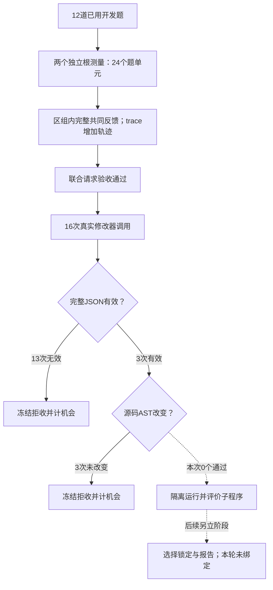

# 真实修改器替代试跑：16次机会完成，尚无可执行新候选

日期：2026-10-09。冻结执行源码 `ef870ab002746d31a8eae2b91dd453006a7f535b`；运行位于 `codex/v3-experience-ablation`。本报告记录一次明确授权的替代试跑，保留先前传输异常及未知请求，不覆盖原停止结果。

**结论：执行与记账完成；16次修改器调用产生13个无效JSON、3个无可执行变化的提案，接受子程序为0。因此当前直接瓶颈在“反馈→实际代码修改”，本轮不能估计程序改进收益或cases/trace质量差。** 原始响应的离线检查进一步发现，16份可提取源码均与父程序AST一致；仅修JSON也不能得到行为改变。没有修补后执行这些响应。

[机器结果与来源哈希](v3_paired_modifier_result_20261009.json) · [修改器原始响应的脱敏审计](v3_paired_modifier_response_audit_20261009.json) · [独立账本与协议复核](v3_paired_modifier_protocol_audit_20261009.json) · [先前传输停止记录](v3_paired_modifier_stop_20261009.md)

## 1. 本次实际做了什么

用户授权原话：“同意替代一次，累计≤¥399／1,566次”。新轮最多1,528次、硬帽¥398.86；原轮38次、保守¥0.13808112继续占用累计额度。两区组根测量全部重做，未导入原轮已知响应。新轮如再遇未知物理结果仍应停止，本次未发生。

| 冻结项 | 本次安排 |
|---|---|
| 开发材料 | 12道已曝光MuSiQue题，2/3/4跳各4道 |
| 配对区组 | 2个，每区组独立测根一次；cases/trace共享该根结果 |
| 两条件 | cases提供同一题序的案例、预测、分数；trace额外提供执行轨迹 |
| 修改机会 | 每区组每条件4次，总16次；交错顺序固定 |
| 选父/修改意图 | 固定根，answer_generation意图；实际程序空间保持原版 |
| 经验记忆 | 关闭 |
| 模型与参数 | 请求和返回均deepseek-flash，thinking关闭，temperature=0；JSON object请求模式已经启用 |
| 接受后的评价 | 原计划每候选12题；此次无接受候选，未产生候选问答调用 |
| 选择/报告角色 | 未绑定、未执行；新面板及封存数据未消耗 |
| 独立开发接口 | paper-controls分支的prompt_only/schema4未混入此次运行 |

冻结计划哈希：`6f4a0ff13cbc36827a5820500df99369e7e0a3f7e1c9cf6fabfe8cbcaadf61c5`。

## 2. 完整结果，包含全部失败

| 区组 | 条件 | 提案机会 | JSON无效 | 无执行变化 | 接受新候选 |
|---|---|---:|---:|---:|---:|
| 0 | cases | 4 | 4 | 0 | 0 |
| 0 | trace | 4 | 2 | 2 | 0 |
| 1 | cases | 4 | 3 | 1 | 0 |
| 1 | trace | 4 | 4 | 0 | 0 |
| 合计 | 全部 | 16 | 13 | 3 | 0 |

所有拒收均消耗预定机会，没有追加提案、替换失败、放松解析或只补成功候选。13份无效JSON有实际的层级/尾随结构错误；其余3份合法JSON未改变可执行行为。候选收益记为“未测/不可估计”，不能把拒收当成问答零分，再计算两个条件的所谓质量差。

## 3. 反馈有没有真正传过去

两区组的共同反馈、题序、父程序和实际发出的完整请求均经宿主门槛与独立复核确认。全部16个实际修改器请求体对应各自冻结门槛，没有按臂裁剪题目。

| 区组 | cases完整请求字节 | trace完整请求字节 | 限制 | 共同信息一致 |
|---|---:|---:|---:|---|
| 0 | 45,100 | 108,335 | 120,000 | 是 |
| 1 | 45,120 | 111,843 | 120,000 | 是 |

这证明相应内容被发送，不能证明模型确实理解或利用了轨迹。根源码在16次请求中一致；每个机会使用独立请求身份和银行，有16个不同供应商响应ID。响应文本只有12种，其中3组出现逐字重复；这是不同调用返回相同文本，没有证据表明宿主复用了提案缓存。

## 4. 原始响应说明卡在哪里

### 4.1 不是输出上限截断的证据

16个响应均正常以`stop`结束，输出8,938—9,176 tokens，低于18,000上限。此次观察不支持“先加大输出上限”作为修复。完整JSON有误，也不能简单归为“忘开JSON模式”：请求已启用该模式。

### 4.2 实际代码基本在照抄父程序

只作静态诊断，从无效JSON的可解析片段中提取源码，不把它转换为合法提案，也不执行：

- 16份`rag.py`均与父程序逐字相同。
- 12份`rag_core.py`与父程序逐字相同；4份只增加末尾换行。
- 16份两文件的AST均与父程序相同，包括13份JSON无效响应。
- 3个合法提案全部只是core多一个换行，因此“没有可执行变化”的拒收有直接依据。

因此，当前未发现被格式检查误拒的真实代码改进；只做宽松JSON修复无法解决这批提案空转。

### 4.3 修改说明与实现脱节

模型文字讨论了停止条件、桥接信息、阅读约束、后续查询和拒答处理。部分说明声称已修改函数或约束，但返回源码没有对应变化；另一些只是提出想法。说明文本不能代替实际差异或作为机制收益证据。

基于本次证据，最值得优先检验的假设是：**整文件返回契约让修改器花大量输出复制约3.4万字符父代码，却没有把修复意图落实为局部修改。** 这是下一版设计假设，不是已证明的因果解释；模型能力、请求组织等因素尚未单独消融。

## 5. 根程序测量与随机波动

| 指标 | 区组0 | 区组1 |
|---|---:|---:|
| 问题数 | 12 | 12 |
| F1 | 37.69% | 22.69% |
| EM命中 | 2/12 | 1/12 |
| 执行完成、答案来自模型 | 12/12 | 12/12 |
| 引用来源校验通过 | 10/12 | 9/12 |
| 根调用数 | 49 | 51 |

相同根程序、相同题目与参数的两次独立端到端测量相差15个百分点。它包含规划、检索路径、阅读和终答的综合波动，不是固定上下文下的纯回答噪声估计。只有两个区组，不能据此稳定估计总体方差或检出能力。

根结果只是工程试跑基准，不是新题确认。引用定位通过不等于事实支持答案；未把引用来源分加进主F1。此次没有新子程序可以与根做收益比较。

## 6. 调用、费用与时间

| 用途 | 调用数 | 本地费用记账 |
|---|---:|---:|
| 两区组根：plan/read/answer | 100（24/52/24） | ¥0.27196128 |
| cases修改器 | 8 | ¥0.62493724 |
| trace修改器 | 8 | ¥0.70613504 |
| 本替代轮 | 116 | ¥1.60303356 |
| 保留的原停止轮 | 38 | ¥0.13808112 |
| 两轮累计 | 154 | ¥1.74111468 |
| 授权累计上限 | 1,566 | ¥399 |

从新轮首次请求预留到末次结算约811.6秒，约13.5分钟，不包含先前准备和离线验收。全部116个新物理请求有独立供应商响应，均已结算；新轮零pending、零账本告警。费用依据本地返回用量与冻结价格，不是供应商发票。

实际费用远低于最坏包络，原因包括真实输入较小、缓存计价和所有候选在执行前拒收；不能据¥1.60估计16个有效子程序的完整评估成本。授权剩余额度也不自动授权第二次替代或新协议实验。

原轮1次未知请求的缓存仍为pending，账本已按¥0.034186保守预留额结算；原账本SHA256仍为`b1775919957bf7dd9f818d04a705a6cde20efa81b74de0451772a01bd6e51124`。没有删除、重写或将它视为零分。

## 7. 下一步的最小修改方向

1. **先改提案交付方式。** 保持相同模型、12题、反馈、根程序与评价机制，另立版本，让修改器返回带父源码哈希的局部精确替换或单函数补丁。宿主负责合成完整候选；原片段必须唯一匹配，不允许模糊猜测或执行补丁文本。只改这一个接口因素，仍保存实际差异、AST归因、原始响应和拒收原因。
2. **把“说改了”落实到差异。** 修改意图仅作说明；必须有真实AST变化才进入原隔离评价。保留无变化拒收，不能由宿主替模型实现其文字建议。局部补丁不意味着限定最终只能调参数，正常program条件仍可修改允许文件内的逻辑。
3. **先离线验收补丁协议，再小批验证修改器。** 用唯一/歧义锚点、父版本错误、越界、空改动和真实旧失败响应做测试；不重新解释这16次为成功。新付费方案需先冻结请求范围和上限，不能把本轮剩余额度直接当新授权。
4. **有效新程序出现后，再恢复完整论文对照。** 先核查是否进入隔离运行、改变行为及产生正负收益，然后做连续cases/trace与独立trace对照。不能跳到经验选择器、元重加权或未见报告集。

后续若局部补丁仍空转，再另立单因素对照检查修改器推理配置或能力。不要同时换模型、开thinking、改反馈、放宽审计后归因于某一个因素。

## 8. 本次交付与边界

完成的是一次真实、完整分母的修改器工程试跑；未验证程序改善、轨迹反馈优势、跨题泛化或完整双循环。原历史结果全部保留，正式D_select/D_report继续未使用。独立paper-controls分支已另行完成提示词编辑空间约束与973项回归，不改变本次冻结协议。

下一项研究门槛很具体：先让修改器稳定产生宿主可还原、隔离可执行、确实改变行为的候选。尚未有这样的候选时，增加评价题量或调整F1无法解释或修复本次失败。
