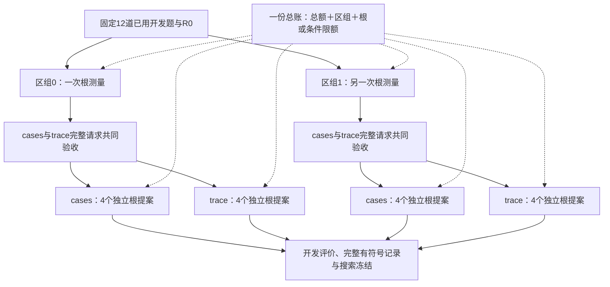

# 已用开发题配对修改器试跑：实现、冻结计划与预算

**执行更新：**已授权启动，后在根测量遇到未知传输结果停止；下文保留准备时快照，当前以[真实停止报告](v3_paired_modifier_stop_20261009.md)为准。

日期：2026-10-09。当前状态：离线准备完成，真实调用未启动。此方案服务第一阶段RAG程序改进论文；完整双循环总目标不变。本次不启用经验学习、不更改问答模型或评分。

## 1. 本次补齐的链路

上一版已经允许D_fit-only搜索。本次在同一 `EvolutionRunner` 上加两个小接口，并由 `paired_evolution.py` 编排固定日程，不另写搜索算法：

1. 两种反馈条件共享**一次完整根程序测量**，包括逐题答案、分数、执行轨迹和来源收据，而不仅是恰好复用某些回答缓存。
2. `run_search_until(n)`按绝对提案机会数推进；可以先只测根，再交错运行两条件。拒收、重复和无效提案都占机会，不补足成功候选。

根测量身份与真实请求bank都包含区组。两个条件、每个修改器提案机会分别使用自己的请求bank。普通候选在**同一条件内**继续原有的精确请求复用规则；命中缓存不算新独立回答，不能将候选数直接解释为独立样本量。

共享根先绑定源码、题组、参考文件哈希、模型身份、检索环境、评分版本、资源限制与重复数，完成后封存所有测量JSON。后续使用只许读取已存在的准确缓存：文件缺失或身份漂移时停止，不以重新调用掩盖证据丢失。不同区组另建测量和请求身份；这保证本地不跨区组复用，不保证供应商temperature=0输出具有统计独立性。

## 2. 修改器确实收到什么

每个区组先建立同一根测量，再对两种完整provider请求做联合检查：

- cases：固定题号与repeat、问题、预测、逐题/平均分、统一交付与资源摘要。
- trace：相同信息，加同一批案例的宿主执行流和诊断。
- 共同字段必须逐字一致；不发送原始私有参考对象，但预测与分数的组合可能暴露可接受答案。
- 两臂完整请求都不超过120,000字节后，才允许任一臂发送第一个修改器请求。不能临时删除trace案例或只缩短某一臂。
- 每个真实develop请求在发送前还要匹配已冻结完整body哈希，避免预检一个请求、实际发送另一个。

`execution_flow`本身沿用已有固定摘要上限；“不裁剪”指不在本轮预算预检中追加不对称截断，不代表把无限长度原始轨迹全部送模型。原始轨迹仍保存在本地。

本次具体计划反馈日程覆盖全部12题，不是只挑失败或高分案例。接口也支持预注册子集，因此预检新增展示案例数和是否覆盖全部D_fit，不能仅凭“不裁剪”标志推断全题反馈。

## 3. 冻结试跑范围

| 项目 | 本轮具体值 |
|---|---|
| 数据 | 12道已经使用的MuSiQue开发题，二/三/四跳各4题 |
| 新选择/报告材料 | 不绑定、不测量；96/107/168正式面板用途不变 |
| 根程序 | R0哈希`359c564942074f62a7d99bc9d722ba011448fec1b6927d6115b8c954d7a5410a`，与前案一致 |
| 区组 | 2，各自独立根测量；区组内cases/trace共享 |
| 提案 | 每区组每条件4机会，共16；每次从R0出发 |
| 反馈日程 | 12题全部展示repeat0，两条件相同 |
| 候选评价 | 同12题，每题1次，Answer F1主分，EM等诊断保留 |
| 模型 | deepseek-flash，temperature=0，thinking=disabled；修改器不另换强模型 |
| 修改意图 | answer_generation，允许原有程序编辑范围；实际混合改动如实归因 |
| 记忆与经验策略 | none；固定根、固定模块意图 |
| 条件顺序 | 第0区组四槽依次cases/trace、trace/cases、cases/trace、trace/cases；第1区组反向 |
| 停止 | 未知请求、原始记录失配、任一完整反馈超帽立即停止；不填零、不追补成功候选 |
| 自动产物 | 原始提案与完整出站反馈、代码归档与实际AST改动、逐题测量、进度/搜索冻结、全部拒收原因、总账及分项账 |

计划哈希、文件身份和无题面摘要见[机器可读计划](v3_paired_modifier_smoke_20261009.json)。完整计划与私人输入留在本地 `runs/stage_one_paper_20261009/paired_preparation`，实际运行目录为 `paired_live`，尚未创建执行结果。

这还是已曝光题上的开发试跑，两个区组也不足以检验正式质量效应。它不替代E-case/E-trace/I-trace的连续改进正式比较。完整连续反馈、prompt_only范围、伪候选、完整搜索运行层统计和统一CB/R0/H入口仍按主计划推进。

## 4. 调用、预算与授权边界

一次区组最多1根＋8个候选，12题×每题最多7个QA模型调用，另8次修改器调用。两区组：

`2 × [(1 + 2×4) × 12 × 7 + 2×4] = 1,528次`

QA最多1,512次，修改器最多16次。按完整请求120,000字节＋1,024输入预留、QA最高2,200输出、修改器18,000输出，以及冻结的高峰计费包络，得**¥398.764544**，申请新增硬帽向上取**¥399**。

2026-10-09已直接核验[DeepSeek官方价格页](https://api-docs.deepseek.com/zh-cn/quick_start/pricing/)：Flash高峰每百万token缓存命中输入¥0.04、未命中输入¥2、输出¥8。模型别名对应V4.1-Flash，但供应商可升级别名，实际返回身份继续在整轮内锁定。

旧1,696次／¥442.385408是未计根共享的历史保守草案，不与新版本混用。**¥399是保守上限，不是预计账单或预付款。**当前仍缺真实代码修改器的本协议成本样本，预计总费用/耗时不伪造，完成后以实际token与账本报告。

总账和区组、根、条件限额同时检查，不因交错或恢复重新给预算。根的逻辑调用数出现在两份反馈里，但实际付费只计一次。本地资源预留不能保证供应商异常计费永不超预留，异常时沿用停止与告警规则。

历史已完成实验的授权不覆盖本轮新范围。本轮需要明确授权发送这12道题、相应检索上下文、净化后的RAG源码，以及允许的预测/分数/执行反馈给DeepSeek；凭据仅使用既定的 `D:\Project\rsi-agent\.env` 中DEEPSEEK_API_KEY，不显示或上传密钥。当前新增DeepSeek API调用为0，凭据读取为0。

## 5. 验收与成功边界

核心新增19项测试、配对入口新增15项测试均通过。完整回归928项中927通过、1项需显式启用的WSL集成测试跳过，耗时766.486秒；本轮另行运行的配对WSL验收如下，不把跳过项算通过。

额外完成真实WSL隔离的两区组合成演示：8个提案机会，4个有效、4个重复拒收；6个真实隔离测量全部执行与答案来源检查通过；28次本地脚本响应按冻结顺序发生；中断恢复及全部完成后恢复无新增调用。这里的脚本知道答案和改法，真实DeepSeek调用为0，不能作为改进收益证据。

真实试跑的工程验收看：共享根是否相同、两条件共同字段是否一致、提案及代码是否归档、改变了哪些行为、重复/非法/截断比例、全部机会是否如实结束、恢复及成本是否可核对。无正收益照实保留；不能仅选最好一个候选当方法证据。候选全拒收或都不改行为，应定位修改器/提示/编辑约束问题，再另立版本，不能直接进入正式大规模实验。

若新根测量后的联合请求尺寸检查失败，停在根测量后报告；此时只能称预算或接口诊断，不能称完成16次提案。历史轨迹尺寸诊断只作为可行性依据，不能替代本轮新根测量或被导入为新根成绩。

## 6. 完整请求尺寸的历史可行性检查

固定12题历史loop/repeat0逐行核对了原冻结哈希、请求身份和答案来源。cases完整出站请求45,091字节，trace为106,794字节，后者距120,000上限还剩13,206字节；两条件共有字段完全相同，未按分数或大小删题。

历史程序与当前R0不同，这只是请求尺寸代理，不是新根观测，也不保证下一次轨迹长度。真实执行仍在新根测量后同时检查两份完整请求，再允许任一修改器调用。完整body及来源证明仅留本地，公开摘要不含题面、预测或原始参考。

## 7. 运行后交付什么、尚未完成什么

真实运行报告按全部16个机会列出：反馈条件与区组、实际源码差异、有效/重复/拒收原因、根及候选F1与EM、逐题修复和回归、行为是否改变、调用/token/费用/耗时与缓存来源。根仅测一次的事实单独说明，不把两份引用视作两次测量。各条件分别列有效候选数和全部有符号增益；最好候选只作开发观察，不能当作未见题收益。

遇到未知API结果先停止并按原请求身份恢复；确认结果前不记零分、不补买同一机会。完整反馈过长时两臂均不发修改器请求，报告已付根测量成本。预算耗尽、候选截断或全部拒收都保留真实停止状态，不以补足有效候选改变分母。

P0—P3的状态表、数据口径、R0/CB/H源码草案与论文契约已交付；P4的阶段边界已完成，本次补齐P5的配对执行条件。尚未完成的是：真实修改器试跑、正式E-case/E-trace连续反馈契约、prompt_only事前限制、根伪候选、完整搜索运行层统计、正式规模核定与最终未见题报告。不能把本次工程验收写成整篇论文实验已完成。
