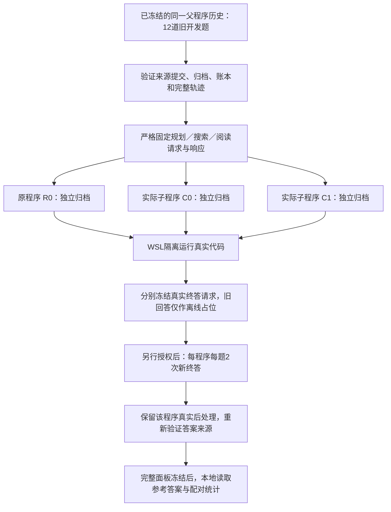

# 原程序与子程序的固定上游终答对照

日期：2026-10-09。分支：`codex/v3-paper-controls`。本页是第一阶段“RAG程序改进”论文的局部诊断，不替代后续改进策略学习与完整双循环。

## 为什么做这一步

上一轮真实试跑首次得到两个可执行子程序。两者F1均由父程序的31.02%变为31.94%，但不能把差值解释为代码改进：父子程序的上游请求与响应仅1/12题完全相同，最终证据仅3/12题相同；两个子程序又共享35个规划/阅读缓存请求，并产生完全相同的12题预测。程序变化、随机过程与缓存复用混在了一起。

此次只回答一个问题：**给原程序与两个真实归档子程序相同的检索和阅读历史，它们各自的终答代码能否造成可重复的答案差异？** 不手写替代补丁，不重新生成候选，也不根据旧分数筛掉某个候选。

## 原程序、子程序怎样分开

三个程序保持不同源码和身份，不覆盖父程序。`is_modified`根据真实文件内容与根程序比较得出，模型声称修改不算依据。两个子程序都是原根的兄弟节点，不宣称连续两次成功修复。

归档的全部已接受且完成原测量的候选都必须保留。计划、程序清单、投影清单三者必须一致；不能删掉第二个候选后重算预算，制造选择性报告。

## 固定什么，允许改变什么

| 内容 | 本轮规则 |
|---|---|
| 原题、数据角色 | 原12道已用MuSiQue D_fit；不读取新96/107/168题面板 |
| 规划、检索、阅读 | 请求与响应逐项完全一致；查询、窗口、顺序、参数或次数改变即拒绝这项对照 |
| 终答输入 | 由每份真实代码在隔离中生成；允许提示、字段组织与压缩不同，这正是被测改动 |
| 终答模型 | 保持原模型、温度、thinking、输出上限和计价包络 |
| 回答与后处理 | 每个单元获得一次新终答，随后继续执行该份程序；不得绕过后处理直接给模型输出评分 |
| 原最终回答 | 只用于离线捕获流程，明确标记不能作为新测量 |
| 缓存 | 程序×题目×重复独立；完整请求相同也不共享首次新回答；恢复可复用同一单元已结算请求 |
| 评分 | 原Answer F1/EM与引用来源诊断分开；先完整生成，再本地读取参考答案 |
| 技术失败 | 未知结果停止；不记零分，不取成功子集做质量比较 |

固定历史上游不能证明现实端到端搜索的收益。修改上游的程序不适用该实验，不能“忽略不同事件”硬对齐。两次新终答仅用于局部诊断，不能把同一道题的重复当成新的独立题目。

## 实现与验收

沿用 `answer_probe` 的预检、执行、冻结、评分入口，新增版本3。原版本1、2不接受新字段，避免改变旧协议含义。新增的来源重建与程序投影模块是准备组件，不是另一个付费执行器。

来源提交必须是完整40位本地Git身份；历史源文件只按字节读取，不导入或执行历史宿主代码。原始运行使用Windows换行、Git对象使用LF时，记录确切换行映射，其他差异不能被忽略。当前维护的根程序还必须完整复现原请求、宿主观察及最终状态。

所有归档候选继续由原WSL沙箱运行。终答请求在调用前与冻结投影逐字段核对。若新回答触发额外模型调用，流程也不能偷偷扩大预算。宿主重新检查程序最终答案是否来自观察到的模型结果。

**本轮已完成，新增真实API调用与费用均为0。** [机器验收与哈希](v3_program_suffix_probe_20261009.json)。

- 220项相关回归：219通过，1项要求显式开关的旧WSL测试跳过；不是新一次全仓库测试声明。
- 12题×3个实际程序，共36次真实WSL离线捕获全部通过，隔离和答案来源检查成立；所有历史前缀完全一致。
- 两个候选各有12/12题的终答请求发生变化，而12/12题的引句证据与原程序完全相同。因此这次确实能把终答代码干预与上游证据变化分开。
- 另6次真实WSL合成集成执行（3捕获、3脚本新终答）通过，恢复0新增请求；另2次路由组件WSL验证通过。脚本终答没有引用，因此引用来源有效性为假，已如实记录，不宣称语义或模型质量成功。
- 截至此处未购买任何新回答，不能报告新的F1提升。

## 已准备的付费对照，尚未启动

冻结计划 `5dd795086005befff77672a705e725635bcd3ea1a76bc48e22ed2844930cb774`：12题×3程序×2重复，共72次新终答；按36个完整请求体逐项计算的保守上界为¥1.295304，新增硬帽取 **¥1.30**。累计调用至多340次，连同历史保守费用和本轮硬帽为¥3.63490820；原累计¥399/1,566次上限继续有效，但它不自动授权不同用途的新实验。

计划路径：`runs/program_suffix_probe_20261009/proposed_plan.json`。准备和请求投影留在本地，不上传问题、引句或原始API消息。

新计划沿用已授权密钥来源，仅把这12道旧题及冻结终答输入交给原DeepSeek模型；全部生成冻结后才本地读取参考评分。原四次提案试跑已结束，本轮新终答诊断需要单独确认范围。

## 论文经验怎样用于这里

[GEPA](https://arxiv.org/abs/2507.19457)用轨迹反思来提出并测试提示改动。这里借鉴“反馈产生可检验改动”的思路；本文的固定上游对照是本项目为消除上游变化混淆设计的诊断，不能声称是论文证明过的通用反事实评估。

[SWE-Edit](https://arxiv.org/abs/2604.26102)研究查看代码、规划和编辑混在一个上下文中的问题，使用分工来改善编辑过程。这提醒我们：局部编辑表示解决了一部分空转，但不保证修改器遵守工具接口。上一轮trace分支仍有响应截断、额外字段、无变化编辑和不支持的调用阶段，应分别计为提案失败，而不是由宿主补写后计为LLM成功。

本轮先检验已经得到的程序。后续若改修改器，应把可用阶段、调用预算与具体编辑位置做成简明接口说明，并用独立提案验证；不把修改器改造和本轮终答比较混在一次干预里。

## 结果如何决定下一步

1. 若三程序无法在同一上游完成捕获：报告不适用的具体事件，停止本轮付费计划，不删题凑面板。
2. 若新终答对照差异接近零或方向不稳：旧+0.93个百分点不能当作补丁有效证据，回到具体失败与修改器能力诊断。
3. 若有一致的局部改善：仍只视为终答改动的开发线索；需要新题、完整问答流程和相同预算的独立确认。
4. 正式论文仍需程序改进与反馈条件的完整对照、根程序重复评估、独立选择与报告面板。经验选择与元重加权接口保留，尚不启用。

本阶段不自动部署候选，不更新旧冻结结果，也不把两份兄弟程序当作两次独立研究复现。
