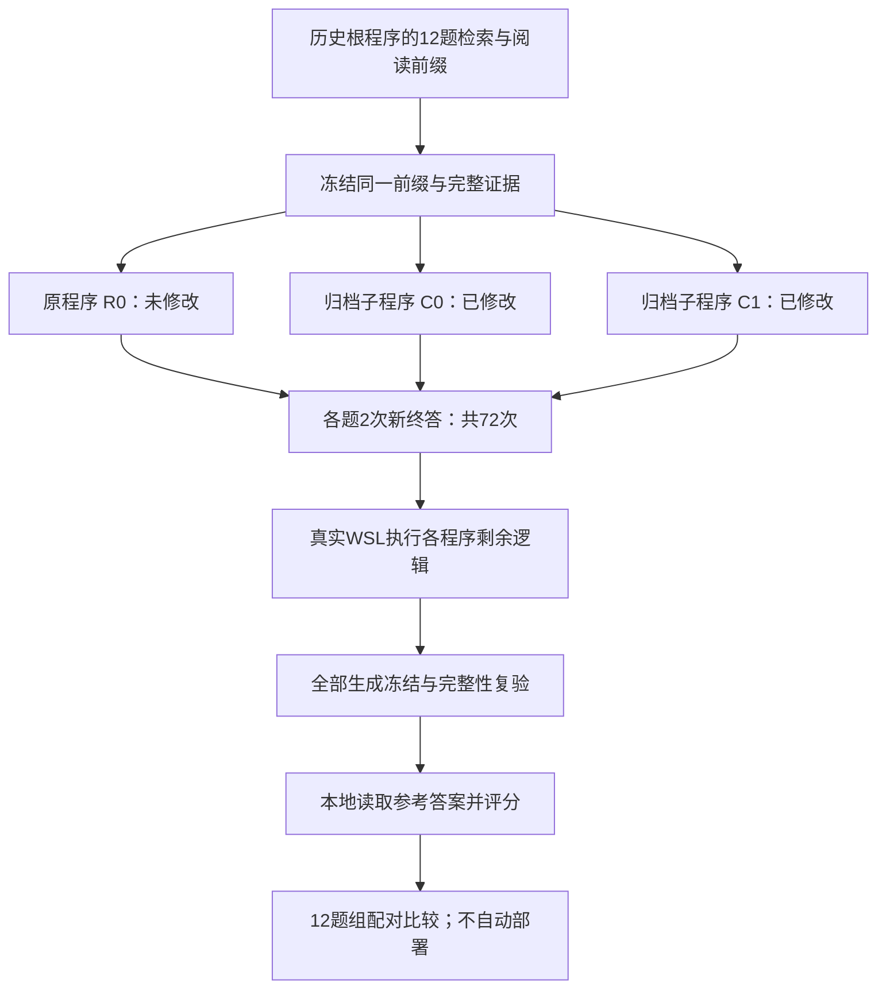

# 同一上游下的父子程序终答复测（2026-10-09）

## 结论

72 次真实调用已完成。固定检索与阅读前缀后，两个真实子程序没有复现此前的小幅正收益：根程序 F1 为 **26.85%**，子程序 C0/C1 为 **22.69% / 23.15%**。保留根程序为参照，不部署两个候选，不启动经验选择或元重加权。

这不证明代码修改无效，也不足以证明候选普遍更差。差异高度集中在个别已用题，根程序的一道题本身在两次回答间发生了正确／拒答翻转。下一步应改进提案的可执行性与实质内容，不能仅凭“源码变化”或先前 +0.93 个百分点宣称质量改进。

## 1. 授权与隔离

本次按用户明确授权：12 道已用 MuSiQue 问题、三个冻结程序、每程序两次新终答，最多 72 次调用，新增费用硬帽 ¥1.30，累计仍受 1,566 次／¥399 约束。密钥沿用已授权来源；正文与公开材料不含原始请求、答案或凭据。

- 真实执行使用 `codex/v3-paper-controls` 的 `857b57f`，源码与计划未修改。
- 并行接口开发位于 `codex/v3-runtime-contract` 的独立目录，没有进入这 72 次调用。
- 父程序与 C0/C1 各自归档，C0/C1 是同一父程序的两个兄弟节点，不是连续修复链。
- `is_modified` 分别为 `false / true / true`，同时保留程序身份和源码哈希；标记不代替真实变化或质量判断。
- 未测新 D_fit96／D_select107／D_report168，没有动用封存确认数据。

## 2. 实际测量链路

本次运行实际归档代码的终答请求与回答后的处理逻辑，不是把某段提示单独摘出来代替程序。上游固定，不新检索、不新阅读、不重选父节点。准备时 36 次捕获已经确认：三个程序各题使用相同证据，两个子程序的终答请求分别在全部 12 题上与根程序不同。

因此本实验估计的是“在同一根程序上游下，候选终答部分是否有收益”，不是整个候选从头运行的端到端效果，也不是 cases 与 trace 两种反馈的比较。

## 3. 结果

| 指标 | 原程序 R0 | 子程序 C0 | 子程序 C1 |
|---|---:|---:|---:|
| 新回答数 | 24 | 24 | 24 |
| Answer F1 | 26.85% | 22.69% | 23.15% |
| EM 命中 | 3/24 | 2/24 | 3/24 |
| 拒答 | 13/24 | 14/24 | 14/24 |
| 非拒答 F1=0 | 2/24 | 2/24 | 2/24 |
| 引用来源校验通过 | 22/24 | 23/24 | 20/24 |
| 两次字符串一致题数 | 11/12 | 12/12 | 11/12 |

引用来源合法与事实支持是不同指标；这里不能把来源通过数当成语义正确数，也不能按来源通过与否筛除题目后重新宣称收益。

| 配对比较 | F1 差（百分点） | 区间（百分点） | 题组方向：正／零／负 |
|---|---:|---:|---:|
| C0−R0 | −4.17 | [−16.67, 0.00] | 0／11／1 |
| C1−R0 | −3.70 | [−15.74, +1.39] | 1／10／1 |

按题内两次均值、12 个题组进行 10,000 次固定种子 bootstrap；对两项比较采用 Bonferroni 调整，单比较名义覆盖 97.5%、目标族覆盖 95%。这是小样本的近似区间，不是有限样本保证；没有进行额外假设检验。72 个回答不是 72 道独立问题。

根程序一道题的两次 F1 为 0 和 1，两个候选在该题均为 0；这贡献了两候选共同的主要下降。C1 另有一题从根的两次 0.8889，变成 0.8889 和 1，形成很小的正向抵消。其余大多数题得分一致。因此应报告“正收益未复现”，不能扩展成稳定、普遍的退化结论。

## 4. 费用与完成状态

- 新增 72 次全部结算，实际费用 **¥0.06873556**；未结算请求 0、告警 0。
- 原程序 ¥0.01519920；C0 ¥0.02279712；C1 ¥0.03073924。
- 本任务对应已登记累计为 **340 次／保守 ¥2.40364376**，包含旧轮未知请求的保守占用；不是全项目历年总账。
- 全部生成冻结后才在本地评分。没有额外购买修复回答。

## 5. 当前卡点与后续动作

当前链路能区分“代码是否变化”“是否能运行”和“是否提升”。新的证据表明第三项仍未成立：两个候选主要强化终答措辞，并未在固定证据下产生稳定收益。

修改器另外两次提案的失败有具体工程原因：接口限制没有完整提供、响应重复键／额外字段／无变化编辑。独立开发版已为这些问题接入共同宿主能力说明与严格输出契约，见[实现报告](v3_runtime_contract_20261009.md)。该改动尚无真实修改器效果数据，不能用本轮 72 次结果来声称它有效。

后续只在新版本中比较提案可执行率、实际改动范围以及同预算质量；保留失败、负收益和无变化记录。若共同能力说明仍不足，再单独测试分析与编辑分离，不把多个改动混进旧试验。当前没有新增付费试跑授权。

[机器可读脱敏汇总](v3_program_suffix_result_20261009.json) · [冻结设计与准备验收](v3_program_suffix_probe_20261009.md) · [此前四次提案结果](v3_exact_edits_result_20261009.md)
