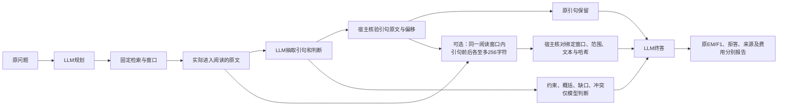

# 终答案例复核与原文邻域模块（2026-10-09）

**决策：保留原有评分和完整中间状态，先检验“引句过短丢失身份、时间、指代信息”这一条。整块删除判断仍未通过推进条件。已实现的邻域模块默认关闭，尚无新增真实模型收益证据。**

活动开发分支：`codex/v3-experience-ablation`。旧96次真实终答实验位于冻结实验分支 `codex/v3-feedback-grounding`，本轮没有修改其源码、生成、账本或评分。下文案例审查为模型辅助分析，不是独立人工事实裁定；工程与覆盖检查均零API。

## 1. 为什么平均分上升仍不宜部署

[原对照](v3_answer_probe_result_20261009.md)的24个固定support状态、两臂各两次新回答已完成：F1从44.68%到55.56%，EM从16/48到25/48；但非拒答F1零从2/48到3/48，且23依赖组配对F1差的95%区间跨零。原推进结论保持不变。

本次核对全部6个正差和4个负差案例，比较原问题、真实阅读窗口、精确引句、派生判断及新终答。**分数变好与使用证据更可靠，是两件需要分别核实的事。**

| 匿名案例 | 冻结材料中观察到的现象 | 能支持的结论与限制 |
|---|---|---|
| Q03、Q14 | 窗口与引句仍缺某项关键关系，删除判断后命中参考 | 命中不能单独证明证据充分；可能借助模型知识，不能仅凭本审阅定为幻觉 |
| Q05 | 同一实体附带括号别名 | 主要涉及输出形式和严格EM，不能据此改评分追认成功 |
| Q09 | 规划加入原题没有的时间限定 | 前序派生约束可能制造了不必要缺口，值得另立提示对照 |
| Q16 | 短引句裁掉来源身份，完整来源涉及另一国家的同名机构；原判断保留了差异 | 删除判断后的高EM不能作为语义改善证明；也不足以宣布题库标注错误 |
| Q22 | 缺口对关系措辞的解释与原题不一致，还涉及地点范围歧义 | 可能有任务理解及契约问题，不能仅用邻域修复解释 |
| Q08 | 日期片段遗漏时间锚点；一个新重复是带真实引用的零分作答，另一个为无引用拒答 | 不是两次伪造引文；附加附近原文可能有帮助，但不保证补齐目标事件年份 |
| Q10 | 引句裁掉说话者和姓名等上下文 | 确有压缩损失；完整目标关系仍不能仅凭现有材料认定已证明 |
| Q12 | 原概括将共同父母强化为婚姻；删判断后两重复一答一拒 | 不能把旧概括当作宿主验证的事实，完整窗口也未必明确婚姻关系 |
| Q19 | 原概括把组织国别迁移为个人国籍 | 这是未经直接证实的推断；删后拒答不等于丢失了已确证的公民关系 |

正例案卷核验24份新终答的冻结身份；负例案卷核验16份新终答与12条引句的来源、偏移及实际阅读窗口。详细题面、回答、引用和参考材料只在本地保存，公开此表不提供这些文本。

## 2. 当前信息链与改动位置

原引句确实能传到终答，但**引句本身可能已丢失必要上下文**。判断块有时补回这些信息，有时加入未获证实的关系，因此既不能全删，也不能当成事实。新增模块仅补传已经读过的连续原文，仍由LLM理解问题和作答。

## 3. 全24题机械覆盖检查

固定统一半径256字符，不按答案、得分或特定案例调整。每条引句只绑定其首次实际阅读来源；没有重新检索、补读文档、读取参考答案或调用模型。

| 指标 | 结果 |
|---|---:|
| 固定案例 / 原引句 | 24 / 78 |
| 可附加邻域 / 原预算内接纳 | 78 / 78 |
| 为邻域删掉原引句或判断 | 0 |
| 新增原文字符，逐引句相加 | 20,393 |
| 按同题同源区间去重后的新增字符 | 18,435 |
| 每题新增原文中位 / 最大 | 828 / 1,527 |
| 请求序列化增量中位 / 最大 | 1,857.5 / 2,831 |
| 扩展后的最大请求 / 原上限 | 6,313 / 64,000字符 |
| 来源、偏移核验 | 78 / 78 |
| 原请求身份核验 | 24 / 24 |

序列化使用RagEngine的JSON字符计数，字符不是token，也不是费用。新增请求成本不能从字符数直接当作实际账单。

**失败边界同样保留：**31条邻域至少一端切在字母数字词内部（左10、右24，有交集）。Q08可看到邻近后续日期的年份，但段首事件时间锚点仍缺；Q10说话者恢复，目标姓名仍被截去末字符；Q16的来源国别标题可恢复。256是受限工程原型，未证明最佳，也没有为了命中这些案例而调宽。

[脱敏聚合](v3_quote_context_feasibility_20261009.json)不含题面、答案、原文或文档ID。覆盖可行不等于语义充分，更不等于真实回答提升。

## 4. 实现契约

- 配置 `final_context_radius` 只接受整数0或256，默认0。禁用时不新增终答材料或诊断事件；与前一维护版本的合成请求、状态、轨迹及用量完全相同。
- 原引句、引用编号、偏移及判断不改写。开启时只在最终 `evidence` 内追加 `context`，不进入规划、阅读或后续查询。
- `context` 包含 `radius_chars/start/end/text/source_start/source_end/source_sha256`。文本为同一实际阅读窗口中的连续原文，宿主重算窗口哈希，不采信候选自行声明的来源合法性。
- 宿主记录原引句与实际阅读窗口的绑定。只有搜索过但未读过的窗口、另一轮更宽窗口、跨来源拼接、错误文本、偏移、哈希和超半径材料均不能补进该引句上下文。
- 最终输入先执行原压缩规则，再按原引句顺序尝试放入完整邻域。空间不够就舍弃该新增邻域，不挤掉原引句或判断；记录接纳、舍弃与字符增量，不作为奖励。
- 返回引用必须与最终模型实际看到的引用及context一致。缓存校验重建新增context的实际阅读来源，测量epoch升级；不把内部哈希校验包装为对外部记录的密码学认证。
- 新配置与邻域函数归入 `evidence_selection` 的实际编辑范围。宿主实现升级不记作修改器演化收益。
- 旧 `answer_replay` 投影字段契约保持不变，不偷偷赋予旧臂新的语义。后续真实比较须使用新协议和新请求身份。

## 5. 论文借鉴与不照搬的部分

[Dense X Retrieval（EMNLP 2024）](https://aclanthology.org/2024.emnlp-main.845/)研究检索单元粒度，其命题单元强调简洁且自包含。对这里的启发是：短引句需要保留指代与身份所依赖的信息。本模块只是该原则的工程应用，不是复现论文的密集检索或命题生成器；也不将模型补写的句子当作原文。

[Sufficient Context（ICLR 2025版本）](https://arxiv.org/html/2411.06037v3)区分“上下文不足”和“模型未能利用上下文”，并发现有用或标注为gold的材料不必然完全支持答案。这里因此同时核对原窗口、引句与最终回答；没有把自动充足性评分器升级成硬事实裁判。

[Prompt-Based Abstention Fails Under Misleading Context（2026预印本）](https://arxiv.org/abs/2608.22228)在小型冻结RAG模型中区分缺失与误导上下文，观察到拒答提示并不能稳定解决误导材料。它启发我们分别报告拒答和错误作答；其模型设置不是本项目的DeepSeek，不能直接继承效果。当前也不增加第二个自动审阅器。

## 6. 接下来的判别性检验

这次先完成实现与离线来源验证，不新增付费实验。

下一项付费方案若准备成熟，唯一处理差异应为：**同一正常检索状态的完整终答材料，关闭或开启原文邻域**。保留判断，不同时换提示、模型、检索、评分或停止规则。冻结两臂的共同前缀和所有非context字段后，再购买独立终答；题目全纳入，不能只选这里的改善案例。

主结果仍报告逐题F1、EM、依赖组配对差区间、拒答、非拒答F1零、引用来源和费用。邻域接纳率、身份恢复、字符增量是过程指标，不能替代正确率。既有门槛不事后放宽；本批已用题只作诊断，冻结改动后才用保留角色确认。不要在这24个支持材料状态上连续试多种半径并把最佳者宣称泛化。

- 补传原文且回答改善、错误作答未增加：支持进一步独立验证，尚不是RSI收益证明。
- 原文补传但回答不改善：应进一步检验任务关系理解、判断块使用或回答提示，而不是继续扩大邻域宣称成功。
- 出现更多同名实体混淆或错误作答：保留负结果，默认保持关闭。
- 仍缺必需关系：说明阅读到的材料本身不足；不能由程序根据参考答案补齐。

真实程序改进、失败轨迹反馈的价值和经验选择的价值仍需各自对照。它们已有工程入口，但不能在证据转换问题未被实测改善时合并宣称有效。

## 7. 审计与复现指针

私有案卷仅本地：`runs/answer_judgment_review_20261009/`。

| 文件 | SHA256 |
|---|---|
| positive_cases.json | a32f23f454b5a008bdf74e81408c446a32048c4aeabda2ba7acec5b1fb3e133b |
| negative_cases.json | 0a8fba5767f0002a4d74b946c3994caa3c253bd5437b1154a75e17fe2a5d642f |
| context_feasibility.json | 7adad3fb681949757527e8baa5ea622cf8ea120df721f4f7814381b210f591fc |

实现基线提交 `a9c9dbe8a4193ddb2f1601fea13ff09e240164f3`。本轮完整回归778项：777通过、1项显式WSL opt-in跳过（151.071秒）；新增28项测试。另有2次实际WSL隔离执行通过，确认两臂规划／阅读相同、终答只差context、返回引用一致。默认关闭与旧维护源码的请求及结果一致；独立模型辅助代码复核未发现剩余高优先问题。

[工程验收与哈希](v3_quote_context_validation_20261009.json)。无真实新模型调用、无凭据读取、无新任务质量结论。测试脚本使用合成来源及模型响应，不能作为答题收益。
