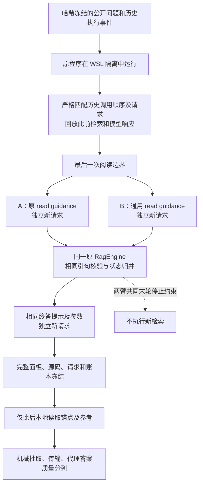

# 固定末轮阅读—终答提示对照协议

日期：2026-10-08。协议版本：`rag-rsi-reader-probe-1`。

**状态：执行入口已实现，方案已冻结并通过零 API 预检；新增真实 API 调用为 0，付费授权待确认。** 本协议只诊断阅读提示能否让已呈现的目标关系进入引句及终答，不测完整循环的质量，也不验证 RSI 演化有效。

冻结方案摘要：`3a47844ad732dfa7bbb0dab58eed767fd985bd91f78f7f78ffc70ff64891fdc9`。

[问题定位报告](v3_new16_followup_20261008.md) · [原 16 题实验](v3_new16_result.md) · [准备与验证数据](v3_reader_probe_preparation.json) · [执行入口](../code_rsi/v3/reader_probe.py) · [冻结回放路由](../code_rsi/v3/reader_replay.py)

## 1. 研究问题与面板

此前固定案例中已确认：原文窗口含目标关系，阅读模型却未抽取；已抽取的 18/18 条引句都进入了终答，因而本例断点在阅读抽取而非引句传输。那些失败案例的冲突列表为空，不能把其弃答归因于永久保留的冲突。

本轮使用此前已经按规则选择的 **4 个执行状态，来自 2 道已用题**。它们覆盖既有成功重复、同题失败重复、循环阅读漏抽及无目标证据的窗口。每个状态都冻结最后一次阅读的完整请求及此前的执行材料。

| 项目 | 冻结值 |
|---|---|
| 执行状态 | 4 |
| 不同题目 | 2，已用于诊断 |
| 提示臂 | A 原提示；B 通用目标关系／当前缺口优先提示 |
| 新重复 | 每状态每臂 2 次 |
| 结果单元 | 4 × 2 × 2 = 16 |
| 最大新增调用 | 16 次阅读 + 16 次终答 = 32 |
| 新检索 | 0；新生成查询仅记录，不执行 |
| 新模型或训练 | 无；不启用选择器或元重加权 |

这不是 4 道独立题，也不是 16 个独立测试样本。两个题目的多个冻结状态相关，重复测量也不增加独立题目数。本轮只做逐状态、逐重复描述，不用显著性或 bootstrap 区间宣称总体优势。

## 2. 执行架构与唯一干预



唯一可变项是**最后一次 `read` 的 `additional_guidance`**。其他历史规划和阅读提示不变。B 的通用要求是：

- 优先核对问题明确要求的关系和当前缺口。
- 即使旧 `known_claims` 声称信息缺失，也重新检查当前窗口；旧声明是模型判断，不是已证实事实。
- 引用应支持所写事实，不能用无关段落或网页元数据证明信息不存在。
- “本轮窗口尚未找到”应写入范围明确的 `gaps`，不要累计成全局否定事实。
- 区分候选答案关系与其他限定条件的验证；保留真正冲突，不因找到一个候选就声称证据完整。

提示不包含本例实体、答案、文档编号、锚点或字符偏移。没有修改 `rag.py` 的证据归并代码，也没有删除或重写已有 `known_claims`。B 只是要求模型重新核对它们，**不等于已修复旧断言累计机制**。

两臂共同把可执行轮数限制到被冻结的末轮阅读位置，确保任何新阅读回复都不能触发额外搜索。这个共同的局部停止规则使实验成为固定后缀诊断，不能当作原完整循环的重跑。阅读回复中的新声明、缺口、冲突和 `ready` 按原引擎处理，再由原引擎构造终答；不能把旧回复强行灌回新终答。

## 3. 冻结、隔离和新请求规则

- 绑定完整案例文件、原引擎源码、历史请求／响应摘要、公开题目、配置、最终原请求摘要及全体运行源码。
- 前缀调用必须逐项匹配；偏离、额外检索、额外模型调用均拒绝。
- A/B 的每个状态及重复都使用独立请求缓存空间；A 也新采样，不能拿旧失败响应作对照。
- 旧响应只用于历史前缀重建。提供商输入缓存属于计费机制，不是重复使用旧答案。
- 模型为 `deepseek-flash`，温度 0，thinking 关闭；阅读输出上限 2200 token，终答上限 800 token。温度 0 不保证服务端确定性。
- 顺序按冻结种子交错安排；末轮阅读请求已按完整供应商请求体检查输入上限。
- 保留真实 WSL 隔离、最终模型答案来源绑定和原引用核验。模式检查不能替代隔离。

`preflight` 读取案例及源码，但只检查参考、锚点与凭据的元数据，不解析其私有内容，不建立 API 传输。`generate` 先匹配批准的完整方案摘要，再检查请求恢复及账本，之后才允许建立真实传输。

评分前还会根据已冻结前缀及已结算新响应，通过宿主重建完整观察轨迹，核对阅读引句和终答输入；仅修改日志中的“已核验”标志并重算外层自哈希不能通过。缺少、重复、外来或被篡改单元阻止评分，不裁掉不利结果。

## 4. 机械指标、机会分母和质量边界

锚点是评分侧的预先冻结局部证据跨度及哈希，**不进入模型输入**。在四个状态中，只有两个末轮窗口具备已经确认的目标关系锚点；这两个状态属于同一道题，不代表两道独立成功机会。

完整报告保留全部四个状态。锚点抽取率如需计算，分母只能使用预先有锚点的两个状态及相应重复，并同时标注实际题目数；无锚点状态不填成“抽取失败零分”，也不事后删掉。

| 指标 | 定义 | 限制 |
|---|---|---|
| 前缀已有锚点 | 历史阅读已核验引句是否覆盖锚点 | 不能归功于本轮新提示 |
| 末轮新阅读锚点 | 新阅读提出、宿主核验的引句是否覆盖锚点 | 完整跨度命中不等于语义充分 |
| 终答输入锚点 | 锚点是否真实出现在终答请求内 | 没被终答引用不等于传输丢失 |
| 新核验引句数 | 本轮阅读的合法引句数量 | 数量增加不是收益目标 |
| 答案 EM/F1 | 生成全部冻结后用原参考本地计算 | 内部代理分，不是 BrowseComp 官方模型裁判成绩 |
| 弃答及来源状态 | 与分数、机械指标分开报告 | 少弃答、来源合法都不必然代表更正确 |

部分正确关系未必落在预设锚点中；未命中机械锚点只能表述为该指标未识别，不能自动判定所有语义抽取错误。模型自报 `evidence_sufficient` 不是真值；完整限定条件没有经过独立逐题人工裁定。原案例的代理命中也不证明每项限定已被验证。

可观察的机制信号是：B 比新采样的 A 更稳定地产生合法目标关系引句并把它传入终答，同时不靠虚构引句或忽略真实矛盾取得表面改善。两次重复只能给探索性迹象。如果 A/B 都抽到，历史漏抽本轮未复现；如果 B 效果不稳定或引入错误，结论仍不确定。任何结果都不能直接宣称完整 RAG 或 RSI 改进。

## 5. 失败、恢复与评分资格

- 合法但零引句、缺口未解决或主动弃答均保留为观察结果。
- 截断或无法解析的 JSON 使末轮阅读没有完整宿主观察时，`anchor_in_new_read` 和新引句数为 `null`，不伪装成完整阅读后的零抽取。原前缀和之后成功终答的已观察信息仍可分别报告。
- 已解析对象的结构错误按原引擎规则处理；`read_schema_failure` 可从完整收据的 `candidate_reported`／轨迹查看，属于引擎报告，不是评分行表已展开的独立宿主真值分类。它与物理响应未知、模型正常报告“未找到”不同。
- API 超时或物理结果未知时停止；预约和请求状态保留，恢复检查先于任何新传输，不自动重买。
- 终答来源或执行资格不合格时保留该结果，质量指标为 `null`；不将未知执行填成答错。
- 全部单元和账本完成核验后才解析锚点与参考。恢复已完成运行不购买新响应。

原 16 题三臂实验的 `protocol_invalid` 状态保持不变；本轮不会替换其失败单元或把旧结论改成有效。

## 6. 费用与授权

采用已核对的 DeepSeek 官方高峰定价：每百万 token 输入未命中 ¥2、输入缓存命中 ¥0.04、输出 ¥8。本方案按输入缓存未命中作保守预约，不预支可能的缓存折扣。[官方价格](https://api-docs.deepseek.com/zh-cn/quick_start/pricing/)

| 项目 | 值 |
|---|---:|
| 单请求完整输入字节上限 | 120,000 |
| 保守输入预约额外余量 | 每次 1024 |
| 最大新调用数 | 32 |
| 保守费用上界 | ¥8.129536 |
| 本轮计划硬上限 | ¥9 |
| 当前新增真实调用／费用 | 0／¥0 |

上界按 32 次最大输入、16 次阅读输出上限和16 次终答输出上限计算：`[32 × (120000 + 1024) × 2 + 16 × (2200 + 800) × 8] / 1000000`。**¥8.129536 是保守上界，不是预计账单。**

两臂调用和输出额度相同，但 B 提示更长，本面板每个完整阅读请求增加 782 字节。因此应分别报告实际输入／输出 token、输入缓存命中和费用，不能称严格等 token 或等费用。缺失供应商输入缓存计数时报告未知，不填零。

审批仍待确认；旧实验剩余额度不自动适用于这个新请求范围。执行时必须提供本协议开头的完整批准摘要。源码、案例或非阅读参数发生变化时应重新冻结，不能沿用旧审批摘要。

## 7. 已完成的工程证据与未验证项

| 验证 | 已取得证据 | 不能证明什么 |
|---|---|---|
| 原始四案例 WSL 重建 | 4 个案例、29 个历史回调事件；为重建材料执行 12 个既有查询；完整状态、宿主轨迹和证据轨迹与原件一致 | 只重建原流程，不验证新提示效果 |
| 新诊断 runner 的脚本 WSL 验收 | 16 个结果、32 个脚本响应；16 个隔离和答案来源均通过；前缀请求相同，只有目标阅读 guidance 改变；恢复新增脚本响应 0 | 返回的是冻结历史响应，没有购买新 LLM 回答，未执行真实参考评分 |
| 全量回归 | 577/577 通过，120.419 秒；启用真实 WSL 终答来源测试，跳过 0 | 工程回归不等于真实质量验证 |
| 新提示真实测量 | 未开始；新增真实 API 调用 0 | 没有新抽取或答案质量增益证据 |

总数 577 已包含 21 项 reader-probe 测试和 16 项 replay 测试，不能再重复相加。

前两项必须分开：原始回放证明冻结案例可重建；脚本验收证明新的编排、隔离、请求隔离和恢复路径能运行。两者都不检验 LLM 是否服从 B 提示，也不能合并当作 20 个真实实验样本。

## 8. 与研究依据的对应

[Sufficient Context（ICLR 2025）](https://arxiv.org/html/2411.06037v3)提醒应把材料充分性与模型是否答对、是否弃答分层，本协议据此将锚点抽取、完整条件和代理答案分开。[Self-RAG（ICLR 2024）](https://selfrag.github.io/)区分相关性、支持性和回答效用，启发本轮避免把“原文引用存在”当作“断言正确”。

这里仅借鉴问题分解和诊断维度。没有采用论文的训练模型，也没有增加自动裁判；不能称为复现这些论文或已经获得其效果。

## 9. 操作入口

以下 `<localfile>` 代表本地冻结方案文件，公开文档不展示私有路径或实验原文。

```text
python -m code_rsi.v3.reader_probe preflight --plan <localfile>
python -m code_rsi.v3.reader_probe generate --plan <localfile> --approved-plan-hash 3a47844ad732dfa7bbb0dab58eed767fd985bd91f78f7f78ffc70ff64891fdc9
python -m code_rsi.v3.reader_probe grade --plan <localfile>
```

`generate` 命令只有在本轮范围得到明确授权后才能执行。公开交付只保留脱敏状态编号、计数、摘要和结果边界；题目、模型响应、参考、原文片段、凭据及私有路径留在本地。
