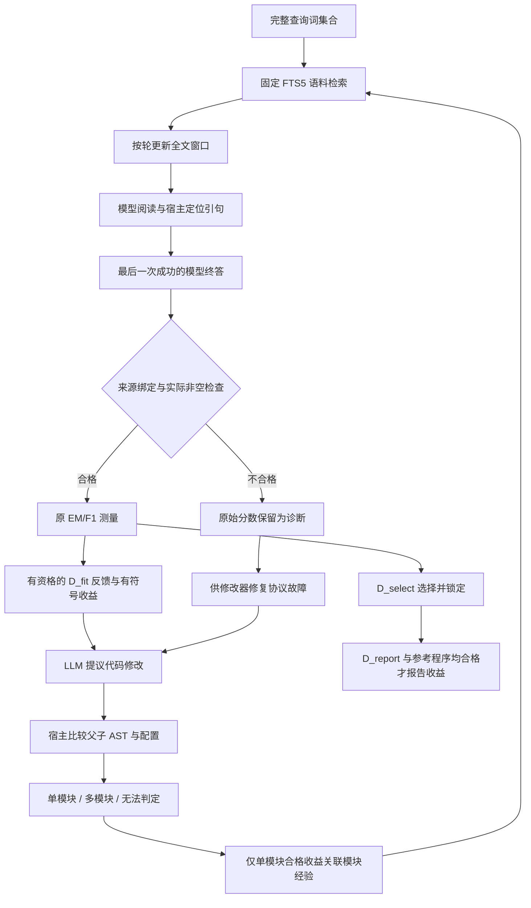

# 外部审查后的三项修复与下一步（2026-10-08）

> 后续更新：本页第 7 节中的三臂与配对统计接口已实现并完成合成隔离验证；真实质量试验尚未执行。见[三臂协议与验证](v3_three_arm_protocol.md)。本页 412 项测试对应上一提交。

这轮已把检索截断、答案来源接纳、声明模块归因三个缺口接到实际执行链。实现与验证位于 `codex/v3-feedback-grounding` 分支；主工作区仍停在 `be43a19`，保留旧实验的冻结版本。**本轮新增真实 API 调用 0、费用 0；没有证明真实模型质量提高。**

## 1. 对审查建议的判断

审查的主要判断成立：首轮有真实数据和可定位的窗口故障，但不能用 8 道已用题、单次基线全部弃答、一个题驱动的两次命中来证明动态流程更好。规划和迭代混在一个开关中，确实需要拆开。

有三点需要进一步限定：

- 检索截断是实际偏差来源，但不能据此断言首轮的全部差异由它造成。旧查询中 4/8 道题受截断；唯一命中的那道题原查询有 52 个不同词，没有触发 60 词上限。旧结果中的模型与窗口差异仍然混在一起。
- 实际冻结的两臂都设置 `max_stagnant_rounds=2`；默认值 1 未在该次真实实验中生效。以后报告应公布实际参数，不能只引用默认值。
- ¥30 是金额上限，不是可继续调用的授权余额。题目、外发范围、调用次数和源码版本都有各自的冻结边界。新三臂方案不能直接沿用旧 112 次方案。

## 2. 修复后的链路

来源合法、语义支持和答案正确仍然是三个概念。上述检查约束谁产生答案以及哪些记录可计作收益，不会自动证明证据足够或回答正确。

## 3. 检索：先去掉系统性丢词，不同时引入新检索算法

删除 `sorted(terms(query))[:60]` 的截断，保留全部规范化去重词。排序只使查询构造确定，不再决定哪些词被保留。FTS5 OR、BM25 文档排序及文档 ID 平局规则保持原样；后端身份升级，旧缓存不能被当作新检索结果。

本次没有同时加入停用词表、IDF 截词、向量检索或新重排器。这些方法可能有价值，但属于新的检索因素；当前先消除明确的字母顺序偏差，便于解释变化。长查询耗时仍需实测，全部保留不等于检索已经足够好。

离线核对真实固定语料：对旧试验中受截断的 4 道已用题，分别重放旧规则和新规则的 top-5 检索。4/4 道题的文档集合改变，新旧交集分别为 4、2、3、3 篇。此次没有调用回答模型、打开参考答案或评判相关性，因此只能证明修改确实改变检索，不能宣称召回率或正确率上升。单次耗时受缓存影响，不作性能结论。

代码同时显式关闭 SQLite 连接。测试覆盖空查询、稳定顺序、旧上限之后的关键词以及现有合法查询长度内的大词集合。

## 4. 终答：以宿主实际观察为准

新 `execution-3` 收据绑定模型请求、响应哈希、完成标记和对应观察。候选返回答案必须等于**最后一次成功完成的 answer 调用**的答案，只允许首尾空白不同。不能通过 EM 归一化放宽来源比较。

以下三种情况即使碰巧拿到原始满分，也不能作为有效程序：

1. 不调用回答模型，直接返回某个答案。
2. 调用模型后把其答案替换成硬编码字符串。
3. 连续调用回答模型，却返回早先一次答案，绕开最后一次结果。

正常模型弃答仍是合格执行，其任务得分继续按原评分规则计算。失败调用不冒充成功的最终回答。候选语法、模型超时和请求结果未知继续按各自状态处理，不偷换为普通答错。

来源检查接入新测量与缓存恢复，并贯穿后续环节：

- 开发反馈的有效 `score`、逐题 `host_score` 和配对 `signed_delta` 必须有宿主核验资格。
- 不合格或旧格式记录的原始分数和正负差值保留在 `raw_*` 诊断字段，不能成为质量奖励；提示词明确这些数据只供定位故障。
- 经验卡不能凭顶层自报 `valid_program=True` 升格，必须使用核验后的反馈资格。
- D_report 任一比较方不合格时，`quality_comparison_valid=false`、`paired_report_gain=null`，原始差仍保留。不会依据报告题重新挑交付。
- 新旧测量版本分开；旧日志可以诊断，不能补造事件后当作新规则验证通过。

这不等于解决了所有硬编码风险：候选还可能把开发题答案写进提示，诱使模型复述。题目/答案特异常量扫描尚未实现，来源一致性也不能证明程序泛化。D_fit 的题目、预测与得分本来就可能透露评分器接受的答案；字段改为 `raw_reference_objects_not_sent` 和 `fit_feedback_can_reveal_accepted_answers`，不再用“未发参考对象”暗示没有答案信息。

## 5. 模块：意图、实际范围和效果分开

修改器提交 `intended_target_module`。旧 `target_module` 仍可解析为意图，不能直接当作效果归因。宿主根据父子源码和配置构建 AST 差异收据，并在恢复时对归档源码重新计算校验。

实际范围包括三个结果：

| 结果 | 如何处理 |
| --- | --- |
| 已识别的单模块改动 | 可作为该模块的相关经验，保留全部正负收益 |
| 多模块改动 | 程序仍可执行和测量，但不记成某一个模块的收益 |
| 未知、动态或无法可靠映射的改动 | 保留实际范围与代码差异，不猜测模块归属 |

若声明查询模块却只改回答提示，按实际回答范围记录，不能再把收益算给查询模块。新增或改名的辅助函数、动态结构、全局调度等映射不充分时，宁可标未知。

这是保守的静态范围记录，不是语义依赖分析或模块因果识别。单模块也可能影响下游；多模块改动也可能有价值。经验选择器仍缺足够真实样本，本轮不增加其复杂度，不启动训练或元重加权。

## 6. 验证与可支持的结论

全量 **412/412 测试通过**，耗时 124.456 秒，包含显式启用的真实 WSL 来源回归，跳过 0 项。默认 CI 不启用该 WSL 项；本地实际验证另存于[机器可读摘要](v3_validation_summary.json)。测试用合成题目、脚本响应和本地固定语料，不购买新的模型回答。

真实 WSL 完整演化入口验证：三个数据角色共 6 个测量单元全部隔离验证通过，19 次脚本响应包含 1 次预设代码改动；交付锁定与报告完成，重启新增请求 0。新来源与程序资格均通过。预设脚本的分差只证明链路接通，不是模型学会改程序。

另有真实 WSL 的 5 类终答用例：零调用、覆盖答案、返回旧终答均被挡在有效程序之外；正常终答与首尾空白处理后的弃答仍可用。前三类保留原始满分以验证“碰巧答对”不能绕过资格检查。

独立只读复核还覆盖旧收据自报有效、伪造可用标记、空白答案、缺少资格、响应哈希不符，以及 D_report 任一方无效却有正原始差的情况。未发现新的实际绕过。旧负收益样例按新合成收据契约更新，合法负收益断言保持不变。

**已证实：**三个工程缺口及下游资格传递可被测试与实际隔离执行核对。

**尚未证实：**修复后模型正确率提高、循环优于规划单次、真实修改器提高程序质量、经验选择优于轮换、独立任务可泛化。EM/F1 对 BrowseComp 仍是内部代理分，不冒充官方裁判。

## 7. 下一步按依赖推进

1. **冻结机制验收。** 用新版本检验“有可接收的新检索窗口时，下一轮阅读确实得到新窗口；需保留的引句实际进入终答”。没有检索到新材料则记为未验证，不能当成功。全文、请求与调用上限同时核对。
2. **实现三臂与统计接口。** A 原问题单次、B 规划后单次、C 规划后循环。B/C 的规划与首轮契约一致，才能区分规划贡献和继续搜索贡献。当前代码仍是两臂预检，不能只改旧 JSON。
3. **另冻新题质量探索。** 先定一个题库、未用题清单与分组，再定重复子集、主指标、实际成本和调用上限。相关问题先按组处理，多轮先在题内汇总；增加配对区间和功效规划。不按能否答对选题，8 题不用于证明总体优劣。
4. **再做真实代码演化。** 先补题目/答案特异常量扫描及日志，再采用固定或轮换选模块对照。开发、选择、报告三个角色继续分离，不把固定流程比较当成 RSI 成功。

旧 112 次复测保持历史记录。本分支三个修复组合在一起，后续验收必须标注新版本；不能把新结果称为单独的窗口修复效果。三臂同 8 题各 2 次的逻辑上限是 `8×2×(2+3+5)=160`，实际新方案应重新计算范围和预算；不以首轮只花约 ¥1 为由扩张调用。

机制对照的依据见 [IRCoT](https://aclanthology.org/2023.acl-long.557/)，多跳开发题可参考 [MuSiQue](https://aclanthology.org/2022.tacl-1.31/)，题级配对重采样可参考 [Koehn 2004](https://aclanthology.org/W04-3250/)。这里是针对本项目的设计迁移，论文不能替代本系统的真实验证。
