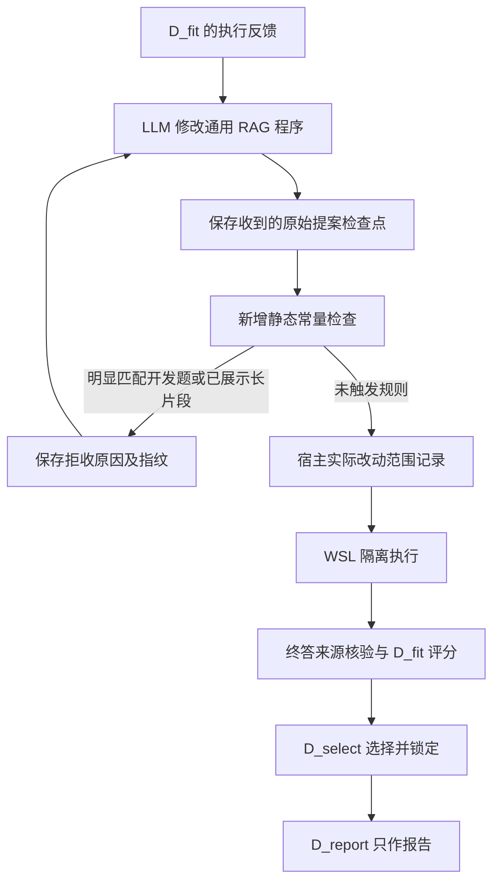

# 第二轮外部审查：落实结果与下一步（2026-10-08）

审查针对主分支 `be43a19` 的判断基本成立。后续修复位于独立分支 `codex/v3-feedback-grounding`；主工作区继续保留旧实验源码。不能用新代码解释成旧实验已消除偏差，也不能把已通过的合成测试当成真实质量结果。

## 1. 对建议的判断

最有价值的排序是：**先消除检索与机制比较的偏差，再做新题质量探索，最后检验程序演化与经验选择。** 同意暂缓选择器训练和经验方法的效果宣称。

有四点需要说得更精确：

- 基线全弃答是重要失败信号，但不能由此单独断言题库不适合，也不能证明动态检索有用。旧命中题首轮证据已经存在，不能归功于后续补证据。
- 先修错误的词截断即可；不必同一轮再换 IDF 选词、停用词表和检索器。现实现保留全部词，继续由同一个 FTS5 BM25 后端排序。通用词和正文窗口选取是否仍拖累检索，留给独立诊断。
- 相同程序重复运行是估计回答噪声；增加独立题才增加任务覆盖。不能把每臂两次重复当两倍题数。
- ¥30 是旧方案的费用上限，112 次也是旧方案的调用限制。未花完的钱不自动构成扩大题目、增加第三臂或追加源码外发的授权。

## 2. 当前已落地的修改

| 审查问题 | 当前实现 | 证据边界 |
| --- | --- | --- |
| 查询按字母序取前 60 词 | 去掉截断，保留完整词集合，检索身份版本变更 | 4 道受影响旧题的 top-5 集合均改变；未证明答案改善 |
| 规划与循环混淆 | A 原问题单轮、B 规划单轮、C 规划后循环 | B/C 共用完全相同的规划与首轮阅读请求，宿主逐单元核验；仍非等实际成本 |
| target_module 自报归因 | 宿主记录实际 AST/配置变更范围 | 混合/未知改动保留整程序收益，不提供单模块收益；关联不等于因果 |
| 返回答案不一定来自模型 | 绑定最后一次成功模型终答 | 无来源/替换/返回旧答案均不能进入有效质量收益；原分保留诊断 |
| 开发反馈可透露答案 | 明示预测与分数会暴露可接受答案，不再声称完全无答案信息 | 不发送原始参考对象不等于没有监督信息 |
| 题目特异常量 | 本轮增加保守静态检查，拒收后反馈给下一次修改 | 不用私有参考匹配，不增加模型审阅，不能证明没有硬编码 |
| 重复噪声与区间 | 三臂校准按题内平均、按预注册题组配对 bootstrap，提供描述性重复波动 | 少组/无变化不输出虚假零宽有效区间；尚无新真实数据 |
| 停滞轮数 | 旧真实冻结方案两臂均为 2，默认值 1 不代表那次实际配置 | 后续完整方案继续冻结此值，不能只查默认参数 |

实现及既有验证见[三臂协议](v3_three_arm_protocol.md)、[前一轮修复报告](v3_review_fixes_20261008.md)和[验证摘要](v3_validation_summary.json)。统计层目前服务固定流程校准；不能据此声称完整程序演化报告已完成独立质量检验。

## 3. 本轮新增：拒收要接通恢复与下一次修改

只检查父子源码之间新增或改变的字符串，包括可静态拼接、字面量 join 和部分 f-string。既有父代文本按同文件实例匹配豁免；把同一段再复制一份仍可能触发规则。

匹配对象仅为 D_fit 公共题目与实际发送给修改器的反馈摘录。使用 `prepare_request` 的请求裁剪结果，防止把未发送的完整诊断当作已展示信息。私有参考、D_select、D_report 均不作为扫描词库。

规则固定为：完整题目至少 12 个字母/数字字符；连续题目片段 64 个规范化字符；已展示预测 48 字符；已展示证据 96 字符。片段还需至少 3 个非通用词或 20 个 CJK 字符。短题号只在明确题号输入关联的路由位置拒收，普通年份、短数值配置和通用弃答提示不一概拒收。规范化使用 NFKC、大小写折叠、格式字符移除、空白折叠，保留标点。这些是可复核的工程规则，不是统计可靠性阈值。

审计收据只含文件、行列、类型、指纹、匹配长度及源码哈希；不把匹配原文再发回模型。完整本地上下文和收到的源码仍属本地运行材料，不提交到仓库。

检查发生在子节点存档和执行之前。收到提案后先落盘；审计阶段中断后，恢复会复用该提案。批准源码必须与收到的提案一致。已有拒收审计必须重验，不能改掉拒收类型便跳过。审计或检查点不一致时停止，而不是购买另一条修改请求来覆盖旧记录。

静态检查仍可能漏掉编码、计算生成、别名、短答案及语义暗示，也可能拒绝碰巧与题面相同的长文字。它是显式常量问题的有限过滤；隔离、终答来源约束和独立题评估仍承担各自职责。

## 4. 新题盘点：不能把未运行直接叫未接触

核查使用题号、清单、冻结生成记录、账本状态及文件哈希；没有读取私有答案或保留题正文。

| 分类 | 题数 | 下一轮处理 |
| --- | ---: | --- |
| 确证运行、外发或诊断 | 40 | 从新题候选中排除 |
| 已获取问题与官方后续查询、但未启用的保留组 | 32 | 也从未接触题候选中排除 |
| 已检查记录中的纯题号差集 | 758 | 仅是可进一步核实的候选范围 |
| 官方 evidence/gold qrel 相同题号范围 | 830 | 仅用于 ID 覆盖核查，不以证据/答案质量筛题 |

40 题来自较早 8 题与后续 32 题的并集；最近 v3 的 8 题属于后续 32 题的子集，不能重复计数。未执行的 rolling/preflight 不作为新增运行记录。

[公开摘要](v3_bcp_usage_summary.json)绑定本地审计指纹；审计保存 41 个来源文件哈希。两个历史项目缺少可归属的 BrowseComp 账本；没有找到记录不等于从未使用。因此 758 不能写成已保证全历史独立的 758 题。

本地没有完整的公开 question-only 池：当前公开 queries 只有 8 题，另有 64 题私有获取记录。后续应在独立目录按固定数据 revision 只提取 `query_id/query`，按固定种子选题，检查题面近重复与已知历史重叠，不获取参考答案列、官方 followup 或历史结果。旧获取入口会读取这些额外材料，不能直接复用。参考只在全部生成冻结后由评分路径读取。

本轮只是盘点，没有下载、启用新题或发送新请求。公开摘要只给分类与来源指纹，完整题号清单保留本地。

## 5. 下一次试验的具体顺序

1. **新题准备**：先完成上述 question-only 提取与排除清单。按固定种子准备 16 道题、每臂 2 次重复作为下一轮探索的建议规模；不按检索成功或模型答对筛选。历史覆盖不完整时明确写探索性新面板，不称独立确认。
2. **三臂冻结与预算**：A/B/C 除 mode 外一致，C 最多 3 轮，冻结模型、温度、语料、窗口、提示、评分和分析规则。16×2×(2+3+5) 的逻辑调用上限为 320；共享请求可能减少物理购买，仍按未复用上界预留。完整源码与输入哈希就绪后再给实际费用上界和授权范围。
3. **机制先验判据**：B/C 规划及首轮阅读须可核对一致；有新片段且满足当轮额度时应能进入阅读。前缀缺失记不可判，观察到不一致则机制比较无效，不能仅留下成功子集。记录后续检索返回、新片段入窗、引句保留、答案使用的逐段数量。
4. **质量作为探索**：完整面板报告 B−A、C−B、弃答率、题内重复波动、配对区间与成本。EM/F1 仍为内部代理，不能叫 BrowseComp 官方成绩。16 题也不是足以保证统计结论的样本量。
5. **再决定是否演化**：如果 B 比 A 好而 C 与 B 接近，优先改规划/首轮证据；如果 C 得到新证据仍不会答，改阅读抽取与答案综合；若新片段根本未进入，则继续修流程。两者都地板时，先定位检索/抽取/答案约束，不增加选择器复杂度。
6. **真实改程序前的对照**：在独立角色面板和固定/轮换模块选择下先看通用源码修改是否有收益。再做总分反馈 vs 完整轨迹、等成本采样等独立对照，之后才判断经验选择是否值得投入。

MuSiQue 可作为单独的多跳开发侧轨，但不要同时换题库、检索器和主流程后宣称解决了 BrowseComp 的旧问题。

## 6. 本轮验证与尚缺证据

本轮 **483/483 测试通过**（190.270 秒，包含真实 WSL 来源回归，跳过 0 项）。新增 16 项静态规则测试及 9 项集成恢复测试。

完整 WSL 夹具先拒收一份写死题目的提案，再接受一份通用修改；6 个执行单元均通过隔离与答案来源核验。20 次脚本响应包括 2 次修改、3 次规划、9 次阅读、6 次回答；恢复新增响应 0。源码与入口指纹匹配，锁定后报告完成。独立只读复核未发现额外阻断问题。

详细字段由[机器摘要](v3_validation_summary.json)给出。测试和完整隔离夹具均使用虚构问题及脚本响应，不调用外部模型。原先真实校准的 105 次调用与 ¥1.01144848 仍保留为历史记录。本轮新 API 调用 0、费用 0。

现在缺的是：修复后流程在更广题目上确实能产生可复现差异，以及反馈驱动的代码修改能在未参与开发的题上获益。基础实现更可核验，并不等于这两项研究假设已经通过。
