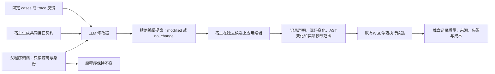

# 修改器宿主接口契约与程序隔离（2026-10-09）

## 结论与范围

本版把原先只在审计稿里的宿主能力说明真正接入修改器。它解决的是“修改器不知道哪些接口实际可用、输出结构不闭合”的具体问题，尚未证明真实提案成功率或 RAG 质量提高。

- 开发分支：`codex/v3-runtime-contract`，从 `857b57f` 分出独立工作目录。
- 真实 72 次终答复测始终在原 `codex/v3-paper-controls` 冻结目录执行，未混用本版源码；[真实结果](v3_program_suffix_result_20261009.md)。
- 复用原 ProgramDeveloper、父子归档、WSL、评价和账本，没有增加审阅模型、第二套优化器或自动格式修复调用。

## 1. 父程序、子程序与宿主的边界

现有归档继续记录 `declared_change_status`、`source_changed`、`ast_changed`、父子源码哈希和实际模块归因。`modified` 只是模型的声明；文本变化、AST变化也不能代替行为差异或质量提升。明确的 `no_change` 与非法编辑都消耗提案机会，不无限补购。

## 2. 这次接入了什么

| 内容 | 实现位置 | 作用 |
|---|---|---|
| 能力说明生成与验证 | `v3/runtime_contract.py` | 从实际宿主限额、模型请求上限、固定系统提示和编辑协议生成闭合说明 |
| 修改器输入 | `v3/evolution.py` | cases/trace 都接收相同完整说明，进入配置快照与冻结清单 |
| 模型请求与解析 | `v3/infrastructure.py` | 整份说明进入模型身份和真实请求；新版本开发响应拒绝重复键 |
| 显式新版本 | `live_evolution.py` schema6 | 计划中的说明必须与真实宿主设置重建值完全相同 |
| 成对入口 | `paired_evolution.py` schema3 | 要求 live schema6；两臂共同说明纳入完整请求相等与容量检查 |

说明明确：候选只能调用 `plan/read/answer`，不能靠新增字符串发明 `answer_retry` 等服务；非终答调用必须预留最后一次模型额度；固定 QA 系统提示不能被候选修改。合法 search/read/record_trace 签名、每题额度、QA 输出上限、引用来源和终答来源要求也完整提供。

编辑输出只允许五个顶层字段，单条编辑只允许 `file/old/new`。字符额度按全部 old/new 的 Unicode 字符总数计算；锚点必须在原父文件唯一匹配、不能重叠、不能无变化。说明中的例子只有占位符，不含题库答案。

`validate_runtime_contract` 检查结构、类型和固定说明；真实额度是否正确由入口按活动设置重新生成后比对，不把一份自洽 JSON 当作可信宿主声明。费用仍由原账本约束，能力说明不是报价。

## 3. 版本与恢复行为

旧 schema1–5 不接受偷偷塞入的新字段；paired schema1/2 的匹配关系保持。没有启用能力说明时，旧模型身份、请求字节和解析行为不变。已有冻结计划不能拿新源码直接继续运行，必须在其冻结副本执行，或另立新计划。

只有新契约下的 **develop** 响应严格拒绝顶层及嵌套重复 JSON 键与非有限 JSON 常量。真实响应仍先保存、结算，再解析；拒收不会退回已花成本，不购买自动修复。未知物理请求仍停止，不能记为答错或重购。QA 响应解析未改变。

重复键检查发生在完整响应收到后，不能保证模型不再重复生成，也不能提前省下已经输出的 tokens。它避免把有歧义的完整响应静默解析成合法提案；是否减少空转仍须实测。

当前独立根提案的拒收反馈与经验投影保持原协议。连续修复、分析与编辑分离仍属后续单独实验条件。

## 4. 验证

新增 20 项能力说明／模型边界测试与 14 项入口集成测试，34 项均通过，覆盖新旧版本隔离、卡与真实设置不一致、完整反馈超限、两臂共同输入、恢复篡改、重复键已计费拒收与未知结果停止。

实际 WSL 合成集成完成：一个根程序和两个条件各一个候选，共三次真实隔离执行；四次提案机会中各条件一次修改、一次明确无变化。13 次脚本模型响应，外部 API 为 0；再次恢复新增响应 0。三个执行均成功且终答来源有效；脚本模型不提供有效引文，因此引用来源不通过，不能把这组结果当成质量证据。

完整回归 **1,127 项：1,126 通过、1 项跳过**，耗时 479.820 秒。唯一跳过项是需 `RUN_V3_ANSWER_ORIGIN_WSL=1` 显式启用的旧测试；上述三次真实 WSL 集成另行执行，不把跳过项改写成通过。结果与日志哈希见[机器可读验收记录](v3_runtime_contract_20261009.json)。

## 5. 历史输入容量

用本版真实请求构造器重建既有四次修改请求，只加入共同契约，原源码、案例和轨迹均不裁剪：

| 条件（各2次） | 原请求字节 | 新请求字节 | 距120,000上限 |
|---|---:|---:|---:|
| cases | 46,254 | 51,568 | 68,432 |
| trace | 113,741 | 119,055 | 945 |

这只证明四份历史输入能装下，不能保证未来更长轨迹也能装下。新根仍在两臂提案前统一检查完整请求；任一超限，两臂都不进入提案调用，不能单独裁剪某一臂案例来继续。

## 6. 研究判断

这一步借鉴的是将实际执行边界与可操作反馈明确交给修改器的原则，尚未照搬多代理编辑或新搜索算法。此前[文献与原始缺口审计](v3_modifier_interface_findings_20261009.md)讨论的 SWE-Edit 分析／编辑分离、GEPA 反思优化仍作为后续可独立检验的选择。

当前优先问题依然是可执行且有用的代码改进。72 次已完成复测没有证明两个现有候选终答部分有效；本版仅修接口，不追认候选成功。下一轮真实修改器试跑须另行固定范围与授权，统一比较提案可执行率、实际行为变化、全部有符号收益和成本；没有启用正式新面板、经验选择或元重加权。
