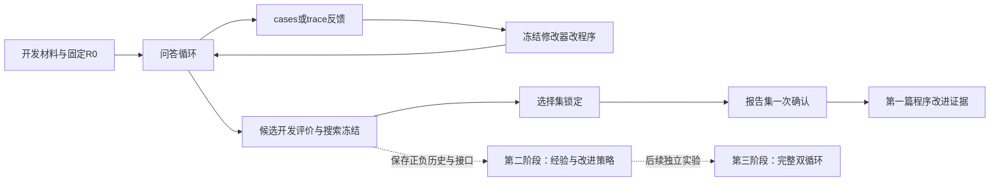

# 第一阶段论文：RAG程序改进主线、状态差异与试跑草案

**最新真实结果：72次固定上游终答复测完成。** 根程序F1 26.85%，两个子程序22.69%／23.15%；未复现正收益，差异集中于少数已用题，不部署候选。新增72次／¥0.06873556，累计340次／保守¥2.40364376；没有新检索、阅读或新面板测量。[完整结果](v3_program_suffix_result_20261009.md)。

**独立接口修复已实现：**修改器共同接收实际宿主接口、固定QA提示、额度与精确编辑要求；新版本拒收重复JSON键并保留计费与失败记录。完整1127项中1126通过、1项显式跳过，另3次真实WSL合成执行通过。冻结实验源码未变，开发分支为`codex/v3-runtime-contract`。[实现与验证](v3_runtime_contract_20261009.md)。

以下预算与未完成项是原方案快照，以本页上方当前状态与对应冻结报告为准；阶段性论文与完整双循环目标不变。

> 本计划是双循环研究的第一阶段，不替代原双循环路线。当前先验证程序修改、执行反馈和候选评价能否带来跨题收益，形成第一篇论文。随后在这个基础上，继续研究经验复用、改进策略更新及双循环协同。暂缓的机制保留实现和接口，待前置证据具备后逐项启用。

## 1. 总原则与发表顺序

| 阶段 | 核心问题 | 当前定位 |
|---|---|---|
| 第一阶段：当前论文 | 固定改进策略下，修改器能否改善RAG；轨迹反馈是否有贡献；候选评价能否保留跨题收益 | 先完成可靠的程序改进单元，不先宣称评分算法创新 |
| 第二阶段：改进策略学习 | 历史经验能否改进选父、选模块、修改方向 | 保留代码与接口，关闭经验机制完成第一阶段对照后再启用 |
| 第三阶段：完整双循环 | 相同总预算下两类循环协同的质量、效率、退化与反馈污染 | 保持项目总目标，另行检验长期稳定性 |

术语固定：一道题内的规划、检索、阅读、补证据和回答为“问答循环”；执行程序、形成反馈、修改代码、评价并保留候选为“程序改进循环”。同一数据集的未见问题表现称“跨题泛化”。不因论文范围收窄而重定义主项目的内外层关系。

经验记忆、经验选模块、经验选父及修改器自身更新暂不启用；不是删掉这些实现。保存所有父子谱系、修改器完整出站输入、实际代码差异、预测与测量、全部有符号收益、拒收/失败原因、请求身份、token、成本和耗时。第一篇使用后的报告题登记为已曝光，不能在第二篇重新称未见确认。

## 2. 交付一：当前状态差异表（P0/P2）

| 项目 | 核对结果 | 状态与下一步 |
|---|---|---|
| 原真实实验分支 | feedback工作区HEAD为`e1e12b5`，工作树干净；本轮未改写历史冻结结果 | 保留真实证据库 |
| 当前开发分支 | `a2f7883`；完整854项测试，853通过、1需显式启用的WSL测试跳过；另2次真实WSL合成执行通过 | 工程验收，不是模型收益 |
| MuSiQue非地板基础 | 单轮／循环F1 22.22%／32.41%，区间跨零 | 足够作为开发起点，不再要求先证明人工修复显著才允许修改器试跑 |
| 终答删除判断 | 均分上升但原推进条件失败 | 保留失败与动机；不作为推荐程序或自动演化成果 |
| 闭卷组件 | 问题直答、1模型/0检索/0读、答案来源核验已实现 | 统一正式入口未接线；第一阶段辅助参照 |
| 历史与新面板 | schema3准备器已验收；96／107／168，共371题 | 原120/240目标被真实容量校正，不再写成现有规模 |
| 隔离语义 | 实际历史与入选样本的直接组成单位重叠排除；全库闭包仅敏感性 | 不保证历史盘点完整或穷尽统计依赖；见抽样验收 |
| 原文邻域 | 半径0/256已有实现 | 作为人工参照H，未验证收益，不称上限 |
| 修改器与归档 | ProgramDeveloper、EvolutionRunner、live_evolution、隔离、恢复、实际AST归因已存在 | 复用，不重建优化系统 |
| cases/trace反馈 | 固定案例日程与嵌套白名单已实现 | 当前限制固定根/固定模块/无记忆，连续改进尚不支持 |
| 搜索阶段独立执行 | schema3已支持显式search/select/report；参考按阶段解析；旧入口语义保留 | 本项已完成工程验收；[实现与验证](v3_evolution_phases_20261009.md)，共享根、交错提案和统一预算编排已实现；真实试跑待新增授权 |
| 仅提示词 | 已实现显式edit_policy事前范围检查、出站政策绑定与恢复复验 | schema4工程验收见[报告](v3_prompt_edit_policy_20261009.md)；正式质量比较未执行 |
| 根伪候选 | 正常去重会拒绝相同源码，普通测量bank会共享相同请求 | 独立对照类型与bank，正常去重不放松 |
| 完整搜索重复统计 | 已有题组/回答重复分析，没有搜索运行层 | 正式结果前补齐；五次搜索不是五倍独立题目 |
| 当前付费状态 | 本轮0新API、未读凭据；之前授权对应已完成实验 | 新16提案范围未获授权；配对静态预检已通过，真实根测量后还需联合验收两臂完整请求大小 |

本轮可信准备器本地读取标注来确定跳数、组成关系和支持段，但不把参考字段发送模型，不按成绩选题。不能表述为完全未读取参考。

[面板与闭卷验收](v3_closed_book_panels_20261009.md) · [历史真实结果](v3_musique_calibration_result_20261009.md) · [反馈控制实现](v3_experience_controls_20261009.md)

## 3. 交付二：研究契约草案（P1/P3）

### 3.1 主要问题与比较

在固定模型、检索条件、编辑范围和优化资源规则下，执行轨迹反馈是否使程序改进获得跨题收益？首轮三条件：

| 条件 | 父程序规则 | 反馈 | 作用 |
|---|---|---|---|
| E-case | 固定版本的非经验选父规则，继续改进已有合格程序 | 聚合＋相同题号的预测与逐题分 | 具体案例反馈基线 |
| E-trace | 与E-case相同规则 | 相同信息＋实际执行流 | 轨迹的增量 |
| I-trace | 每次回到同一R0独立提案 | 根程序轨迹反馈 | 连续继承相对独立尝试 |

主要比较族预先限定为E-trace−R0、E-trace−E-case、E-trace−I-trace。主分Answer F1，EM并报；拒答、非拒答零分、引用来源、语义支持、执行交付、搜索成本、最终推理成本分列。三个主要比较统一处理多重比较，例如在最终统计冻结时采用Holm控制；未冻结前不以个别未校正结果作为推进成功。

各臂固定选父规则不等于后来选中同一父程序。建议新协议采用简单、可复现的“在当前合格节点中按D_fit均分选父，平局保留最早”作为首个非经验规则，模块按同一预声明轮换。允许实际程序分化；记录非根父节点比例和谱系深度。始终选根时，只能称运行了连续改进算法，不能说已经证明多代积累。

正式多次搜索的完整预算草案为每条件5次搜索、每次8个机会，**尚不作最终样本量承诺**。仅作工作量计算：开发评分24题、选择107题、报告168题、选择3个候选、每题1次且每题最多7模型调用时，一次完整搜索上界为`7×[(8+1)×24+3×107+2×168]+8=6,119`次；三条件各5次合计91,785次，尚未加闭卷、人工参照、伪候选和方法对照。它不是已批准规模或费用预测。若采用仅按5个配对搜索区组翻转符号的精确双侧检验，最小p值为2/32=0.0625，连未校正0.05都达不到。因此正式规模要结合搜索间方差和分析方法重新核定，不能靠把168题乘重复数来弥补搜索重复不足。

统计保留题组和搜索区组两个方向的相关性；正式分析前同时冻结全题库family关联的敏感性映射及对应有效组数，不能事后选择最显著的分组；共享题、共享根测量必须在各臂使用同一重采样索引。题内回答先平均，再报告每次搜索与总体结果。功效评估应使用最小关注效应和试跑方差做情景分析；区间很宽与足以排除目标收益是不同结论。

### 3.2 三个参照的实物快照

本地已生成源码快照和哈希，公开仅哈希。它们是草案快照；运行控制器改完后再绑定最终源码和模型身份。

| 参照 | 定义 | 冻结依据 |
|---|---|---|
| R0 | 当前维护RAG源码，继承已完成校准loop臂的明确配置；邻域半径0 | `359c564942074f62a7d99bc9d722ba011448fec1b6927d6115b8c954d7a5410a` |
| H | R0唯一变更为final_context_radius=256，两个rag_core文件完全一致 | `a73e0326821f47bfd552be08e43da0625fad82fbd27bb8790bc526ee3851a0cc` |
| CB | 已实现问题直答程序，无检索；只作知识基线 | 详见机器可读草案 |

R0不是直接采用全部默认值：延用3轮、每轮最多2查询、每查询5结果、每题最多7模型调用、停滞阈值**2**、24,000上下文字符、6,000来源字符、64,000有效载荷字符、1000答案字符。默认停滞阈值1不能覆盖这个历史冻结值。检索为原题局部语料的固定LocalCorpus，所有原段落/标题保留。

模型草案继承deepseek-flash，temperature=0，thinking=disabled；plan/read/answer/develop输出帽1200/2200/800/18000。首轮不同时换更强修改器。供应商模型身份与价格在实际执行前再次记录，别名不能保证服务永不升级。

H只叫人工设计参照；不把其设计归为修改器发现，不预先称成功修复。删除判断、状态分层、句段边界吸附不混入H。

### 3.3 数据用途修订

| 数据 | 当前实数 | 第一篇用途 |
|---|---:|---|
| 已用开发题 | 24 | 修改器工程/成本试跑、旧案例；无新泛化结论 |
| D_fit | 96 | 固定候选评分子面板、反馈、必要的R0/CB/H校准；评分与展示案例子集分别冻结 |
| D_select | 107 | 搜索结束后比较预先规定数量的候选并锁定；不向修改器反馈 |
| D_report | 168 | **保留给第一阶段自动程序改进的最终比较**；不先用于邻域试选或提示调参 |

已经冻结的题目身份和采样规则不变。168题主总体仍按题目等权，跳数80/68/20另列；四跳20不足以单独作高精度结论。不能拿不均衡面板宣称等权三跳数总体成绩。

开发版CB/R0/H只承担校准和人工参照角色。正式最终报告可以一次性包含预注册参照和各条件锁定程序；先冻结全部算法、程序与分析，不能看到某些报告分数后继续改其他臂。使用后逐题登记曝光，后续双循环研究另留新确认材料。

## 4. 交付三：最小代码缺口和完成标准（P4）

按以下顺序复用现有系统。暂缓经验、选模块学习等接口保留，通过开关关闭。第1项阶段拆分已实现并通过定向测试与11次真实WSL合成测量；完整验收见[阶段入口报告](v3_evolution_phases_20261009.md)。另已补齐P5所需配对编排、共享根和统一总账；连续反馈、提示词编辑限制与搜索运行层统计等其余项目仍按表推进。

| 顺序 | 位置 | 最少改动 | 完成标准 |
|---|---|---|---|
| 1 | `v3/evolution.py:544`、`live_evolution.py:109,327` | 拆search→freeze→select→report；旧run保留兼容入口；搜索只解析D_fit，保留角色只绑定哈希 | 搜索结束不会读/测保留角色；恢复不重购；后续阶段验证前序冻结 |
| 2 | `v3/evolution.py:387`、`feedback_conditions.py:98` | 新控制版本允许cases/trace与冻结非经验选父规则、固定模块轮换、none记忆共存 | 相同父测量时共同字段一致；父程序分化时案例日程/反馈规则仍同；无先验从旁路回流 |
| 3 | `v3/edit_policy.py`、`v3/evolution.py`、`live_evolution.py` | 已实现prompt_only只许预声明CONFIG.prompts字符串；program模式保留；live schema4显式冻结 | 新静态与入口测试、6次WSL测量通过；[验收](v3_prompt_edit_policy_20261009.md)，完整回归见机器摘要 |
| 4 | `v3/evolution.py:479,613` | 根伪候选独立测量身份和bank；普通演化去重不动 | 根相同源码可作为显式null控制独立测量，并经历同样选择和报告；不靠普通缓存假装重复 |
| 5 | `paired_analysis.py`与运行汇总 | 区分search_repeat与answer_repeat，绑定每次交付锁与共同题组 | 不把题×回答×搜索当独立N；保留所有运行和负收益，跨运行区间与逐运行结果同时报告 |
| 辅助 | `calibration.py`、`closed_book.py` | 接入CB/R0/H的适当开发/最终参照，不另建运行器 | 完整前缀共享、终答身份明确、空引用记不适用、每角色完整生成后评分 |

已有不可变归档、请求检查点、独立修改器提案bank、拒收计机会、隔离执行、模型答案来源、实际AST范围、选择锁定和平局规则直接复用。根与候选真实轨迹/输出保存在本地，不以新审查流程代替实测。

## 5. 交付四：真实修改器试跑草案（P5）

已从旧24题中按新固定哈希顺序各选二/三/四跳4题，共12题。选择仅用题号和跳数，不读模型成绩择题。完整题号、题目、参考与源码在本地runs；公开身份哈希：

`eb6c4a61dd08575061a3a406d1f5930400c20325d9b58e46a23d9c5700db42d2`

| 项目 | 草案 |
|---|---|
| 独立配对区组 | 2；每个区组包含cases与trace两条件 |
| 每条件每区组提案 | 4，从同一R0独立提案；总修改器最多16次 |
| 候选评分 | 每候选12题，每题1次；这不是正式效应测量 |
| 展示反馈 | 两条件同一12题、同一repeat0，trace仅增执行流；固定12题历史尺寸代理已通过，新根产生后仍须共同过门槛 |
| 修改意图 | answer_generation；正常program编辑空间一致，混合改动如实记录，不以意图做因果归因 |
| 记忆 | none，关闭经验策略 |
| 根测量 | 同一配对区组两条件共享同一冻结根反馈，不同区组独立 |
| 修改器bank | 每区组/条件/机会独立；按预声明顺序交错条件 |
| 普通候选缓存 | 保留冻结的精确请求复用语义，但不得跨独立区组；缓存命中不是新重复 |
| 拒收/重复/失败 | 计机会，保留全部记录，不追加成功候选 |
| 选择与报告 | 本阶段不执行、不读取正式角色参考 |

若完整trace提示超过120,000字节，先停止该版本并共同修订输入日程；不能只截掉trace臂的不利案例。固定12題历史完整请求的cases/trace分别为45,091/106,794字节，均低于120,000字节；历史程序不等于新R0，所以仍须真实根测量后的完整出站联合验收。配对计划现已通过静态预检，这不等于真实请求已产生或获授权。

### 5.1 历史草案调用与费用（已由配对版本替代）

不计根共享与缓存节省的保守上界：

`4条件区组 × [(1根 + 4候选) × 12题 × 7模型调用 + 4修改器调用] = 1,696次`

其中QA最多1,680次、修改器最多16次。每次完整请求输入上限120,000 UTF-8字节，额外输入预留1,024；QA按最大输出2,200，修改器18,000。按峰价每百万输入未命中¥2、缓存命中¥0.04、输出¥8计算，保守包络为**¥442.385408**，完整运行费用帽草案向上取**¥443**。这些数值记录旧草案，当前已实现根共享的执行版本为1,528次/¥398.764544/硬帽¥399。

这与[官方中文价格说明](https://api-docs.deepseek.com/zh-cn/quick_start/pricing/)的搜索返回表一致；直接规范页面本次读取超时，执行前仍核验冻结价格。包络是当前工程预留模型，不是预计账单，也不是对供应商异常计费的数学保证。实际请求按其真实完整字节数预留，超帽前停止；账单异常另行告警。

必须区分三种数：

1. 历史实测：350次校准¥1.12708076，96次短终答¥0.07724652；它们不是代码修改器单价。
2. 本试跑预计费用/耗时：**目前未知**，缺少本协议真实修改器样本，不伪造估计。
3. 完整试跑保守包络：¥442.385408，费用帽草案¥443；尚未授权，尚未启动。

不能把hard_cny直接填20元绕过当前完整运行预检。若希望更低主动预算，需要另版明确允许预算停止、保存未完成和条件交错；不能既保证全部16次又隐去完整包络。优先在实际提示与输入限制验收后收紧保守包络，而不是据旧一元账单承诺。

[机器可读草案与源码/数据哈希](v3_stage_one_paper_smoke_draft_20261009.json)。旧草案保留`draft_not_executable`状态，并指向新配对计划。现有授权不覆盖新16提案及源代码/反馈范围；隔离与静态预检已完成，真实根仍需通过请求尺寸门槛。当前可审预算见新计划，本计划本身不算新费用授权。

## 6. 正式实验和论文证据链（P6—P10）

先取得可解释的真实修改器记录：反馈是否送达、生成是否不同、行为是否改变、拒收率、重复率、耗时、token和成本。没有增益也完整报告，不能只选一个正候选作为方法证据。

然后核定完整搜索次数、提案机会、D_fit评分子面板、选择候选数和统一回答重复。现入口重复数统一1–8，不能先假定按角色各设一个。题量与完整搜索重复数一起做不确定性分析，再冻结正式预算。

正式论文三条件后，按因素分别补：prompt_only对program、根伪候选、明确版本的最近邻方法、人工参照H。人工参照不能代替相关方法；代码空间和提示词空间不同的比较不能直接归因于优化器算法。

[GEPA v2](https://arxiv.org/abs/2507.19457v2)用执行轨迹的文本反思指导候选优化，可作为最相关的方法对照。需冻结官方实现版本或明确标注适配内容，不能把一般反思提示称为完整复现。[TextGrad](https://arxiv.org/abs/2406.07496)提供按系统组件传播文本反馈的参照；本文不借其结果宣称我们的方法已有效。

最终分析至少包括保留根的比例、有效候选/全部机会、选择减报告收益、改善/持平/退步搜索比例、修复/回归题、实际修改与谱系、优化成本及交付成本。评价协议先作为可靠性支撑；有新的具体评分/选择规则并完成独立消融，才追加算法创新主张。

第一篇案例展示“原始失败→实际反馈→代码变化→执行行为→未见题结果”，同时保留成功、无效和退步。当前动作顺序调整为：**阶段拆分→真实修改器冒烟与成本→连续反馈/编辑限制/搜索统计→正式三条件及必要消融**。不再把人工终答改动过门槛设成所有程序改进实验的前置条件。
