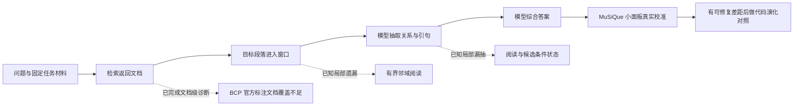

# 任务校准与检索瓶颈：零 API 诊断及 MuSiQue 真实准备

日期：2026-10-08。基于开发分支 e62b00f 后的工作。新增付费 API 0、模型调用 0、费用 0。

**新增证据支持先调整任务条件：BrowseComp 的官方标注文档覆盖确实偏低；MuSiQue 已完成真实数据准备，但还没有真实模型答题成绩。** 换任务不等于证明演化有效。本次没有修改旧 new16 结果，也没有把其 protocol_invalid 追认为有效。

[单页证据等级表](EVIDENCE_STATUS.md) · [脱敏机器可读结果](v3_task_recalibration_20261008.json) · [旧 new16 报告](v3_new16_result.md)

## 1. BrowseComp：从猜测转为文档级观测

使用旧 16 题、96 个冻结执行单元与官方 evidence/gold qrels，检查返回文档、实际呈现文档、合法阅读引句所属文档三个集合。只处理已用题；不读参考答案、不重新生成、不重新检索，不按召回结果挑题。

已核对 16/16 题标注可用，共 102 个 evidence 题文档对、36 个 gold 题文档对；102 个涉及的文档全部存在于固定语料。本次未重新计算整个 4.4 GB 语料文件的哈希；文档存在性检查不能替代完整语料认证。每个 frozen cell 的字节、payload 与完整面板身份均匹配。旧运行资格仍按其原报告解释，本次不在新源码上重新认证旧运行。

| 已观测事实 | A 原问题单轮 | B 规划单轮 | C 规划后循环 |
|---|---:|---:|---:|
| 结果单元 | 32 | 32 | 32 |
| 完整执行 | 32 | 32 | 31；另 1 个失败前缀 |
| 至少返回一个 gold 文档的执行单元 | 0 | 3 | 9 |
| 对应题目数／16 | 0 | 2 | 5 |
| 已见零阅读引句 | 17 | 18 | 12，含失败前缀 1 |
| 有终答且零引用 | 29/32 | 26/32 | 23/31；另 1 未知 |

多次重复不增加独立题数。47/96 是已见零阅读引句比例约 49%，不是总体超过半数；终答零引用与阅读零引句不能互换。

| 文档集合召回（先算每执行召回，再取均值） | A | B | C 已见前缀，不是完整结果 |
|---|---:|---:|---:|
| 返回 evidence 文档 | 2.57% | 9.06% | 19.39% |
| 呈现 evidence 文档 | 2.57% | 8.44% | 19.08% |
| 引句所属 evidence 文档 | 1.25% | 6.18% | 15.02% |
| 返回 gold 文档 | 0% | 7.29% | 21.88% |
| 呈现 gold 文档 | 0% | 7.29% | 21.88% |
| 引句所属 gold 文档 | 0% | 7.29% | 17.71% |

C 的完整面板召回在 JSON 中为 null。这里展示失败前实际见到的材料，未删掉失败单元，未用 31 条成功结果排名。A/B 数值同样只作旧无效面板的事后描述，无效果区间或优劣推断。

这些指标是一次执行所有查询结果的去重并集，不是单查询 Recall@5，更不能由只保存 top-5 的记录制造 Recall@10。全部 96 个单元满足“引句文档 ⊆ 呈现文档 ⊆ 返回文档”；纯函数模块对 18 项已观测集合聚合独立复算与第一次统计一致。

**解释：** A 完全没找到标注答案文档，B/C 的覆盖也只涉及少数题，检索确实限制当前可见信号。C 接触到更多 gold 文档但仍只有旧 Q01 那次命中。仅凭文档召回，仍不能区分剩余证据不完整与窗口、抽取或综合损失；已有局部案例已证实目标关系漏抽，不能只归咎检索。

evidence 是标注的回答所需文档，gold 是其中语义包含最终答案的文档子集。qrels 是文档标注，并非所有可能证据的穷尽集，也不提供本次诊断所需的逐条件金标准引句。命中 gold 文档不证明它的关键段落已经进入窗口；未命中 qrels 不自动证明没有可用事实。命中全部 evidence 文档并非答对的必要条件，标注可能包含替代证据。

## 2. MuSiQue：先保证真正把官方输入交给模型

官方数据来源固定到 StonyBrookNLP/musique 的 922ac98f19a201998dbdae6d7f2887a5258dbdeb 下载指针，下载 ZIP 272,049,578 字节，仅解压 Ans train/dev。没有打开 Test/Full。公开源未提供独立官方校验和；本地保存下载来源、ZIP 与文件 SHA256，不把本地哈希冒充官方认证。

真实数据暴露两个合成测试没发现的缺口，本次已修：

1. **标题丢失。** 旧适配器将 title 放在单独字段，但 LocalCorpus 和根阅读流程只传 text。现在规范正文为“非空原标题 + LF + 原段落”；空标题保留原正文。标题成为可搜索、可阅读、可精确引用的公开来源，偏移基于规范正文。内容指纹随之变化，私有答案与支持标签不进入文本。
2. **段落数假设错误。** 官方 train 21 题、dev 16 题只有 16–19 段。现在接受并保留原始 1–20 段、验证索引连续及支持标注一致，不补段、不丢题。全量 19,938 train + 2,417 dev 行已通过修复后准备器。

面板协议升级为 rag-rsi-musique-ans-panels-2；旧合成面板和旧冻结结果未重写。

| 角色 | 2/3/4 跳配额 | 数量 | 当前用途 | 共享子题或支持段连通分量 |
|---|---|---:|---|---:|
| D_fit | 8/8/8 | 24 | 开发校准 | 23 |
| D_select | 4/4/4 | 12 | 保留，未做模型测量／选择 | 12 |
| D_report | 8/8/8 | 24 | 保留，未做模型测量／报告 | 22 |

固定 seed musique-mechanism-calibration-20261008 只试一次；维持原跨角色隔离和抽样顺序，27 个 D_select 候选因跨角色共享关系被拒收。抽中的 60 题恰好都是 20 段，这来自固定抽样，不是删掉少段题后抽样。角色内部并非完全独立，后续配对统计应按共享关系组处理。

D_fit 的零 API 检索检查使用原问题与现有 LocalCorpus 词重叠排序、每题 k=5：两遍输出相同；120 个窗口的正文、偏移、read 与哈希一致；13/24 题至少命中一个支持段，3/24 题命中全部支持段，平均支持段 Recall@5 为 32.99%。这些只表示检索行为，不证明模型能答对或主评分已经脱离地板。该后端不是 BrowseComp 的 FTS5/BM25，两组数值不能当成换任务带来的性能提升。

## 3. 研究主线与下一项测量

近期主线改为 MuSiQue 机制开发校准，BCP 保留困难检索诊断与后续迁移。MuSiQue 尚未产生任何真实 LLM 结果，不能宣称已经找到非地板任务。

下一项付费实验应先完成可运行规格：D_fit 上比较固定根流程、匹配首轮的迭代流程，以及“给定标注支持材料”的诊断条件。诊断条件不能参加正常交付选择，也不能把答案或私有分解传给执行器。保持正常臂的公开输入、评分及预算可核对，单独记录诊断条件减少检索／噪声等共同变化，不能把三个分差直接当独立因果贡献。

先让 LLM 决定查询、补读与证据综合；宿主承担来源绑定、预算与统计。邻域阅读可复用现有 read 接口，候选条件状态应保留支持／反驳／未知和更新依据。模型阶段、检索后端、最终评分及经验选择不在同一次未拆分干预中一起修改。

已有四状态／两题的 ¥9 reader-probe 方案优先级下调，状态为 deferred_by_task_recalibration，未启动。它绑定 e62b00f；本次数据适配改变了运行源码指纹，旧计划不能直接在当前版本启动，如以后执行须重新冻结或使用对应历史版本。它不再是主线的前置门槛。

真实演化前先使用固定／轮换模块基线，再比较总分反馈与失败轨迹反馈。经验选择和元重加权继续没有有效性证据。未来允许宿主故障恢复须另行预注册错误类型、一次恢复上限、成本和未知请求处理，不追认旧实验。

## 4. 文献与结论边界

[BrowseComp-Plus 原论文](https://arxiv.org/html/2508.06600v1)的 oracle 与 get-doc 消融说明证据可得性、阅读方式和执行模型能力需要拆开；它们不保证当前模型复现论文收益。[MuSiQue 官方实现](https://github.com/StonyBrookNLP/musique)提供支持段落与答案评分，适合受控多跳诊断，但与十万文档搜索不同。[Sufficient Context](https://arxiv.org/html/2411.06037v3)提醒应区分材料充分性和模型能否利用材料，不能仅由拒答或来源合法性判定语义充分。

本次进展是：文档级瓶颈已有数据、真实任务材料已冻结、两处输入缺口已修。端到端真实收益、递归改程序优势和经验选择收益均未验证。

## 5. 对两轮外部建议的取舍

总体同意把误差分解置于架构扩张之前。当前证据支持调整任务与检索条件的匹配，但不能断言“只是题库问题”或“已经排除实现问题”。

- **MuSiQue 提升为机制开发校准主线。** 先验证基线是否既能答对一部分、又存在可修复失败；F1 能提供部分匹配信息，但全错时同样可能为零。BrowseComp 保留困难检索和后续迁移，不能用 MuSiQue 成绩替代其成绩。
- **优先做证据阶梯。** 比较真实检索和给定标注支持材料的表现；标注材料只作诊断干预，不向正常执行器泄漏支持身份。若给足材料仍差，应检查阅读、综合、任务契约与判分，不能归因于检索。BCP qrels 没有金标准引句，不能凭空构造“gold 引句”上限。
- **宽松预算条件是能力探测。** 同时加轮数、开思考、换模型只能测整套较强条件，不能解释各因素贡献；随后仍需单因素比较。不能因为它仍低分就认定检索是唯一原因。
- **工具改动跟随损失位置。** 文档已找到、关键段落未入窗时，优先有界邻域阅读；跨条件候选互相混淆时，再加候选的支持／反驳／未知状态。两者都要由 LLM 决定何时使用，不能把答案逻辑写死。
- **模块诊断与最终奖励分开。** 召回、引句覆盖、固定材料答题分可定位损失，暂不拼成总奖励。D_fit 聚合标注反馈也要单独登记；不给答案文档 ID 不等于完全消除过拟合风险。
- **修改器更强是待测假设。** 不预设必须强于执行器。先用小单元改动、总分反馈与失败轨迹反馈、固定／轮换模块基线，检验修改器是否产生可迁移收益，再比较不同模型和成本。
- **恢复规则向前生效。** 预注册确定的宿主超时、同输入同语料、有限次数恢复及完整成本记录；模型请求结果未知仍不得盲目重发。旧 new16 的无效状态保持不变。

这一顺序用于选择下一个可解释实验，不是给所有建议同时实施的许可。当前尚未启动新的真实模型测量。

## 6. 本次验证

全量 **594/594 通过**，232.936 秒，启用真实 WSL 来源回归，跳过 0 项。新增测试分别覆盖文档召回未知值边界及标题经适配、检索、阅读、引句到终答的传输；后者使用脚本模型，不能当作真实模型质量证据。日志与规范源码哈希见机器可读摘要。

所有原始题目、参考、文档身份和运行记录保留本地 ignored runs；公开提交仅包含实现、测试、聚合统计与哈希。新增真实 API 调用 0，未读取密钥。
