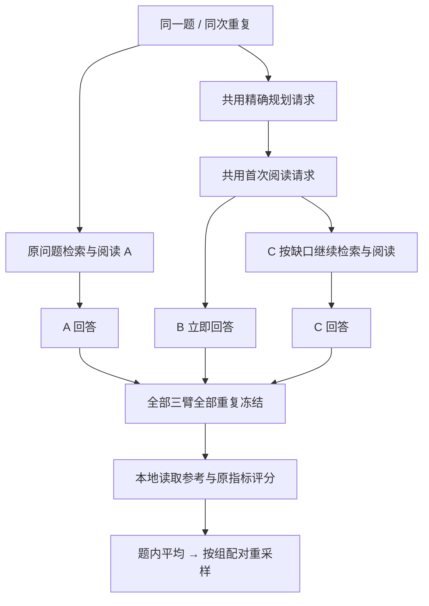

# 三臂 RAG 校准与配对统计（2026-10-08）

当前实现位于 `codex/v3-feedback-grounding`。新增 `planned_single`、校准方案 schema 2、完整面板配对分析及共用的请求恢复检查。**没有启动新的真实模型试验，也没有把固定流程对照称为 RSI 程序改进。**

## 1. 这次要回答的问题

旧的 single/loop 同时改变了查询规划和循环，无法知道收益来自哪一步。本版本拆成三条固定流程：

| 臂 | 模式 | 流程 | 每题每次重复的逻辑模型调用上限 |
| --- | --- | --- | --- |
| A | `single_pass` | 原问题检索 → 一轮阅读 → 回答 | 2 |
| B | `planned_single` | 规划查询 → 一轮阅读 → 回答 | 3 |
| C | `iterative` | 规划查询 → 最多 R 轮检索/阅读 → 回答 | R+2 |

预注册的两项比较固定为 **B−A：planning**、**C−B：iteration**。不把三臂数据放进旧的“后臂减前臂”二臂公式，也不根据结果再挑比较方向。主指标事先选内部 F1 或 EM，其余分数作描述。

三臂除 mode 外的配置必须相同。B/C 的规划提示、约束、首轮查询和阅读契约相同；C 至少允许两轮。B 只读取一轮，不执行阅读阶段产生的后续查询。规划失败时延续原流程的原问题回退，失败状态保留。

IRCoT 的核心是让新获得的信息指导后续检索，支持把“规划后的一次检索”与“依赖已读证据的后续检索”分开检验。本项目采用引句、桥接实体和缺口来实现这一点，不声称复现其完整推理方法或效果。[IRCoT 原文](https://aclanthology.org/2023.acl-long.557/)

## 2. 共享请求到底共享什么

同一题、同一次重复、完全相同的模型请求 body 共用一个缓存 bank。不同重复使用不同 bank。不会因为两次返回文字相同就认定它们是同一请求。

B/C 的规划和首次阅读应共享精确请求与响应。若第一轮已经 ready，它们的最终回答请求也可能完全相同，此时会继续共享。A 若构成完全相同请求，也遵守同一规则。这是全臂一致的请求复用政策，不能把被复用的回答当作两次独立物理采样。

报告同时给出各臂逻辑调用数与全运行实际付费调用数、保守账本费用。共享调用由哪一臂先触发取决于执行顺序，因而不分摊成“每臂独立部署的实际费用”。同上限不等于同成本；本版本也不能独自排除“循环只因多花预算而改善”。等成本额外采样是后续单独的对照，不混进这次首轮拆分。

## 3. 前缀一致性不是默认假设

校准器依据宿主事件检查 B/C 每题每重复的规划与首次阅读的请求、响应哈希：

- 全部可见且一致：`mechanism_comparison_valid=true`。只证明前缀契约实现，不证明循环提高质量。
- 无明确冲突，但缺少或失败的前缀无法验证：该字段为 `null`。可保留合格固定程序的描述与配对统计，不能解释为已完成干净的循环机制检验。
- 任一已观察到的不一致：标记 `protocol_invalid`，合格推断部分置空，全量原始分差仍保留。不能只抽出一致的成功子集排名。

单个结果的 `program_eligible` 继续表示执行、来源和实际非空答案资格。报告的 `execution_comparison_valid` 与机制资格分列；总体 `quality_comparison_valid` 在来源不合格或已观察到前缀协议违例时为 false。不会为隐藏机制问题而修改原来的来源记录。

## 4. 预算预检

R=3 时每题每次重复最多 `2+3+5=10` 次逻辑调用。因此旧 8 题、两次重复的 112 次方案不能用于新三臂；新逻辑上限是 **160 次**，48 个回答结果仍只有 8 道题。

按当前示例上限（完整输入 120,000 字节，plan/read/answer 输出 1200/2200/800，输入未命中 2 元/百万 token、输出 8 元/百万 token），8×2 的保守整计划预留约 **¥40.75008**。这是按字节估算输入 token 的保守上界，**不是实际费用预测，也不是已获批预算**。精确请求共享可能减少物理调用，仍按未复用上界预留，不能提前拿节省额度扩大范围。

预检还要求：

- 三类宿主调用上限是正整数，不能以 0、布尔值或缺字段放行。
- `search_limit` 不超过宿主 30 条上限。
- 模型预算覆盖规划、允许阅读轮数和最终回答；检索预算覆盖允许查询数。模型每阶段最多生成 24 条查询，按该限制计算保守搜索上界。
- 模型、语料、源码、题目、分析定义和输出目录全部绑定。新源码不能使用旧方案哈希。

`max_reads` 限制的是原文读取 RPC，不是 LLM 阅读调用；两者不混用。当前固定语料搜索直接返回正文窗口。

## 5. 统计口径

schema 2 必须在运行前冻结 `analysis` 的九个字段：schema、primary_metric、comparisons、question_groups、confidence_level、bootstrap_samples、bootstrap_seed、target_effect、power。

每个题×臂×重复必须恰有一条记录。缺行、重复行、非法分数或身份不匹配会拒绝分析；任何来源不合格都不产生正式分析，原始正负差值仍完整保留。

先在每道题内平均重复得分，再计算候选减基线。主均值仍然是题目等权，不因有多次回答扩大独立样本数。有共享子问题或来源依赖的题必须预先放在同一组，按整组共同重采样。组大小不等时，使用“抽中组的差值总和 / 抽中组的题目总数”，保持题目等权目标，不悄悄变成每组等权。

两项比较共用重采样序列，percentile 区间按 Bonferroni 修正；95% 总置信水平对应每比较 97.5% 区间。它仍是近似区间，尤其少组时不能保证有限样本覆盖率。组少于 2、观测无变化或重采样退化时不输出虚假的零宽有效区间。

重复噪声单独给出题内标准差、极差和相邻重复 EM 状态翻转率；只有一轮时这些量为 null。重复次数少时它们只是描述，不是稳定性已解决的证据。

设计敏感性使用整组残差近似标准误，报告在指定目标差值、功效下的粗略最小可检出差异与所需独立组数。其假定未来组规模和残差分布相近，只是 pilot 方差下的正态近似，不能当正式样本量保证；功效是每项比较的目标，不是两项同时检出的联合保证。没有变化时不据此得出“少量题就足够”。

配对重采样的评测思想参考 Koehn 的机器翻译评估论文；相关题组抽样和本项目两个预注册比较的组合是针对当前数据依赖作出的设计，不声称该论文直接验证了本 RAG 协议。[Koehn 2004](https://aclanthology.org/W04-3250/)

## 6. 请求恢复与参考答案边界

把演化入口已有的请求恢复、缓存与账本一致性检查提取为一个共用模块，校准入口也使用它。只要运行内有未知物理结果，恢复时即使改了请求正文或 bank 也必须停止；不能因为账本保守结算后 pending 计数变成 0 就继续购买。

检查发生在凭据读取、创建传输器之前；生成冻结前及评分前继续核验。所有三臂、所有题、所有重复完成且冻结后，才解析本地参考答案。评分不会流回已冻结的生成，也不会调用额外模型裁判。

旧 schema 1 仍只接收两个固定模式；schema 2 只能接收三种模式和上述预注册比较。兼容解析不代表可以用新代码续跑旧源码哈希。历史结果不回写。

## 7. 验证范围与当前局限

真实 WSL 校准使用两道虚构双跳题和脚本响应：6 个单元全部通过隔离及答案来源检查，B/C 的 2 个首轮配对均一致。逻辑调用数 A/B/C 为 4/6/8，共 18 次；实际脚本响应 14 次，恢复新增响应 0。原问题单次和规划单次没有第二段证据，循环取得第二段后回答；这是已知脚本设计的机制验证，不是题库成绩。

两项比较在这两道虚构题上没有题间变化，所以区间被标为 `insufficient_variation`，未把确定性脚本输出包装成可信质量提升。

本次真实 API 调用 0、费用 0；没有启用新真实题或封存数据。全量 **458/458 测试通过**（144.121 秒，显式启用真实 WSL 来源回归，跳过 0 项）；源码指纹见[验证摘要](v3_validation_summary.json)。

## 8. 下一次真实试验还缺什么

1. 用实际使用记录核对一份未用题清单及依赖分组；`unused_declared` 仅是方案声明，代码不会把它冒充独立验证。
2. 冻结完整三臂方案与主指标，明确是探索而非确认；在费用、调用次数和外发范围都明确后执行。
3. 先判断是否存在跨题、非地板的流程差异，以及差异来自规划还是后续证据补充，再决定程序修改应该改哪个模块。
4. 真实程序演化前仍需题目特异常量扫描与固定/轮换模块基线。经验选择器、Skill 或元重加权不能以本次工程校准代替效果验证。

BrowseComp 仍使用内部 EM/F1 代理，未实施官方模型裁判；本版本没有解决同义正确答案被 EM/F1 低估的问题。MuSiQue 分组工具仍可作为多跳开发侧轨，但本校准入口暂不混入另一个题库。
